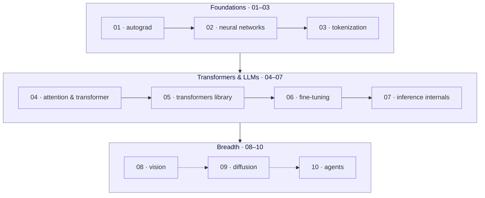

# Build ML From Scratch — Then the Hugging Face Way

Learn to **build** machine-learning models, not just call them — from a scalar
autograd engine all the way to fine-tuning and serving an LLM. The trick of this
course: you build **everything twice**. First from scratch, so you understand
every moving part; then the Hugging Face way, so you can move fast and ship real
work. You **see every concept as a picture** — loss surfaces, attention
heatmaps, feature maps, denoising trajectories — because intuition comes from
images, not equations alone. And you write the core algorithms in **two
languages**: **Python** for reach and ecosystem, and **Zig** for understanding —
where nothing is hidden, memory is explicit, and you finally see what the tensor
library was doing all along.

This is a hands-on course. There is no "watch me code." Every module is a
walkthrough you run on your own machine, an Apple-silicon Mac, with optional
cloud acceleration when you want it.

---

## How to use this course

Each **module** is a self-contained folder under `modules/` and follows the same
shape:

- **README walkthrough** — the narrative. Read it top to bottom; it explains the
  concept, the math you actually need, and what you are about to build.
- **Runnable scripts** — every code block is a real script you launch with
  [uv](https://docs.astral.sh/uv/). No hidden setup: `uv run script.py` just
  works.
- **Exercises with solutions** — you write code; a reference solution lives in
  `solutions/` so you can check yourself (peek only after you try).
- **Figures** — generated plots and diagrams in `figures/`. Regenerate them
  yourself; seeing the picture is the point.
- **A checkpoint** — each module ends with a short "you should now be able
  to…" checklist. Don't move on until you can tick every box.

**Do the modules in order.** Later modules assume the tools, vocabulary, and
code you built earlier. Foundations (01–03) are load-bearing for everything that
follows.

Before module 01, work through **[SETUP.md](SETUP.md)** to verify your
toolchain. If your Mac ever feels too small — a big fine-tune, a hungry GPU
job — **[CLOUD.md](CLOUD.md)** shows the optional cloud lane.

---

## The learning path

The three tracks build on each other. **Foundations** gives you autograd, a
network, and a tokenizer written by hand. **Transformers & LLMs** turns those
into attention, a real model library, fine-tuning, and fast inference.
**Breadth** takes the same ideas sideways into vision, diffusion, and agents.

---

## Modules

| # | Module | What you build |
|---|--------|----------------|
| 01 | [autograd](modules/01-autograd) | A scalar autograd engine, in **Python and Zig** — reverse-mode backprop from first principles. |
| 02 | [neural-networks](modules/02-neural-networks) | A numpy MLP trained on **FashionMNIST**, loaded via Hugging Face `datasets`. |
| 03 | [tokenization](modules/03-tokenization) | **BPE from scratch** in Python and Zig, then the real **SmolLM3** tokenizer, with a **Gradio** playground. |
| 04 | [attention-transformer](modules/04-attention-transformer) | Attention from scratch → a tiny **char-GPT**, with **attention heatmaps**. |
| 05 | [transformers-library](modules/05-transformers-library) | `pipeline`, `AutoModel`, **SmolLM3 anatomy**, and sampling strategies. |
| 06 | [fine-tuning](modules/06-fine-tuning) | **TRL SFT + LoRA** on SmolLM3, an **MLX** Mac lane, and **trackio** tracking. |
| 07 | [inference-internals](modules/07-inference-internals) | **KV cache**, quantization, and a **Zig inference capstone**. |
| 08 | [vision](modules/08-vision) | Fine-tune a **ViT**, and visualize its **feature maps**. |
| 09 | [diffusion](modules/09-diffusion) | A toy denoiser from scratch → the **`diffusers`** library. |
| 10 | [agents](modules/10-agents) | Build agents with **smolagents** and the **Model Context Protocol (MCP)**. |

---

## Toolchain

The course targets an **Apple-silicon Mac** and a small, modern toolset:

- **[uv](https://docs.astral.sh/uv/)** — Python environment and script runner (one per module).
- **[Zig](https://ziglang.org/)** — the from-scratch systems lane.
- **[`hf` CLI](https://huggingface.co/docs/huggingface_hub/guides/cli)** — Hub auth, downloads, and cloud Jobs.
- Optional per-module extras: **PyTorch**, **mlx-lm**, **Gradio**, **graphviz**.

Full verification steps and per-module setup live in **[SETUP.md](SETUP.md)**.
The optional cloud lane — HF Jobs, trackio, Spaces, ZeroGPU — is in
**[CLOUD.md](CLOUD.md)**.

The multi-language philosophy has its own page: **[docs/algorithm-cards.md](docs/algorithm-cards.md)**
explains the "algorithm card" format — the same algorithm side by side in
Python and Zig — and lists the cards this course ships.

---

## Built on

This course stands on the shoulders of the free, open
[Hugging Face learning platform](https://huggingface.co/learn). Each track draws
directly from one or more of these courses — go deeper there any time. For the
full catalog, a module-by-module map, certifications, and suggested continuation
paths, see **[RESOURCES.md](RESOURCES.md)**.

- **[LLM Course](https://huggingface.co/learn/llm-course)** — transformers, tokenizers, `datasets`, and fine-tuning.
- **[smol-course](https://huggingface.co/learn/smol-course)** — SmolLM3, TRL, LoRA, and small-model fine-tuning.
- **[Agents Course](https://huggingface.co/learn/agents-course)** — smolagents and agentic patterns.
- **[MCP Course](https://huggingface.co/learn/mcp-course)** — the Model Context Protocol.
- **[Community Computer Vision Course](https://huggingface.co/learn/computer-vision-course)** — ViT and vision transfer learning.
- **[Diffusion Course](https://huggingface.co/learn/diffusion-course)** — denoising diffusion and `diffusers`.
- **[Deep RL Course](https://huggingface.co/learn/deep-rl-course)** — reinforcement learning foundations.
- **[Open-Source AI Cookbook](https://huggingface.co/learn/cookbook)** — practical, task-focused recipes.
