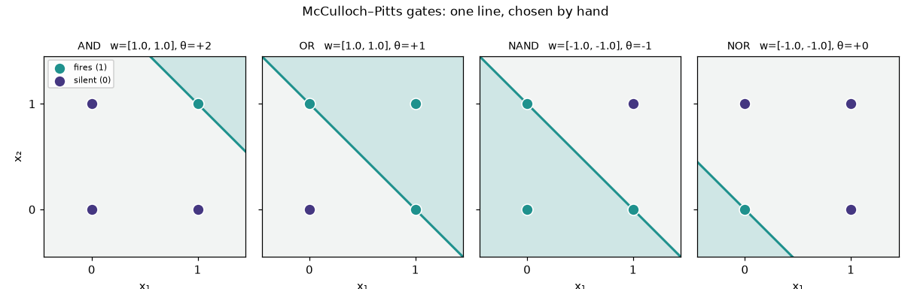
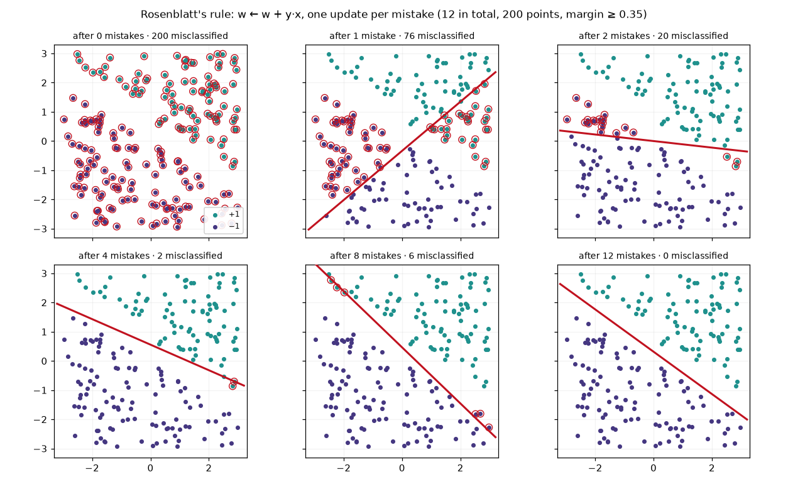
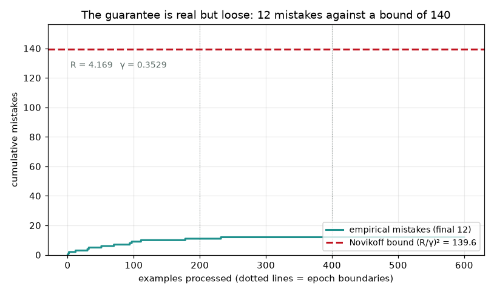
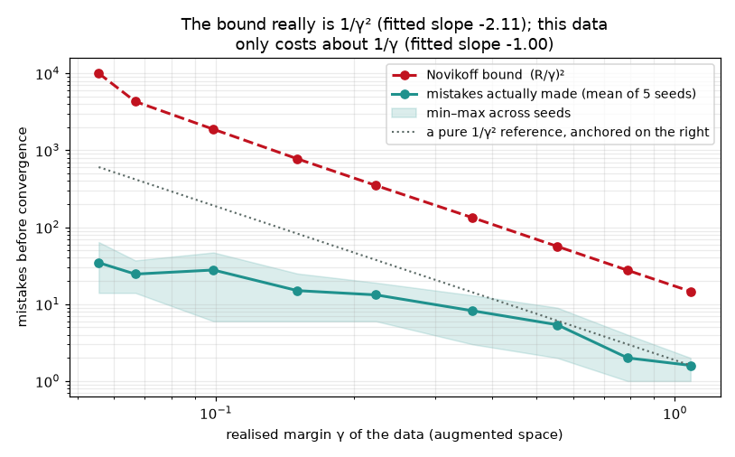
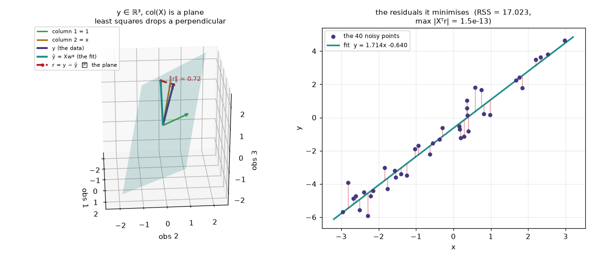
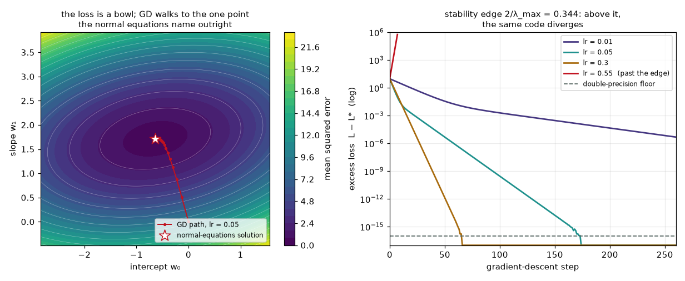
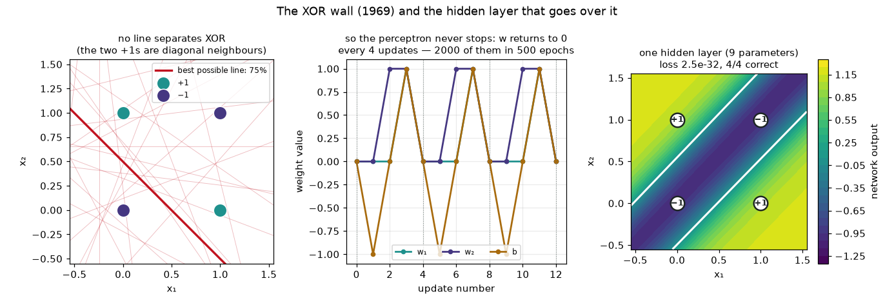
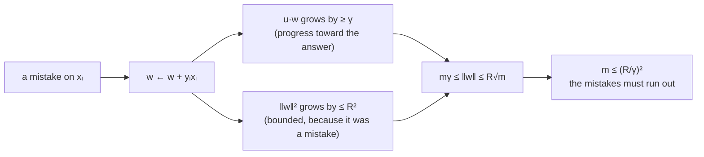

# Module 00a — The perceptron & least squares

> Two ideas from the 1950s that never went away. One asks *which side of the
> line?* and learns by admitting mistakes. The other asks *how far off?* and
> learns by minimising a distance. Everything later in this course is a
> variation on the second, powered by a stack of the first.

This is the opening module of **Track 0 · Origins**. It is deliberately small:
200 points, three weights, arithmetic you can do on paper. What makes it worth
your time is that both algorithms come with something modern deep learning
almost never has — a **proof**. You will train a perceptron, count its mistakes,
compute the bound that says it cannot make more, and watch the two numbers sit
in the same picture. Then you will hit the wall that stopped the field for
fifteen years, and step over it with nine parameters.

**🕹 Interactive:** [The perceptron, one mistake at a time](../../explorables/00a-perceptron.html) —
drag the margin, watch the line snap, replay this module's real run, and flip on
XOR to watch convergence turn into a cycle.

**✅ Quiz:** [10 questions](../../quizzes/00a.html) — check yourself once both lanes run.

## Goals

By the end you can:

- explain a **McCulloch–Pitts** unit and wire logic gates by hand;
- implement **Rosenblatt's rule**, `w ← w + y·x`, and say why it terminates;
- compute a dataset's **radius R** and **margin γ**, and evaluate Novikoff's
  mistake bound `(R/γ)²` — then measure how loose it is;
- solve **least squares** two ways, by normal equations and by gradient descent,
  and predict the learning rate at which the second one explodes;
- read least squares as a **projection**: the residual is perpendicular to the
  column space, and that is the whole derivation;
- state exactly why the perceptron **cannot** learn XOR, and fix it with one
  hidden layer;
- point at any line of the Zig perceptron and name its Python counterpart.

## What you'll see

Every concept here produces a figure. This module ships six.

**Logic without learning.** A McCulloch–Pitts unit fires when `w·x ≥ θ`. Choose
`w` and `θ` by hand and you get a logic gate; the shaded half-plane is the set of
inputs that make it fire. No data, no training — the intelligence is entirely in
your choice of numbers.



**The perceptron finding a line it was never told.** Same architecture, but now
the weights come from the data: every misclassified point gets added (or
subtracted) into `w`, and the line swings. Twelve updates on 200 points, then it
never makes another mistake.



**The guarantee, drawn to scale.** The teal staircase is what actually happened;
the red line is the maximum Novikoff's theorem allows. The run used **8.6%** of
its allowance.



**How the bound behaves when you squeeze the margin.** Nine margin settings ×
five seeds, retrained from scratch each time. The bound grows as `1/γ²` — the
fitted log-log slope is −2.11. The mistakes actually made grow as `1/γ`, slope
−1.00. A worst-case theorem is a statement about the worst case, not a
prediction about your data.



**Least squares is a right angle.** With three data points, `y` is a vector in
ℝ³ and the fit `ŷ = Xw*` is the closest point of the plane spanned by the
columns of `X`. The residual is what is left over, and it is perpendicular to
that plane — which *is* the normal equations, rearranged.



**The same answer, walked to instead of solved for.** Left: gradient descent
crawling down the loss bowl toward the point the normal equations name in one
step. Right: the excess loss on a log scale, one line per learning rate. Above
`2/λ_max = 0.344` the identical code diverges.



**The wall.** Four points, and no line on Earth gets more than three of them
right. The perceptron responds by cycling forever — its weights return to
exactly where they started every four updates. A single hidden layer of two
tanh units, nine parameters in total, bends the plane and the problem
disappears.



## Theory in one minute — why the perceptron stops

Append a constant 1 to every point so the bias is just another weight:
`x = [x₁, x₂, 1]`. Suppose some unit vector `u` separates the data with margin
`γ`, meaning `yᵢ·(u·xᵢ) ≥ γ` for every point, and let `R = max‖xᵢ‖`. Start at
`w = 0` and update only on mistakes.

Each update does two things at once:

- **it lines `w` up with `u`.** On a mistake, `u·w` grows by
  `y·(u·x) ≥ γ`. After `m` mistakes, `u·w ≥ mγ`.
- **it barely lengthens `w`.** `‖w + yx‖² = ‖w‖² + 2y(w·x) + ‖x‖² ≤ ‖w‖² + R²`,
  because `y(w·x) ≤ 0` is exactly what made it a mistake. After `m` mistakes,
  `‖w‖ ≤ R√m`.

But `u·w ≤ ‖w‖` for a unit `u`, so `mγ ≤ R√m`, so **`m ≤ (R/γ)²`**. The count
cannot grow forever, so the mistakes must stop. That is Novikoff's 1962 proof in
five lines, and the only thing it needs is that a separator exists.



Two honest caveats the module makes you confront:

1. **γ is not free.** The largest margin any separator achieves is the distance
   from the origin to the convex hull of the points `yᵢ·xᵢ` — a genuine
   optimisation problem. `src/perceptron/rosenblatt.py` solves it with
   Frank–Wolfe in twenty lines and reports a *bracket*: the achieved margin
   below γ\*, the hull distance above it. For the headline dataset the bracket
   is 2.5·10⁻⁴ wide.
2. **The bound says nothing when no separator exists.** Take γ away and the
   theorem says nothing at all — which is precisely the XOR situation.

## This module's numbers

Everything below was produced by the scripts in `python/scripts/`; each one also
writes a JSON blob next to the code so the Zig lane, the tests and the
explorable can check themselves against it.

| quantity | value | where |
|---|---|---|
| dataset | 200 points, geometric margin ≥ 0.35, seed 1958 | `src/perceptron/data.py` |
| final weights | `[4.611830, 6.361736, −2.0]` | `run_perceptron.json` |
| mistakes | **12** in 3 epochs (11 · 1 · 0) | `run_perceptron.json` |
| accuracy | 100% | — |
| radius R | 4.169359 | augmented, `max‖[x,1]‖` |
| margin γ | 0.352921 (hull bound 0.353170) | Frank–Wolfe |
| Novikoff bound | **139.57** — the run used 8.60% of it | `(R/γ)²` |
| least squares | intercept −0.639556, slope +1.714142 | `run_least_squares.json` |
| normal eqs vs GD | agree to `1.8e−15` (400 steps, lr 0.05) | — |
| orthogonality `max|Xᵀr|` | `1.5e−13` | machine zero |
| GD stability edge | 0.343976 | `2/λ_max` |
| XOR: best possible line | **75%** of 4 points | exhaustive search |
| XOR: tiny MLP | 9 parameters, 4/4 correct, loss `2.5e−32` | `run_xor.json` |

## Hands-on walkthrough (Python lane)

Everything lives in `python/`, a `uv` project. Move there first:

```bash
cd modules/00a-perceptron/python
```

Wire the 1943 neuron by hand and confirm that two layers of it make XOR:

```bash
uv run scripts/mcculloch_pitts.py
```

Train the perceptron, count the mistakes, and compute the bound it cannot break:

```bash
uv run scripts/train_perceptron.py
```

Squeeze the margin nine ways and watch both curves move:

```bash
uv run scripts/margin_sweep.py
```

Fit the same line by solving and by descending, and draw the projection:

```bash
uv run scripts/least_squares.py
```

Hit the wall, then step over it:

```bash
uv run scripts/xor_wall.py
```

Check every claim against an independent implementation (numpy's solvers,
scikit-learn's `Perceptron`, finite-difference gradients):

```bash
uv run pytest -q
```

The library itself is small and worth reading top to bottom:

- `python/src/perceptron/mp_neuron.py` — threshold logic, no learning
- `python/src/perceptron/rosenblatt.py` — the rule, the mistake trace, R, γ, the bound
- `python/src/perceptron/lstsq.py` — normal equations, GD, the projection geometry
- `python/src/perceptron/mlp.py` — 2→2→1 tanh, forward and backward in nine lines
- `python/src/perceptron/data.py` — every seeded dataset in the module

## The Zig lane

The same perceptron in Zig 0.16 — 157 lines of algorithm plus 112 of driver and
tests — trained on the *identical* 200 points. Because the algorithm has no learning rate, no shuffling and starts from
`w = 0`, the two lanes should not merely be close — they should agree bit for
bit. They do: `max |Δw| = 0.000e0`, same 12 mistakes, same 3 epochs.

`python/scripts/gen_zig_data.py` writes `zig/data.zig`, carrying both the points
and the Python lane's answers so `main.zig` can assert parity at runtime.

```bash
uv run scripts/gen_zig_data.py    # optional — a copy is committed
cd ../zig && zig run main.zig
```

Or through the build script, which also has a test step:

```bash
zig build run
zig build test
```

Three things Zig makes explicit that Python hides:

- **the augmented point is a value, not a view.** `augment` returns a `[3]f64`
  by value; there is no array to allocate and no row to alias.
- **the snapshot history is the only allocation in the program.** It uses the
  0.16 `ArrayList` shape — `.empty` to create, and every growing method takes
  the allocator as its first argument, so the list stores no allocator itself.
- **the margin solver allocates nothing at all.** Frank–Wolfe's iterate is three
  floats on the stack; the "convex hull" never exists as a data structure.

Files:

- `zig/perceptron.zig` — the rule, radius, Frank–Wolfe margin, the bound
- `zig/main.zig` — training, the report, the parity assertions, three tests
- `zig/data.zig` — generated: the points plus Python's answers
- `zig/build.zig` — `run` and `test` steps

The output also times both phases with `std.Io.Timestamp`. In a debug build,
training 200 points for 3 epochs finishes in well under a millisecond, while
the 20 000-iteration margin solve takes tens of milliseconds — two orders of
magnitude more. Proving the guarantee costs far more than earning it.

## Exercises

Skeletons are in `exercises/` (look for `# TODO(you):`), verified answers in
`solutions/`. Run them from the `python/` directory, e.g.
`uv run ../exercises/ex1_pocket.py`.

1. **`ex1_pocket.py`** — flip 6% of the labels and the guarantee is gone: the
   perceptron makes 1959 updates in 60 epochs and never settles. Implement the
   **pocket algorithm** — keep the best weights you have seen — and recover
   94.0% accuracy, which is the ceiling given the corrupted labels.
2. **`ex2_ridge.py`** — add a nearly duplicate feature (κ(XᵀX) ≈ 9.3·10⁶) and
   watch the normal equations produce coefficients of `+21.5` and `−19.9` that
   cancel. Implement **ridge**, `(XᵀX + λI)w = Xᵀy`, and watch them collapse to
   roughly `+0.83` each while the training MSE moves from `0.31956` to
   `0.32029` — a change in the fourth decimal for a twentyfold drop in `‖w‖`.
3. **`ex3_margin_bound.py`** — implement `radius` and the Frank–Wolfe
   `max_margin` yourself, then verify the bound holds across eight datasets and
   report what fraction of the guarantee each run used (it ranges from 0.8% to
   14.5%).

## Checkpoint — you should now be able to…

- [ ] wire a McCulloch–Pitts gate by choosing weights and a threshold;
- [ ] write the perceptron update rule from memory and explain why the bias is
      just a feature that is always 1;
- [ ] sketch Novikoff's proof: one quantity grows at least linearly, the other
      at most as a square root;
- [ ] compute R and γ for a dataset and evaluate `(R/γ)²`;
- [ ] say why the bound was 139.57 while the run made 12 mistakes, without
      calling either number wrong;
- [ ] derive the normal equations from "the residual is orthogonal to the
      column space";
- [ ] predict the learning rate at which gradient descent on a quadratic
      diverges;
- [ ] explain the XOR obstruction in one sentence and name the fix.

## Where this shows up later

The perceptron's threshold unit becomes the **neuron** of
[module 02](../02-neural-networks/README.md) — the same `w·x + b`, with the hard
step swapped for something differentiable so gradients can flow. The XOR fix
here, a hidden layer of two tanh units, is literally module 02's network with
the width turned down. Least squares supplies the other half: the
**differentiable loss** whose gradient [module 01](../01-autograd/README.md)
computes automatically, and whose descent path module 01's explorable lets you
roll a ball down. The stability edge `2/λ_max` you measured here is the reason
learning-rate schedules exist at all, in module 02 and in every fine-tuning run
in [module 06](../06-fine-tuning/README.md). And the margin — the quantity that
made the whole guarantee work — comes back as the object being maximised in
[module 00c](../00c-kernels-hopfield/README.md), where support-vector machines
stop treating any separator as good enough.

## What's next

Continue in Track 0 with [module 00b](../00b-bayes-knn-pca/README.md) —
probability, neighbours and eigenvectors — or jump straight to the machinery
that generalises what you just built: [module 01](../01-autograd/README.md),
autograd from scratch.

## Sources

- F. Rosenblatt, *The Perceptron: A Probabilistic Model for Information Storage
  and Organization in the Brain* (1958), Psychological Review 65(6) —
  <https://doi.org/10.1037/h0042519>
- W. McCulloch and W. Pitts, *A Logical Calculus of the Ideas Immanent in
  Nervous Activity* (1943), Bulletin of Mathematical Biophysics 5 —
  <https://doi.org/10.1007/BF02478259>
- A. Novikoff, *On Convergence Proofs for Perceptrons* (1962) — the mistake
  bound this module measures.
- M. Minsky and S. Papert, *Perceptrons* (1969) — the XOR obstruction, stated in
  full generality.
- S. Gallant, *Perceptron-Based Learning Algorithms* (1990), IEEE Transactions on
  Neural Networks 1(2) — the pocket algorithm of exercise 1.
- M. Frank and P. Wolfe, *An Algorithm for Quadratic Programming* (1956) — the
  method used here to compute γ honestly.
- Recommended reading: Anil Ananthaswamy, *Why Machines Learn: The Elegant Math
  Behind Modern AI* (Dutton, 2024) — the chapters on the perceptron and its
  learning rule, and on least squares and the normal equations, tell the
  historical story behind this module in narrative form.
