# Module 00b — Probability, neighbours & eigenvectors

> Three ideas older than every neural network in this course, and all three are
> still running inside it. **Bayes** turns evidence into belief. **Nearest
> neighbours** turns a memory into a classifier — and comes with a guarantee
> nobody expected. **Eigenvectors** find the directions your data actually
> varies along, which is what every embedding since has been trying to do.

You will implement all three on numpy, with no scikit-learn anywhere in the
algorithms themselves. Along the way you get something rare: a dataset whose
**Bayes error is known exactly**, so a classifier's error can be compared to the
best error any classifier could ever achieve — not to a leaderboard.

**🕹 Interactive:** [PCA playground](../../explorables/00b-pca.html) — drag a
point cloud around and watch power iteration hunt for its principal axis.

**✅ Quiz:** [10 questions](../../quizzes/00b.html) — after you have run the labs.

## Goals

By the end you can:

- turn Bayes' rule into **odds × likelihood ratio** and explain why a 96%-accurate
  test can leave you 95% likely to be healthy;
- fit **Gaussian naive Bayes** in closed form and say precisely which assumption
  the word "naive" refers to — and what it costs;
- write **k-NN** as four lines of numpy and read the accuracy-vs-k curve as a
  bias/variance trade;
- state the **Cover-Hart** bound and *measure* it: 1-NN error caught between the
  Bayes error and twice it;
- find eigenvectors by **power iteration with deflation**, and check them against
  `numpy.linalg.eigh` to fourteen decimal places;
- read a **scree plot**, and connect reconstruction error to discarded variance.

## What you'll see

Twelve figures, all produced by the scripts in `python/scripts/`.

### 1 · Bayes: the base rate is doing most of the work

A fictional condition with prevalence **0.4%**, a test with **96% sensitivity**
and **92% specificity**. Every number below comes out of
`scripts/bayes_screening.py`.

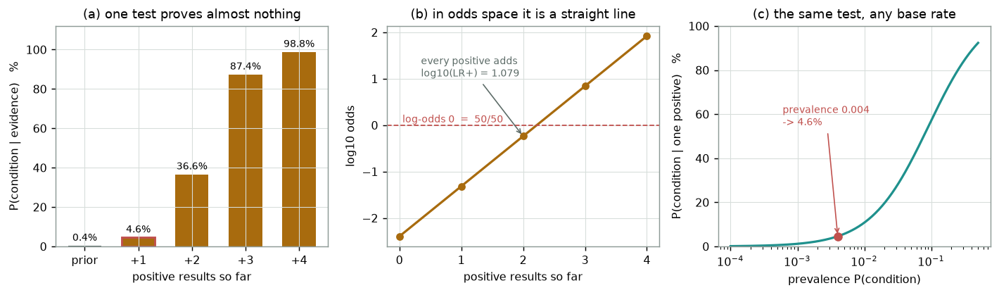

### 2 · Naive Bayes: what "naive" costs

Same data, two models. The naive model can only draw axis-aligned ellipses; the
full-covariance model can tilt them. On deliberately tilted classes that is worth
six points of accuracy.

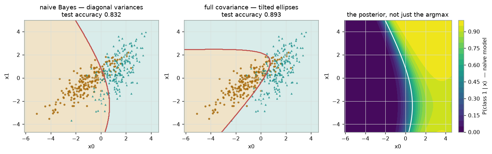

Then the same estimator on 784 raw pixels — no optimiser, no epochs, just
per-class means and variances.

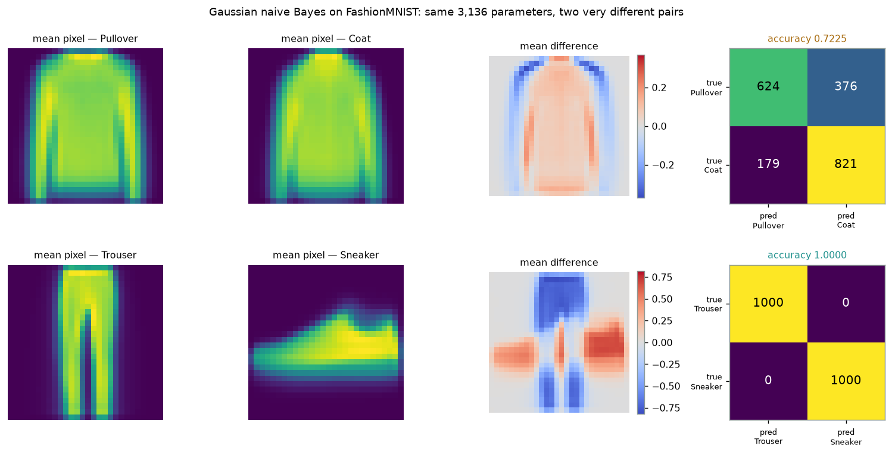

### 3 · k-NN: the boundary as k grows

At k = 1 the boundary is a shredded mess that memorises every training point; by
k = 101 it has all but converged on the true vertical boundary.

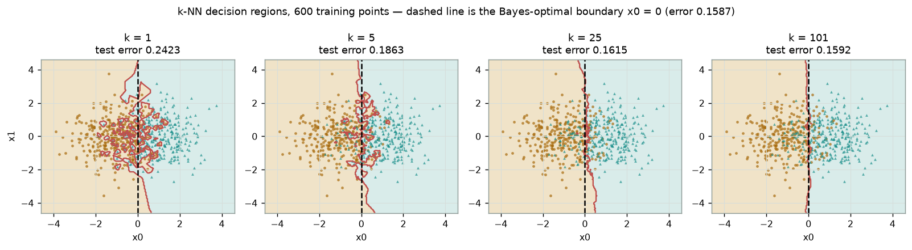

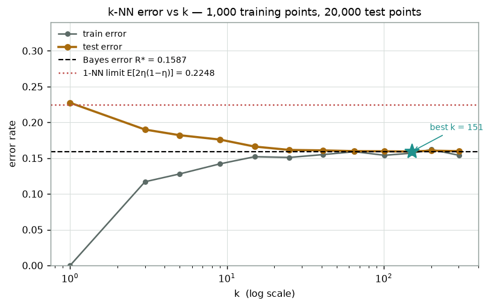

### 4 · Cover-Hart, measured rather than quoted

The shaded band is everything the theorem permits. The 1-NN curve walks into it
and stays.

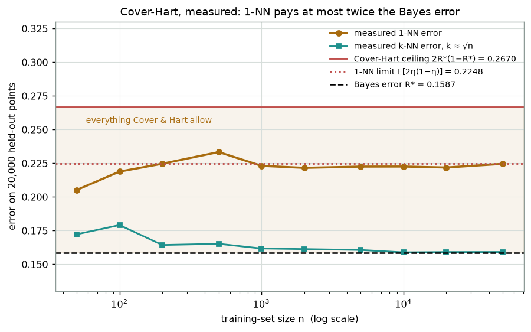

### 5 · PCA: power iteration, and what it finds

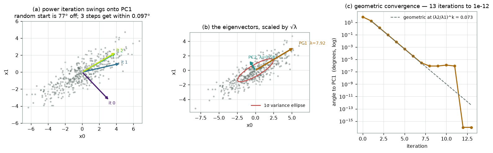

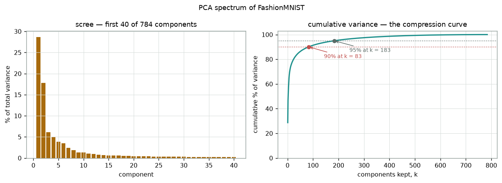

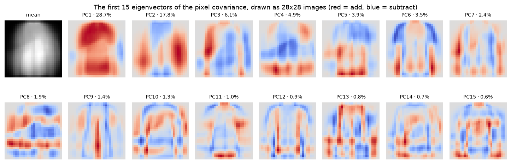

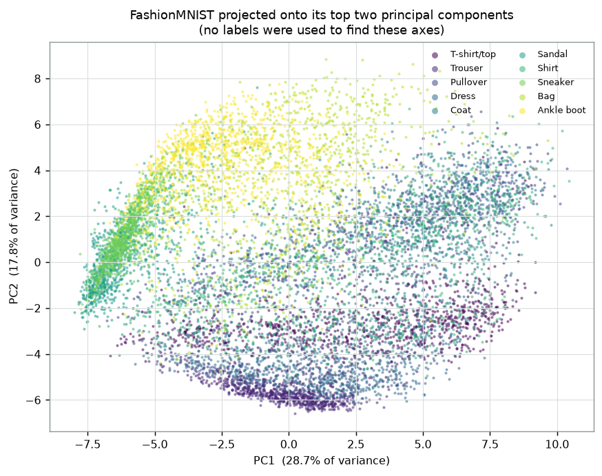

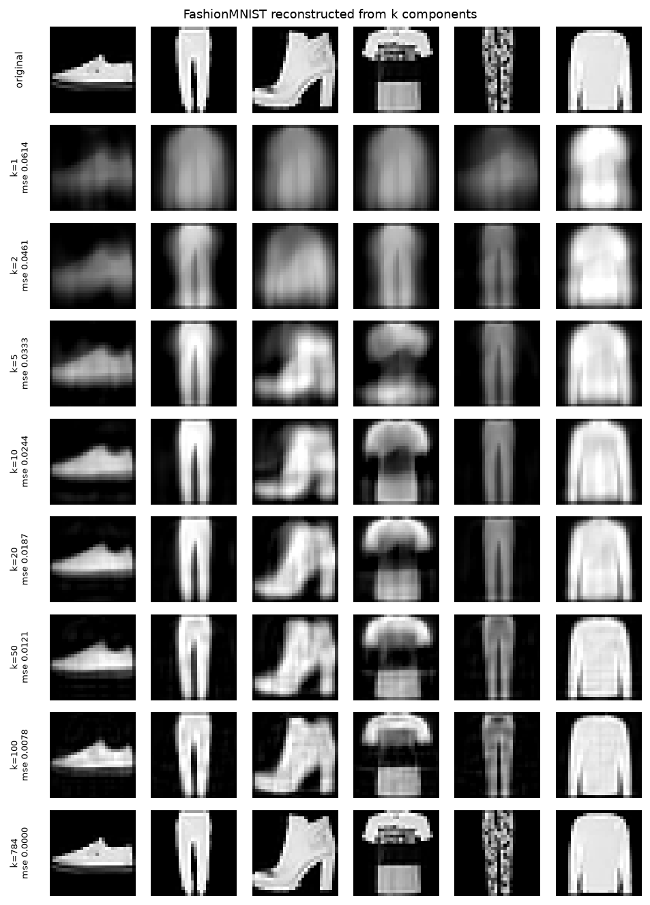

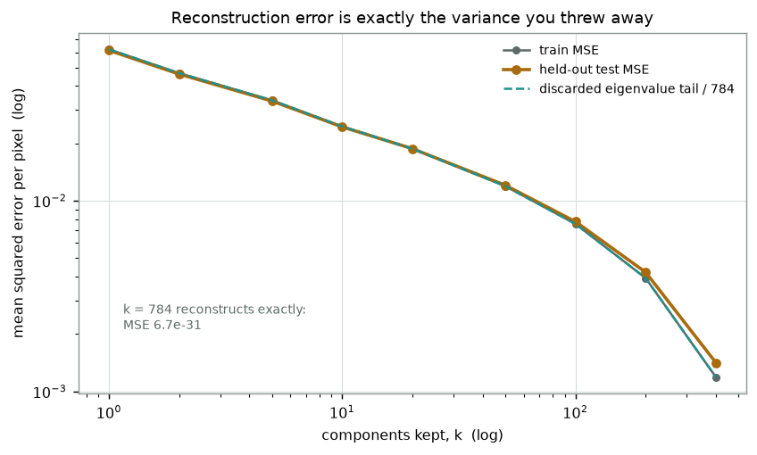

---

## Part 1 — Bayes' rule, and the number everyone gets wrong

Bayes' rule is a definition rearranged:

```
P(H | E) = P(E | H) · P(H) / P(E)
```

*Posterior = likelihood × prior / evidence.* Nothing is being assumed; this is
just what conditional probability means. The interesting part is what it does to
your intuition.

### The worked example

Invented numbers, chosen so the arithmetic stays clean:

| quantity | symbol | value |
|---|---|---|
| prevalence | `P(D)` | 0.004 (4 in 1,000) |
| sensitivity | `P(+ \| D)` | 0.96 |
| specificity | `P(− \| ¬D)` | 0.92 |
| false-positive rate | `P(+ \| ¬D)` | 0.08 |

You test positive. How worried should you be?

```
P(+)     = 0.004 · 0.96  +  0.996 · 0.08  =  0.00384 + 0.07968 = 0.08352
P(D | +) = 0.00384 / 0.08352 = 0.045977  ≈  4.6%
```

**4.6%.** A test that is right 96% of the time on sick people has left you
95.4% likely to be fine. The reason is arithmetic, not paradox: in 1,000 people
there are 4 sick (of whom 3.84 test positive) and 996 healthy (of whom 79.68 test
positive). The false positives outnumber the true ones twenty to one, because
there are 249 times more healthy people to draw them from.

### The same thing in odds, where it is one multiplication

Divide the positive-case Bayes rule by the negative-case one and the evidence
term `P(+)` cancels:

```
posterior odds  =  prior odds  ×  LR+ ,      LR+ = sensitivity / (1 − specificity)
```

Here `LR+ = 0.96 / 0.08 = 12` exactly. Prior odds are `0.004 / 0.996 = 1 : 249`.
So the posterior odds are `12 : 249`, i.e. `p = 12/261 = 0.045977` — the same
answer with no evidence term to compute. Every further independent positive just
multiplies by 12 again:

| positives | 0 | 1 | 2 | 3 | 4 |
|---|---|---|---|---|---|
| P(condition) | 0.400% | **4.598%** | 36.641% | 87.405% | 98.813% |

That is panel (a) of the posterior figure, and (b) is the same table in log-odds, where the update is
a straight line of slope `log₁₀ 12 = 1.079`.

**The honest caveat.** Multiplying by 12 four times assumes the four results are
*conditionally independent given your true status*. Real repeat tests are not:
if your body chemistry is what produces the false positive, it will produce it
again. Test **1** is the reliable number in that table; treat the rest as an
illustration of the mechanism, not of clinical practice.

## Part 2 — Gaussian naive Bayes

Now use the same rule as a classifier. Pick the class with the largest
`P(class) · P(x | class)`. Everything hinges on how you model `P(x | class)`,
and the cheapest possible choice is:

> **the naive assumption**: given the class, the features are independent.

Then `P(x | c) = Π_d P(x_d | c)`, and with each factor a 1-D Gaussian the whole
model is a mean and a variance per feature per class. Fitting it is one pass of
`.mean()` and `.var()` — there is no loss function, no gradient, no epoch. The
implementation is `python/src/origins/bayes.py`, and in log space it reads:

```python
z = ((X - self.theta_[i]) ** 2 / self.var_[i]).sum(axis=1)
norm = np.log(2.0 * np.pi * self.var_[i]).sum()
out[:, i] = self.log_prior_[i] - 0.5 * (norm + z)
```

That `.sum(axis=1)` **is** the naive assumption. A product of densities became a
sum of log-densities, and nothing couples the features.

### What it costs, in 2D

`scripts/naive_bayes.py` builds two Gaussian classes that are deliberately
*correlated* (`corr = +0.85` and `+0.62` in the sample), then fits both the naive
model and the same model with full per-class covariances:

| model | parameters (2 features, 2 classes) | test accuracy (2,000 points) |
|---|---|---|
| naive Bayes, diagonal | 8 | **0.8320** |
| full covariance | 12 | **0.8930** |

Six points of accuracy for four extra numbers. The naive model is not broken —
it is *misspecified*, and the middle panel of the figure shows exactly how: the
axis-aligned boundary cannot follow the tilt of the clouds.

### What it buys, in 784D

Full covariance costs `D(D+1)/2` parameters per class. At `D = 784` that is
**307,720 per class** and a covariance matrix you cannot reliably estimate from
6,000 images, let alone invert. Naive Bayes costs `2D = 1,568` per class. On
FashionMNIST (loaded from the local Hugging Face cache, 6,012 training / 2,000
test images per pair, `var_smoothing = 1e-2`):

| pair | test accuracy | confusion `[[TN FP],[FN TP]]` |
|---|---|---|
| Trouser vs Sneaker | **1.0000** | `[[1000, 0], [0, 1000]]` |
| Pullover vs Coat | **0.7225** | `[[624, 376], [179, 821]]` |

Same model, same 3,136 parameters, same amount of training. Trousers and sneakers
occupy different pixels, so per-pixel means are enough. Pullovers and coats
occupy the *same* pixels and differ in texture and edge placement — exactly the
information that lives in pixel-to-pixel *correlations*, which is exactly what
naive Bayes throws away. Look at the mean-difference panels: the easy pair's is
loud, the hard pair's is a faint outline.

## Part 3 — k-nearest neighbours, and a guarantee

k-NN does not fit anything. It stores the training set, and at query time takes
the majority label of the k closest points. In `origins/knn.py` the distances are
one matmul via `||a−b||² = ||a||² − 2a·b + ||b||²`; the rest is `argpartition`.

### The data with a known answer

Two spherical Gaussians, equal priors, means `(−1, 0)` and `(+1, 0)`, covariance
`I`. Because the covariances are equal, the optimal boundary is the vertical line
`x₀ = 0` and its error rate is available in closed form:

```
R* = Φ(−sep / 2σ) = Φ(−1) = 0.158655
```

Nothing can beat 15.87% on this data. That is not a benchmark, it is a ceiling
built into the distribution — the two classes genuinely overlap.

The posterior is a logistic (all the quadratic terms cancel when the covariances
match): `η(x) = P(y=1 | x) = σ(2x₀)`. A 2-million-point Monte Carlo estimate of
`E[min(η, 1−η)]` gives 0.158622, agreeing with the closed form to 3.3e-05 — the
`scripts/knn_lab.py` sanity check that everything downstream rests on.

### Error vs k

1,000 training points, 20,000 test points:

| k | 1 | 3 | 5 | 9 | 15 | 25 | 65 | 101 | **151** | 201 | 301 |
|---|---|---|---|---|---|---|---|---|---|---|---|
| train error | 0.0000 | 0.1170 | 0.1280 | 0.1420 | 0.1520 | 0.1510 | 0.1590 | 0.1540 | 0.1570 | 0.1620 | 0.1540 |
| test error | 0.2274 | 0.1900 | 0.1821 | 0.1760 | 0.1662 | 0.1615 | 0.1599 | 0.1596 | **0.1593** | 0.1605 | 0.1598 |

Read the first column twice. **Train error at k = 1 is exactly zero** — every
point is its own nearest neighbour — while test error is the worst on the row.
That is the purest example of overfitting in this course: a model with perfect
training accuracy and maximal variance. Raising k averages more labels, variance
falls, and at k = 151 the test error is **1.004 × R\***: within a rounding error
of the best any classifier could do.

### Cover & Hart (1967)

Here is the surprise. Take the dumbest version — k = 1, no averaging at all —
and let the training set grow. Its error does *not* go to R\*, but it cannot run
away either:

```
R*  ≤  lim R_1NN  ≤  R* (2 − M/(M−1) · R*)     ( = 2R*(1 − R*) for two classes )
```

The intuition: as n grows, the nearest neighbour of a query point converges onto
the query point itself, so its label is an independent draw from `η(x)`. Query
and neighbour therefore disagree with probability `2η(1−η)`, and averaging that
over the data gives the limit. For our distribution:

| quantity | value | × R\* |
|---|---|---|
| Bayes error R\* | 0.158655 | 1.000 |
| asymptotic 1-NN error `E[2η(1−η)]` | 0.224758 | 1.417 |
| Cover-Hart ceiling `2R*(1−R*)` | 0.266968 | 1.683 |

And the measurement (20,000 fixed test points, 3 training draws averaged):

| n | 50 | 100 | 200 | 500 | 1,000 | 2,000 | 5,000 | 10,000 | 20,000 | 50,000 |
|---|---|---|---|---|---|---|---|---|---|---|
| 1-NN error | 0.2052 | 0.2188 | 0.2247 | 0.2333 | 0.2231 | 0.2216 | 0.2225 | 0.2226 | 0.2218 | **0.2245** |
| k≈√n error | 0.1723 | 0.1791 | 0.1643 | 0.1652 | 0.1617 | 0.1613 | 0.1606 | 0.1589 | 0.1591 | **0.1591** |

The 1-NN row settles at ≈ 0.222–0.225, against a predicted limit of 0.224758,
and never once exceeds the 0.266968 ceiling. **Half the information in an
infinite labelled dataset is in the label of the single nearest point.**

The second row is the other half of the story: let k grow with n (here k ≈ √n)
and k-NN becomes *consistent* — 0.1591 at n = 50,000, which is 1.003 × R\*. The
condition is `k → ∞` with `k/n → 0`: enough neighbours to average away the noise,
close enough that they are still local.

Two honest notes on the table. The n = 50 and n = 100 entries sit *below* the
asymptotic limit, which looks wrong until you remember the theorem is a statement
about the limit: with very few points the 1-NN cells are enormous and act like a
crude smoother, which happens to help on a distribution this simple. And the row
is noisy — 0.2333 at n = 500 is a 3-draw average, not a converged number.

## Part 4 — PCA by power iteration

Centre the data, form the covariance `C = XᵀX/(n−1)`, and take its eigenvectors.
The top eigenvector is the direction of greatest variance; its eigenvalue *is*
that variance.

### Why multiplying repeatedly works

Write any starting vector in the eigenbasis: `v = Σ cᵢ uᵢ`. Then
`Cᵏv = Σ cᵢ λᵢᵏ uᵢ`. Every component is amplified, but the largest `λ` is
amplified fastest, so after renormalising, everything except `u₁` has shrunk by
`(λᵢ/λ₁)ᵏ`. That is the whole algorithm, and it also tells you the convergence
rate: **the gap ratio `λ₂/λ₁` is the factor the error shrinks by per iteration.**

On the 2-D demo cloud (400 points, built by stretching by `(3.0, 0.8)` and
rotating 30°):

- covariance `[[5.9978, 3.2276], [3.2276, 2.4977]]`
- `λ₁ = 7.9192411088` by power iteration, `7.9192411088` by `eigh` — relative
  difference **0.0e+00**, eigenvector angle **0.0e+00°**
- **13 iterations** to `tol = 1e-12`, with `λ₂/λ₁ = 0.0728` — and panel (c) of the
  power-iteration figure shows the measured error tracking `0.0728ᵏ` exactly until it hits float noise
- recovered PC1 direction **30.77°**, against the 30° the data was built with

### Deflation, and the 784-dimensional check

For the next component, subtract the one you found: `C ← C − λ₁u₁u₁ᵀ`. Every
other eigenpair is untouched (they are orthogonal to `u₁`); this one drops to
zero. Repeat.

Running that for 40 components on the FashionMNIST covariance (10,000 images,
784×784) and comparing every pair against `numpy.linalg.eigh`:

| check | result |
|---|---|
| iterations per component | min 22, median 431, max 3,390 |
| eigenvalue relative error vs `eigh` | max **4.98e-15**, mean 9.81e-16 |
| eigenvector angle vs `eigh` | max **2.7e-06°**, mean 8.2e-07° |

Fourteen significant figures, from an algorithm that is a `for` loop around a
matrix-vector product. The iteration counts are the interesting column: the
components with well-separated eigenvalues converge in tens of iterations, the
ones with near-ties need thousands. That is `(λ₂/λ₁)ᵏ` again, and it is why real
libraries use QR/Lanczos rather than this.

### What the components are

| variance target | components needed (of 784) |
|---|---|
| 50% | **3** |
| 90% | **83** |
| 95% | **183** |
| 99% | **447** |

PC1 alone carries **28.68%** of the total pixel variance, PC2 another 17.82%.
Drawn as images (the eigenimage grid) they are recognisable: PC1 is "how much bright stuff
is in the upper body area", PC2 separates tall narrow things from wide short
things. Nobody told the algorithm about clothes — those are just the directions
the pixels vary in.

Project onto the top two and the classes separate visibly (the projection
scatter), **without
having used a single label to find the axes**. Trousers, bags and footwear land in
distinct regions; the four upper-body garments pile on top of each other, which
is the same fact that made Pullover-vs-Coat hard for naive Bayes.

### Reconstruction: you lose exactly the variance you dropped

Project to k dimensions and come back. Held-out test MSE per pixel:

| k | 1 | 2 | 5 | 10 | 20 | 50 | 100 | 200 | 400 | 784 |
|---|---|---|---|---|---|---|---|---|---|---|
| test MSE | 0.0614 | 0.0461 | 0.0333 | 0.0244 | 0.0187 | 0.0121 | 0.0078 | 0.0042 | 0.0014 | 6.7e-31 |

and the dashed line in the error-vs-k figure is the sum of the *discarded* eigenvalues
divided by 784 — it lies on top of the measured curve, because that identity is
what PCA optimises. At k = 50 (6.4% of the dimensions) the images in the reconstruction grid
are already unmistakable; at k = 100 the fine texture starts coming back.

## Hands-on

Everything lives in `python/`, a `uv` project pinned to Python 3.12.

```bash
cd modules/00b-bayes-knn-pca/python
```

The screening example and its three-panel figure (instant):

```bash
uv run scripts/bayes_screening.py
```

Naive Bayes in 2D and on FashionMNIST (~30 s, reads the local `datasets` cache
and falls back to synthetic data if it is not there):

```bash
uv run scripts/naive_bayes.py
```

k-NN, the accuracy-vs-k sweep and the Cover-Hart measurement (~70 s — the
n = 50,000 runs are the cost):

```bash
uv run scripts/knn_lab.py
```

PCA end to end: power iteration, `eigh` cross-check, scree, projection,
reconstruction (~45 s):

```bash
uv run scripts/pca_lab.py
```

The cross-check suite — our numpy against scikit-learn, `numpy.linalg.eigh` and
closed-form probability, plus the three exercise solutions:

```bash
uv run pytest
```

The code worth reading top to bottom:

- `python/src/origins/bayes.py` — odds updating, `GaussianNaiveBayes`, `GaussianBayes`
- `python/src/origins/knn.py` — `KNN`, and the Cover-Hart quantities
- `python/src/origins/pca.py` — `power_iteration`, `top_eigenpairs`, `PCA`
- `python/src/origins/data.py` — the seeded generators and the FashionMNIST loader

Two JSON files, `python/knn_results.json` and `python/pca_results.json`, hold the
measured numbers; the explorable inlines the scree data from the second.

## Exercises

Skeletons are in `exercises/` (look for `# TODO(you):`), full answers in
`solutions/`. Run them from `python/`, e.g. `uv run ../exercises/ex1_naive_bayes.py`.

1. **`ex1_naive_bayes.py`** — `fit` is written for you; write
   `joint_log_likelihood`. The check compares your log-likelihoods against the
   module's implementation elementwise, and against one number you can verify by
   hand (the score of class 0 at its own mean, `−3.026002`).
2. **`ex2_knn_weighted.py`** — implement the vote tally, both uniform and
   weighted by `1/distance`. Then explain the table it prints: distance
   weighting is *worse* here at every k > 1 (0.1611 vs 0.1596 at k = 101), and
   identical at k = 1. Why?
3. **`ex3_power_iteration.py`** — write power iteration and deflation, then let
   the check hold them against `numpy.linalg.eigh` on a 6×6 matrix and on a real
   784×784 covariance. Leave out the sign-alignment step and watch a negative
   dominant eigenvalue never converge.

## Checkpoint — you should now be able to…

- [ ] compute a posterior from a prior and a likelihood ratio without writing
      down the evidence term;
- [ ] explain why a 96%-sensitive test gives a 4.6% posterior at 0.4% prevalence;
- [ ] state the naive assumption, point at the line of code that is it, and give
      one case where it costs you and one where it saves you;
- [ ] implement k-NN in numpy and explain why train error at k = 1 is zero;
- [ ] state the Cover-Hart bound and describe an experiment that measures it;
- [ ] run power iteration by hand on a 2×2 matrix, and say what `λ₂/λ₁` controls;
- [ ] explain deflation, and why 40 stacked deflations still agree with LAPACK to
      1e-15;
- [ ] read a scree plot and predict reconstruction error from it.

## Where this shows up later

**Bayes** is the shape of every probabilistic loss you will meet: minimising
cross-entropy in [module 01](../01-autograd/README.md) and
[module 02](../02-neural-networks/README.md) is maximising a log-likelihood, and
the `log_prior + log_likelihood` sum you wrote here is the same object a language
model computes over a vocabulary in [module 05](../05-transformers-library/README.md).
The `log-sum-exp` used in `predict_log_proba` is literally the softmax
denominator from [module 04](../04-attention-transformer/README.md).

**Nearest neighbours** is retrieval. Attention in
[module 04](../04-attention-transformer/README.md) is a *soft* k-NN: a query
scores every key by similarity and takes a weighted average of values — same
computation, softmax instead of a top-k majority. The
`||a−b||² = ||a||² − 2a·b + ||b||²` trick you used for the distance matrix is the
same `QKᵀ` matmul, and CLIP's zero-shot classification in
[module 08](../08-vision/README.md) is 1-NN in embedding space.

**Eigenvectors** are the low-rank idea that
[module 06](../06-fine-tuning/README.md) turns into money: LoRA freezes a weight
matrix and learns a rank-r update, betting the useful change lives in a few
directions — the same bet as keeping 83 of 784 components here. The 2-D
projection above is what every embedding visualisation you will see in
[module 08](../08-vision/README.md) is doing, and the scree plot is how you would
choose r.

## What's next

Continue with **[module 00c — Kernels, memory & the modern bridge](../00c-kernels-hopfield/README.md)**,
which takes the margin idea into kernels and the retrieval idea into Hopfield
networks. If you are heading straight for neural networks,
[module 01](../01-autograd/README.md) starts there.

## Sources

- **Cover, T. M. & Hart, P. E. (1967), *Nearest Neighbor Pattern Classification***,
  IEEE Transactions on Information Theory 13(1), 21–27 — the theorem measured in
  part 3: <https://ieeexplore.ieee.org/document/1053964>
- **Pearson, K. (1901), *On Lines and Planes of Closest Fit to Systems of Points
  in Space***, Philosophical Magazine 2(11), 559–572 — PCA's first appearance,
  posed as a least-squares fitting problem rather than an eigenvalue one.
- **Hotelling, H. (1933), *Analysis of a Complex of Statistical Variables into
  Principal Components***, Journal of Educational Psychology 24 — where the name
  and the covariance-eigenvector formulation come from.
- **von Mises, R. & Pollaczek-Geiringer, H. (1929), *Praktische Verfahren der
  Gleichungsauflösung*** — the power method.
- **Anil Ananthaswamy, *Why Machines Learn: The Elegant Math Behind Modern AI*
  (Dutton, 2024)** — recommended reading alongside this track. Its chapters on
  Bayesian reasoning, on nearest neighbours and the curse of dimensionality, and
  on eigenvectors and PCA cover the same territory as this module in narrative
  form, with the historical figures behind each result.
- **FashionMNIST** — Xiao, Rasul & Vollgraf (2017),
  <https://huggingface.co/datasets/zalando-datasets/fashion_mnist>. Loaded here
  from the local Hugging Face cache shared with modules 02 and 09.
- Reference implementations used only as cross-checks in `python/tests/`:
  scikit-learn's `GaussianNB`, `KNeighborsClassifier`, `PCA` and
  `QuadraticDiscriminantAnalysis`.
