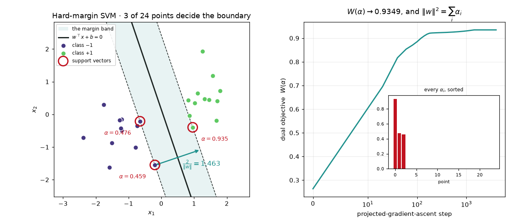
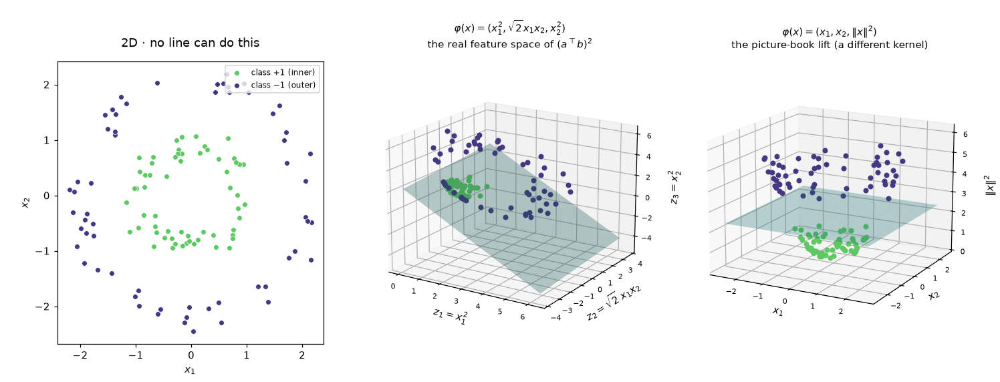
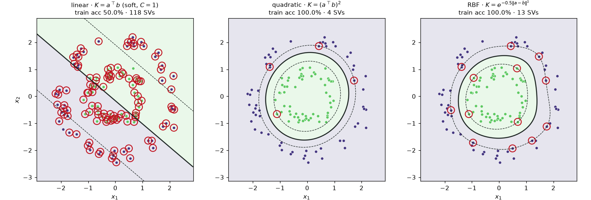
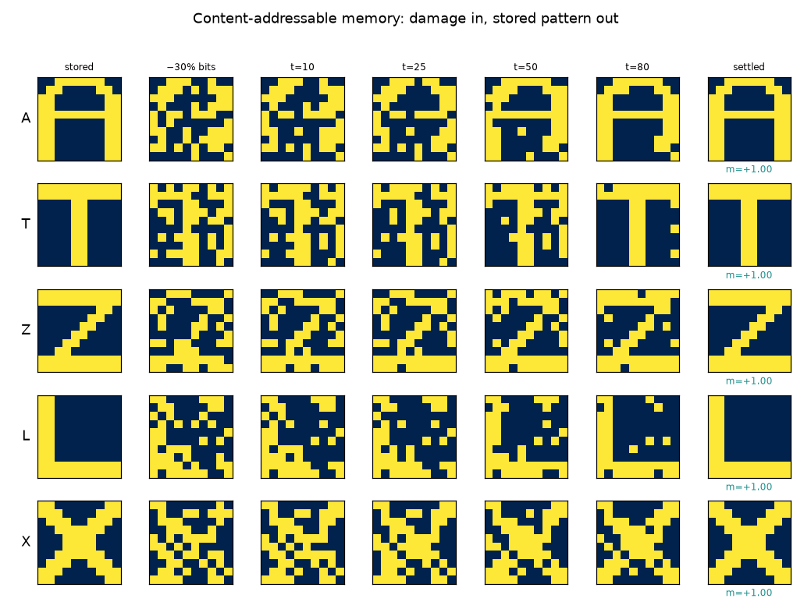
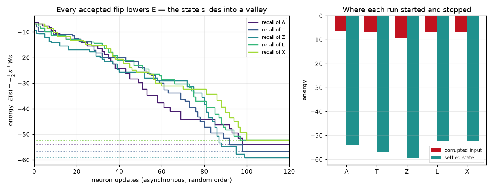
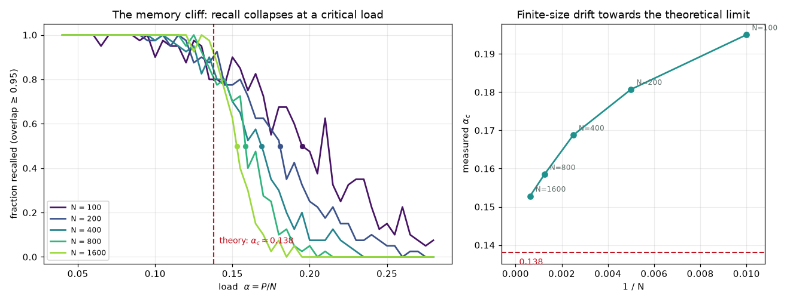
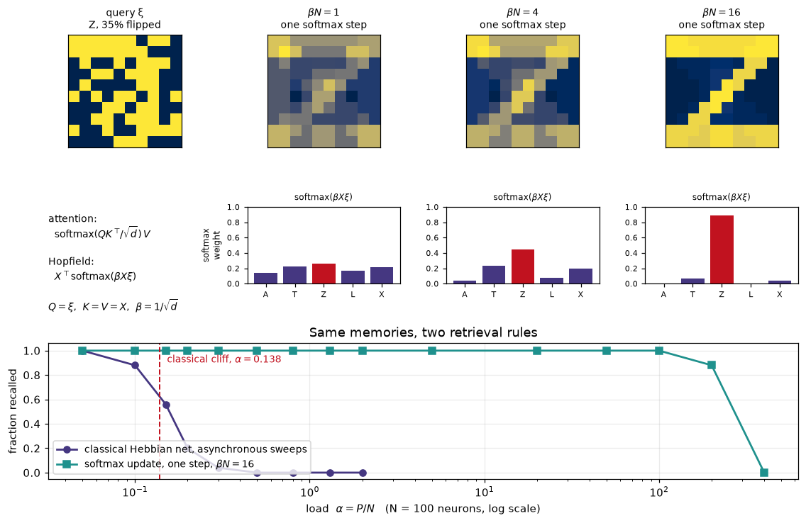
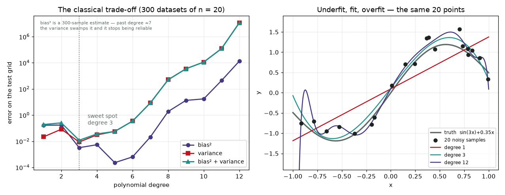
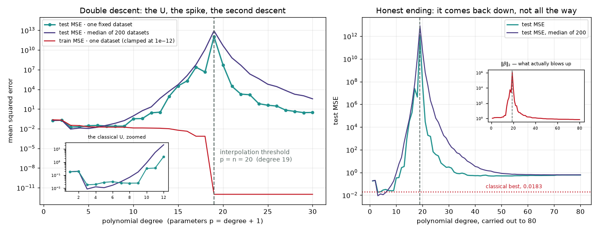

# Module 00c — Kernels, memory & the modern bridge

> Three ideas from before deep learning that refuse to stay in the past. The
> widest gap you can cut between two classes. A way to bend space so a straight
> cut works on curved data. And a network whose memories are the bottoms of
> valleys — which turns out, forty years later, to be an attention layer.

This is the closing module of **Track 0 · Origins**, and the one that reaches
furthest forwards. [Module 00a](../00a-perceptron/README.md) found *a*
separating line; here you find the *best* one, and discover that only a handful
of points had a vote. Then you stop touching the data directly and touch only
inner products, which is the whole kernel trick. Then you build a Hopfield
network, measure exactly how many memories fit in it, and watch the 2020 version
of its update rule turn into `softmax(QKᵀ)V`. Finally you take the textbook
bias–variance curve and break it: past the point where the model can fit the
training data exactly, test error starts falling again.

**🕹 Interactive:** [Double descent & the kernel lift](../../explorables/00c-double-descent.html) —
scrub the polynomial degree and watch the fit, the spike and the second descent
draw themselves live, then send the circles up into three dimensions.

**✅ Quiz:** [10 questions](../../quizzes/00c.html) — check yourself once the
figures are on disk.

## Goals

By the end you can:

- state the **hard-margin SVM** in both primal and dual form and explain what
  the dual buys you;
- solve that dual with **projected gradient ascent**, including the exact
  projection onto {α ≥ 0, αᵀy = 0}, and verify the KKT conditions yourself;
- explain **why only support vectors matter**, and read `α` as a vote count;
- write down the feature map behind a kernel when it is small enough
  (φ(x) = (x₁², √2·x₁x₂, x₂²)) and say why you would never want to for an RBF;
- store patterns in a **Hopfield network**, prove to yourself that asynchronous
  updates can only lower the energy, and repair a corrupted input;
- measure the **0.138·N capacity** rather than quoting it, and explain the
  finite-size gap between your number and the theoretical one;
- line up `Xᵀ softmax(βXξ)` against `softmax(QKᵀ/√d)V` term by term;
- locate the **interpolation threshold** at p = n and explain what the
  minimum-norm solution does on either side of it.

## What you'll see

Every concept here produces a figure. This module ships nine.

**The margin, and the three points that set it.** Twenty-four points, one
boundary, and a `α` next to every point that got a vote. The other twenty-one
have α = 0: delete them and the answer does not move.



**The lift, drawn out longhand.** Concentric rings that no line can split, sent
through φ(x) = (x₁², √2·x₁x₂, x₂²) into three dimensions where an ordinary plane
does the job. The right-hand panel is the picture-book version, (x₁, x₂, ‖x‖²) —
prettier, and a *different* kernel.



**One solver, three kernels.** The same projected-gradient code, the same data;
only `K` changes. The linear panel needs a soft margin to have an answer at all
and still gets 50% — every point becomes a support vector.



**Memory as physics.** Five letters stored in 100 neurons by one outer-product
sum. Destroy 30% of the bits and the network walks back to the original, one
neuron at a time.



**Downhill, always.** The energy trace of those five runs. It never goes up, and
each run stops exactly on the dotted line marking its stored pattern's energy.



**The memory cliff.** Recall fraction against load α = P/N, at five network
sizes. The theoretical threshold is 0.138; the measured one is higher and walks
towards it as N grows, which the right-hand panel plots directly.



**The bridge.** One softmax step retrieves a 35%-destroyed letter, and the bar
chart under it *is* an attention row. Underneath: how far each rule scales.



**And the curve that broke the textbook.** Bias² and variance trade off as
advertised — up to the point where the model has as many parameters as it has
training points. There the error explodes, and then falls again.





## Part 1 — the widest gap

A perceptron stops at the first line that works. There are infinitely many, and
they are not equally good: a line that skims one class will misclassify the next
sample drawn from it. The **max-margin** principle picks the one whose distance
to the nearest point on either side is largest. Fix the scale by demanding
`yᵢ(wᵀxᵢ + b) ≥ 1` and that distance is `2/‖w‖`, so the problem is

```
minimise  ½‖w‖²    subject to  yᵢ(wᵀxᵢ + b) ≥ 1  for all i.
```

A convex quadratic program with linear constraints. Attach a multiplier αᵢ ≥ 0
to each constraint, minimise out `w` and `b`, and you get the **dual**:

```
maximise  W(α) = Σᵢ αᵢ − ½ ΣᵢΣⱼ αᵢαⱼ yᵢyⱼ ⟨xᵢ, xⱼ⟩
subject to  αᵢ ≥ 0   and   Σᵢ αᵢyᵢ = 0,        with  w = Σᵢ αᵢyᵢxᵢ.
```

Two consequences, and they are the reason anyone bothers with the dual.

**Sparsity.** Complementary slackness says `αᵢ·[yᵢ(wᵀxᵢ+b) − 1] = 0`. A point
strictly outside the margin has the bracket positive, so its αᵢ must be zero.
Only points sitting *on* the margin can carry weight. Those are the **support
vectors**, and in the figure above there are exactly **3 of 24**. The other 21
could be deleted and the boundary would not move by a float.

**The data enters only through inner products.** `⟨xᵢ, xⱼ⟩` is the sole
appearance of x in the whole problem, including in the prediction
`f(z) = Σᵢ αᵢyᵢ⟨xᵢ, z⟩ + b`. Hold that thought for part 2.

### Solving it by climbing

`∇W(α) = 1 − Qα` with `Q = (yyᵀ) ⊙ K`. Gradient ascent would leave the feasible
set immediately, so after each step we project back onto it. That projection is
not a heuristic — the KKT conditions of the projection problem say the answer is

```
α = clip(v − μ·y, 0, C)
```

for a single scalar μ, and since y ∈ {−1,+1} the function `μ ↦ α(μ)ᵀy` is
non-increasing, so a bisection finds μ exactly.
[`svm.py:project_feasible`](python/src/kernelmem/svm.py) is fifteen lines and
that is the entire constraint machinery. The step size is `1/λ_max(Q)`, the
largest step that cannot overshoot a quadratic.

4,000 steps on 24 points gives:

| quantity | value |
|---|---|
| support vectors | **3** of 24 |
| w | (1.294725, 0.439761) |
| b | −0.065263 |
| margin `2/‖w‖` | **1.462661** |
| margin `2/√(Σαᵢ)` | 1.462661 |
| smallest `yᵢf(xᵢ)` | 1.000000 |
| `Σαᵢyᵢ` | 1.1e−16 |

The two margin formulas agreeing is not a coincidence: at the optimum
`‖w‖² = Σαᵢ`, so the second one measures the margin *without ever forming w* —
which is what you need once w lives in a space you cannot write down.

`sklearn.svm.SVC(kernel="linear", C=1e6, tol=1e-12)` on the same data returns
the same hyperplane to **2.6e−8** in w and **2.2e−8** in b, and picks the same
three support vectors. That check is
[`tests/test_svm.py`](python/tests/test_svm.py); `sklearn` is a dev dependency
and nothing in `src/` imports it.

## Part 2 — the kernel trick, without the mystery

If the data only ever appears as `⟨xᵢ, xⱼ⟩`, then any function
`K(a,b) = ⟨φ(a), φ(b)⟩` can be dropped in its place and the solver has, without
knowing it, fitted a hyperplane in φ's space. The trick is only interesting
because K is usually far cheaper than φ.

For the homogeneous quadratic kernel in 2D the map is small enough to print:

```
φ(x₁, x₂) = (x₁²,  √2·x₁x₂,  x₂²)

⟨φ(a), φ(b)⟩ = a₁²b₁² + 2a₁a₂b₁b₂ + a₂²b₂² = (a₁b₁ + a₂b₂)² = (aᵀb)²
```

The √2 is load-bearing: drop it and the cross term is counted once instead of
twice. [`lift.py:check_identity`](python/src/kernelmem/lift.py) measures the
identity on real data and gets **1.07e−14** — float noise, as promised.

Fitted on 120 points of concentric rings, the quadratic kernel separates them
perfectly with **4 support vectors**. Recover the plane in feature space,
`w = Σ αᵢyᵢφ(xᵢ) = (−1.2030, +0.1131, −1.0677)`, `b = +2.8000`, and pull it back
to 2D:

```
−1.2030·x₁²  +0.1599·x₁x₂  −1.0677·x₂²  +2.8000 = 0
```

an ellipse with semi-axes 1.526 and 1.619. A near-circle, not exactly one,
because the sampled rings are not exactly symmetric — and the plane really does
tilt to match. Evaluating the fit both ways, through the kernel and through the
explicit φ, agrees to **7.1e−15**.

The third panel of the lift figure shows the map most textbooks draw,
(x₁, x₂, ‖x‖²). It is a legitimate feature map, it makes a nicer picture, and it
belongs to a different kernel (`aᵀb + ‖a‖²‖b‖²`). Worth knowing which one you
are looking at.

The RBF kernel `exp(−γ‖a−b‖²)` needs 13 support vectors for the same data and
has an infinite-dimensional feature space — you could not write φ down if you
wanted to, which is exactly the point of never needing it.

The linear panel is the control. The rings are not linearly separable, so the
*hard*-margin dual has no finite optimum at all; with a box constraint C = 1 it
returns a soft-margin answer of **50.0% accuracy with 118 of 120 points as
support vectors**. When everything is a support vector, nothing was learned.

## Part 3 — memory as a landscape

Take N neurons, each `sᵢ ∈ {−1,+1}`, wire them symmetrically with no
self-connections. To store patterns `ξ¹ … ξᴾ`, do not train anything — just add
them up:

```
W = (1/N) Σ_μ ξ^μ (ξ^μ)ᵀ ,     W_ii = 0
```

Recall is dynamics. With

```
E(s) = −½ sᵀWs
```

update one neuron at a time: `sᵢ ← sign((Ws)ᵢ)`. If that flips sᵢ, the energy
change is `ΔE = −Δsᵢ·(Ws)ᵢ`, and the rule picked the sign that makes
`Δsᵢ·(Ws)ᵢ` positive — so **E can only go down**. It is bounded below, the state
space is finite, so the process stops. The measured largest single-update energy
increase across all five recall runs is **+0.000e+00**.

Where it stops is a local minimum, and the stored patterns are (nearly) exactly
those. So a corrupted input rolls downhill into the clean original: address the
store with a piece of the content and get the whole thing back. Five 10×10
letters, 30% of bits destroyed, all five recovered to overlap **+1.000** — that
is the retrieval figure, and the energy figure is the same five runs plotted
against the number of neuron updates.

### How much fits

Crosstalk between stored patterns digs spurious valleys, and past some load they
swallow the real ones. The statistical-mechanics answer (Amit, Gutfreund &
Sompolinsky, 1985) is `α_c ≈ 0.138` as N → ∞. Measuring it:

| N | measured α_c (50% recall) | patterns at that load |
|---|---|---|
| 100 | 0.1950 | 19.5 |
| 200 | 0.1807 | 36.1 |
| 400 | 0.1688 | 67.5 |
| 800 | 0.1585 | 126.8 |
| 1600 | **0.1528** | 244.4 |

Higher than 0.138, and walking towards it. That gap is the honest part: 0.138 is
an N → ∞ result, and a 100-neuron network is nowhere near infinity. The mean
overlap *at* α = 0.138 stays between 0.94 and 0.97 at every size, which is the
other half of the theory's prediction — retrieval states at the critical load
still carry a few percent of wrong bits.

The five letters in the demo are α = 0.05, comfortably under. They are also
**correlated** (Z and T share their top two rows), which the Hebbian rule assumes
they are not; at 25% corruption, 42 of 50 runs recover cleanly rather than 50.

## Part 4 — the bridge to attention

Replace `sign` with `softmax` and the Hopfield update becomes
(Ramsauer et al., 2020):

```
ξ_new = Xᵀ · softmax(β · X ξ)
```

with the stored patterns as the rows of X. Now line it up:

| attention | Hopfield |
|---|---|
| `softmax(QKᵀ/√d)·V` | `Xᵀ·softmax(β·Xξ)` |
| query Q | the probe ξ |
| keys K | the stored patterns X |
| values V | the stored patterns X |
| `1/√d` | β |

They are the same expression. **An attention layer is doing associative
retrieval**: each token's query pulls a weighted blend out of the patterns
sitting in its context window, once per token, on every forward pass. Module 04's
attention heatmap and the softmax bars in the bridge figure are the same object.

β is the temperature and it decides what kind of memory you have. At `βN = 1`
the softmax is nearly flat and the "retrieved" pattern is a blur of all five
letters — a metastable mixture. At `βN = 16` one weight is **0.894** and the
letter comes back exactly, **in a single step**, where the classical net needed a
hundred neuron updates.

Capacity changes too, and not by a little. At N = 100 neurons and 20% corruption:

| P (patterns) | α = P/N | classical | modern, 1 step |
|---|---|---|---|
| 15 | 0.15 | 0.56 | 1.00 |
| 20 | 0.20 | 0.20 | 1.00 |
| 50 | 0.50 | 0.00 | 1.00 |
| 10,000 | 100 | — | 1.00 |
| 20,000 | 200 | — | 0.88 |
| 40,000 | 400 | — | 0.00 |

The classical rule dies just past its cliff. The softmax rule holds 10,000
patterns in 100 neurons — which is the property a transformer needs, because its
"stored patterns" are however many tokens happen to be in the context.

## Part 5 — bias, variance, and the curve that broke them

Fit a polynomial of degree d to n = 20 noisy samples of `f(x) = sin(3x) + 0.35x`.
Averaged over 300 fresh datasets, the test error splits cleanly:

- **bias²** — how wrong the *average* fit is. Falls as d grows.
- **variance** — how much the fit moves when the data is resampled. Rises.

Their sum is minimised at **degree 3**, with bias² 0.0032 + variance 0.0088 =
0.0120. That is the classical story, and it says clearly: past the sweet spot,
more parameters are worse.

Now keep going. Past degree 19 there are more coefficients than data points and
infinitely many polynomials interpolate the training set exactly. `np.linalg.pinv`
picks the one with the smallest ‖β‖₂ — the **minimum-norm** interpolant. That
choice is doing real work, and it is the same kind of implicit bias gradient
descent brings to an overparameterised network.

| degree | p = d+1 | test MSE (one dataset) |
|---|---|---|
| 3 | 4 | **0.0183** ← classical best |
| 10 | 11 | 0.3309 |
| 18 | 19 | 4.38e+06 |
| **19** | **20 = n** | **1.11e+12** ← the spike |
| 20 | 21 | 5.57e+07 |
| 25 | 26 | 37.95 |
| 30 | 31 | 3.019 |
| 47 | 48 | 0.4825 ← second-descent floor |
| 80 | 81 | 0.5991 |

The peak lands on **degree 19 — exactly p = n**, for the single fixed dataset
and for the median of 200 fresh ones. At that point there is precisely one
interpolant, so "pick the smallest" has nothing to choose from: ‖β‖ hits
**1.26e+06**, against 2.45 at degree 30 and 0.70 at degree 80. It is not the
error that is fundamental, it is the norm.

Training error tells you none of this. It slides down through the U, reaches
**2.07e−18** at the threshold, and stays at machine zero forever after.

### The honest note

Read the last column again. The second descent is real and it is enormous —
twelve orders of magnitude from the spike — but at degree 47 it bottoms out at
0.48, which is **worse** than degree 3's 0.0183. With minimum-norm polynomial
fits on n = 20 points, the far side never beats the classical sweet spot.

Double descent that dips *below* the first minimum shows up in richer settings:
random-feature models, wide neural networks, models where the extra capacity buys
genuinely better interpolants rather than smoother ringing. The shape here is
real; the promise "just make it bigger" is not automatic. It also depends on the
basis — minimum-norm is a statement about *coordinates*, so switching from
Legendre to raw monomials changes both the conditioning and the answer.

## Hands-on walkthrough

Everything lives in `python/`, a `uv` project. Move there first:

```bash
cd modules/00c-kernels-hopfield/python
```

Fit the hard-margin dual and draw the margin, the support vectors and the ascent:

```bash
uv run scripts/svm_margin.py
```

Verify the quadratic identity, lift the circles into 3D, and compare three
kernels through one solver:

```bash
uv run scripts/kernel_lift.py
```

Store five letters, break them, and watch the energy fall:

```bash
uv run scripts/hopfield_demo.py
```

Measure the capacity cliff at five network sizes (~45 s):

```bash
uv run scripts/hopfield_capacity.py
```

Retrieve with softmax instead of sign, and see how far each rule scales:

```bash
uv run scripts/attention_bridge.py
```

Sweep the degree and draw the double-descent curve:

```bash
uv run scripts/double_descent.py
```

Regenerate the numbers the explorable inlines, and run the test suite:

```bash
uv run scripts/export_explorable.py
uv run pytest
```

The code is short and worth reading top to bottom:

- `python/src/kernelmem/svm.py` — kernels, the exact feasible projection, `DualSVM`
- `python/src/kernelmem/lift.py` — the quadratic feature map, written out
- `python/src/kernelmem/hopfield.py` — storage, recall, energy, capacity, softmax update
- `python/src/kernelmem/polyreg.py` — Legendre features and minimum-norm fits

## Exercises

Skeletons are in `exercises/` (look for `# TODO(you):`), full answers in
`solutions/`. Each file is standalone and checks itself. Run them from the
`python/` directory, e.g. `uv run ../exercises/ex1_dual_solver.py`.

1. **`ex1_dual_solver.py`** — write `dual_gradient` and `project_feasible`, the
   two functions the whole SVM stands on. The checker verifies the KKT
   conditions: support vectors exactly on the margin, nothing inside it, and
   `‖w‖² = Σαᵢ`. Get it right and you reproduce the margin 1.4627 above.
2. **`ex2_hopfield.py`** — write the Hebbian rule, the asynchronous update and
   the capacity sweep. Repair three corrupted letters, then measure α_c at
   N = 100, 400 and 1600 and watch it drift towards 0.138.
3. **`ex3_double_descent.py`** — write the minimum-norm fit and find the peak.
   Then change `N_TRAIN` from 20 to 30 and confirm the threshold follows n
   rather than staying put.

## Checkpoint — you should now be able to…

- [ ] write the SVM dual from the primal and say what complementary slackness
      implies about points outside the margin;
- [ ] project a vector onto {α ≥ 0, αᵀy = 0} and explain why a bisection on one
      scalar is enough;
- [ ] compute a margin two ways — `2/‖w‖` and `2/√(Σαᵢ)` — and say which one
      survives kernelisation;
- [ ] expand `(aᵀb)²` into an explicit feature map and point at the √2;
- [ ] argue that asynchronous Hopfield updates terminate, from the sign of ΔE;
- [ ] state the 0.138 capacity, and explain why your own measurement is higher;
- [ ] map every symbol of `softmax(QKᵀ/√d)V` onto `Xᵀsoftmax(βXξ)`;
- [ ] locate the interpolation threshold from n alone, and predict what ‖β‖ does
      there.

## Where this shows up later

**Kernels are similarity, and attention is a similarity function.** The dual's
`f(z) = Σᵢ αᵢyᵢ K(xᵢ, z) + b` weights every stored example by how similar it is
to the query and sums — which is what one row of
[module 04](../04-attention-transformer/README.md)'s `softmax(QKᵀ)V` does, with
learned similarity in place of a fixed kernel and softmax weights in place of α.
The Gram matrix you built here is `QKᵀ` with the labels stripped out.

**Hopfield is attention's other parent.** The equivalence in part 4 is exact, and
it is why module 04's attention map reads as retrieval rather than as arithmetic.
Every time a token in module 05 pulls information from a token 300 positions back,
that is a probe finding a valley.

**Support vectors are the sparsity intuition** behind everything that prunes:
most of the data, most of the weights, most of the rank does not matter.
[Module 06](../06-fine-tuning/README.md)'s LoRA is the same bet in a different
coordinate system — the useful part of a weight update lives in a few directions,
the way the useful part of a dataset lives in a few points.

**Double descent is why the training curves in
[module 02](../02-neural-networks/README.md) and
[module 06](../06-fine-tuning/README.md) behave the way they do.** A modern
network is enormously past its interpolation threshold, which is the regime on
the *right* of the spike — the reason a 3-billion-parameter model fine-tuned on a
few thousand examples is not automatically garbage, and the reason "reduce
capacity to reduce overfitting" is no longer reliable advice. The minimum-norm
solution you computed with `pinv` is the closest thing in this course to what
SGD's implicit bias does at scale.

## What's next

Track 0 ends here. Continue with [module 01](../01-autograd/README.md), which
replaces every closed-form solution in this track with a gradient, and then
[module 02](../02-neural-networks/README.md), where the training curves you were
just warned about start appearing for real. If you want the attention side first,
[module 04](../04-attention-transformer/README.md) picks up part 4 directly.

## Sources

- **Boser, B., Guyon, I. & Vapnik, V. (1992), *A Training Algorithm for Optimal
  Margin Classifiers***, COLT '92 — the kernel trick's first appearance in a
  margin classifier: <https://doi.org/10.1145/130385.130401>
- **Cortes, C. & Vapnik, V. (1995), *Support-Vector Networks***, Machine Learning
  20(3), 273–297 — the soft margin and the box constraint C:
  <https://doi.org/10.1007/BF00994018>
- **Mercer, J. (1909), *Functions of Positive and Negative Type***,
  Philosophical Transactions of the Royal Society A 209 — the condition under
  which a kernel has a feature map at all.
- **Hopfield, J. J. (1982), *Neural Networks and Physical Systems with Emergent
  Collective Computational Abilities***, PNAS 79(8), 2554–2558 — the energy
  function and the storage rule: <https://doi.org/10.1073/pnas.79.8.2554>
- **Amit, D., Gutfreund, H. & Sompolinsky, H. (1985), *Storing Infinite Numbers
  of Patterns in a Spin-Glass Model of Neural Networks***, Physical Review
  Letters 55(14), 1530–1533 — where α_c ≈ 0.138 comes from:
  <https://doi.org/10.1103/PhysRevLett.55.1530>
- **Ramsauer, H. et al. (2020), *Hopfield Networks is All You Need***,
  arXiv:2008.02217 — the continuous update of part 4 and its identity with
  transformer attention: <https://arxiv.org/abs/2008.02217>
- **Belkin, M., Hsu, D., Ma, S. & Mandal, S. (2019), *Reconciling Modern
  Machine-Learning Practice and the Classical Bias–Variance Trade-off***,
  PNAS 116(32), 15849–15854 — double descent, named:
  <https://doi.org/10.1073/pnas.1903070116>
- **Nakkiran, P. et al. (2019), *Deep Double Descent: Where Bigger Models and
  More Data Hurt***, arXiv:1912.02292 — the same shape in deep networks, plus
  epoch-wise double descent: <https://arxiv.org/abs/1912.02292>
- Recommended reading: Anil Ananthaswamy, *Why Machines Learn: The Elegant Math
  Behind Modern AI* (Dutton, 2024) — the chapters on support vector machines and
  the kernel trick, on Hopfield networks and associative memory, and the closing
  discussion of double descent tell the historical story behind this module in
  narrative form.
