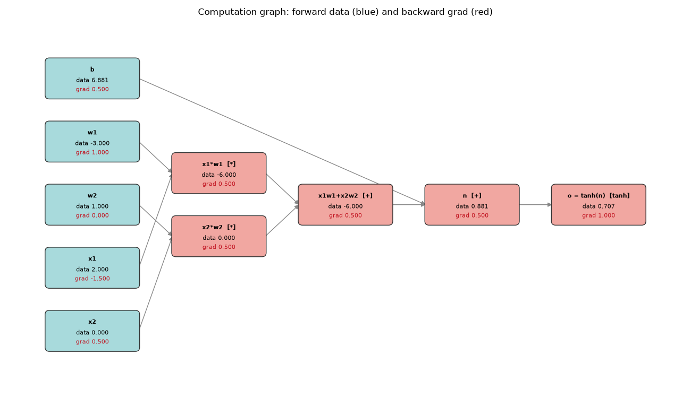
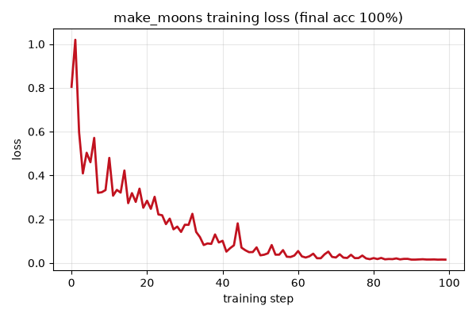
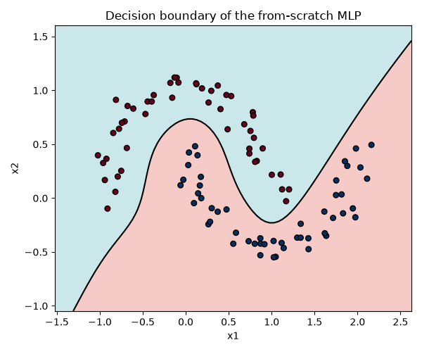
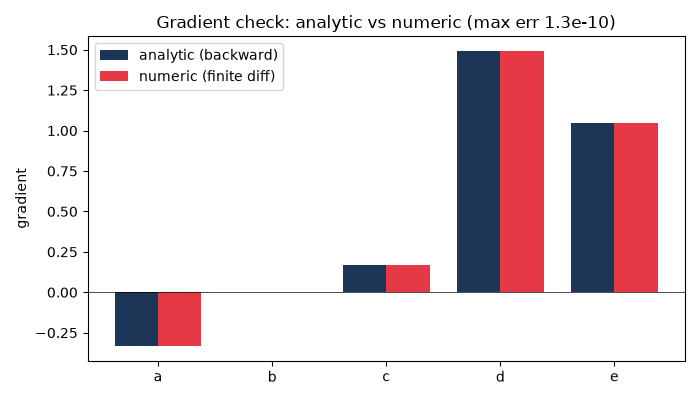
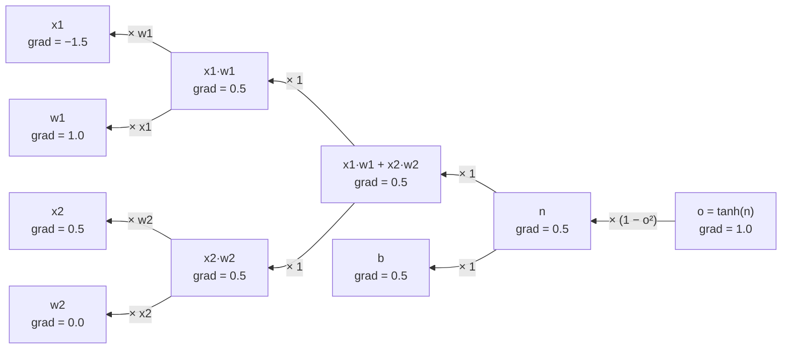

# Module 01 — Autograd from scratch

> The single idea underneath every neural network: build a graph of tiny
> operations, then let gradients flow **backwards** through it. Get this and the
> rest of deep learning is bookkeeping.

In this module you build a **scalar automatic-differentiation engine** — a
`Value` type that records every `+`, `*`, `tanh`, `exp`, `pow`, `relu` you apply
to it, then differentiates the whole expression with one call to `backward()`.
On top of it you build a tiny MLP and train it to classify the two-moons dataset
to 100% accuracy. Then you do it **again in Zig**, so you can see the same
algorithm with all of its memory and ownership made explicit.

This is a from-scratch reconstruction of Karpathy's
[micrograd](https://github.com/karpathy/micrograd), extended with a second
language lane and a graphical-first treatment.

**🕹 Interactive:** [Gradient descent & backprop](../../explorables/01-gradient-descent.html) —
roll a ball down a loss surface at the learning rate you pick, then step this
module's computation graph forward and backward in your browser.

## Goals

By the end you can:

- explain reverse-mode autodiff as **message passing on a graph**;
- implement the backward pass for `+`, `*`, `pow`, `exp`, `tanh`, `relu`;
- run a **topological sort** and understand why the reverse order is required;
- **gradient-check** an engine numerically and catch a wrong derivative;
- train a from-scratch MLP to convergence and read its **decision boundary**;
- map every line of the Python engine onto its Zig counterpart.

## What you'll see

Every concept in this course produces a figure you can look at. This module ships four.

**A computation graph, with forward values (blue) and gradients (red).**
One tanh neuron, `o = tanh(x1*w1 + x2*w2 + b)`, after `backward()`. Read it
right-to-left to watch gradient flow from the output back to every input.



**The training loss** falling as the MLP learns make_moons:



**The decision boundary** the trained network carves out — the two interleaving
moons, cleanly separated:



**A gradient check**: analytic gradients (from `backward()`) vs numerical
finite-difference estimates. They agree to ~1e-10, which is how you *know* the
engine is correct:



## Theory in one minute — the chain rule as message passing

An expression is a directed acyclic graph. Each node holds a value (the
**forward** pass) and, after we run **backward**, a gradient
`∂(output)/∂(node)`.

Backprop is one rule applied everywhere: a node takes the gradient arriving from
its output, multiplies by its own **local derivative**, and adds the result into
each input. Do this in reverse topological order — every consumer before its
producer — and each node's gradient is complete by the time it passes messages on.



Each arrow is "multiply the incoming gradient by this local derivative." That is
the entire algorithm. A full side-by-side derivation in Python **and** Zig lives
in [ALGORITHM.md](ALGORITHM.md).

## Hands-on walkthrough (Python lane)

Everything lives in `python/`, a `uv` project. Move there first:

```bash
cd modules/01-autograd/python
```

Draw the computation graph above (values **and** gradients labelled). If the
graphviz `dot` binary is installed it is used; otherwise the graph is laid out
with pure matplotlib — no system packages required:

```bash
uv run scripts/computation_graph.py
```

Train the MLP on make_moons and produce the loss curve and decision-boundary figures:

```bash
uv run scripts/train_moons.py
```

Convince yourself the gradients are right by checking them against finite differences:

```bash
uv run scripts/grad_check.py
```

The engine itself is small and worth reading top to bottom:

- `python/src/micrograd/engine.py` — the `Value` class and `backward()`
- `python/src/micrograd/nn.py` — `Neuron`, `Layer`, `MLP` built on `Value`
- `python/src/micrograd/draw.py` — the graph renderer (graphviz or matplotlib)

## The Zig lane

The same scalar engine, rewritten in Zig 0.16. Where Python attaches a *closure*
to each node, Zig stores the operation as an `Op` enum and the children as array
indices, and the backward pass is one `switch`. Nodes live in a single
arena-backed `ArrayList` that is reused across training steps. Read
[ALGORITHM.md](ALGORITHM.md) for the line-by-line comparison.

Both languages train on the **exact same data**: `python/scripts/gen_zig_data.py`
samples make_moons and writes it to `zig/moons_data.zig` as a Zig array, so the
two lanes are directly comparable.

Regenerate the shared dataset (optional — a copy is committed):

```bash
uv run scripts/gen_zig_data.py
```

Then train the Zig MLP and print its loss table (run from the `zig/` directory):

```bash
cd ../zig && zig run main.zig
```

Or via the build script:

```bash
zig build run
```

You'll watch accuracy climb from ~43% to ~95% on the 40-point sample:

- `zig/engine.zig` — `Engine`, `Node`, the ops, and topological `backward()`
- `zig/nn.zig` — the persistent-parameter MLP
- `zig/main.zig` — the training loop and loss table
- `zig/build.zig` — a minimal build with a `run` step

## Exercises

Skeletons are in `exercises/` (look for `# TODO(you):`), full answers in
`solutions/`. Run them from the `python/` directory, e.g.
`uv run ../exercises/ex1_exp_pow.py`.

1. **`ex1_exp_pow.py`** — the engine has `exp` and `pow` forward passes but no
   backward. Write the two `_backward` closures; a built-in gradient check tells
   you when they're right.
2. **`ex2_relu.py`** — implement a `relu` op (forward + backward), switch the
   network's nonlinearity to ReLU, and retrain on make_moons.
3. **`ex3_gradcheck.py`** — one operation in `exercises/buggy_engine.py` has a
   wrong backward pass. Write a numerical gradient checker and let it point at
   the guilty op. (No peeking — let the math find it.)

## Checkpoint — you should now be able to…

- [ ] draw a computation graph and annotate each node with its value and gradient;
- [ ] implement `backward()` for a new op by writing its local derivative;
- [ ] explain why backward walks the graph in **reverse topological order**;
- [ ] gradient-check an engine and interpret a mismatch;
- [ ] train a scalar-autograd MLP to separate make_moons and plot its boundary;
- [ ] read the Zig engine and point to the line that corresponds to any Python line.

## What's next

You just built the machinery that PyTorch and JAX scale up to billions of
parameters. The natural next step is to see that same idea powering large
language models. Continue with the **Hugging Face LLM Course, Chapter 1**:
<https://huggingface.co/learn/llm-course/chapter1>.

Reference for this module: Karpathy's original
[micrograd](https://github.com/karpathy/micrograd).
