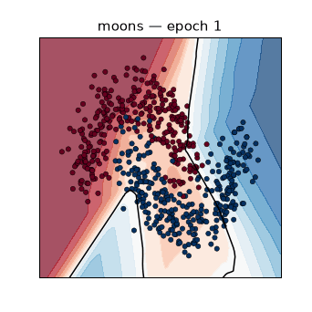
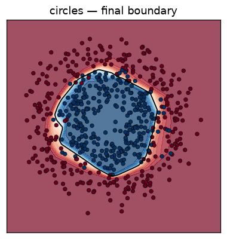
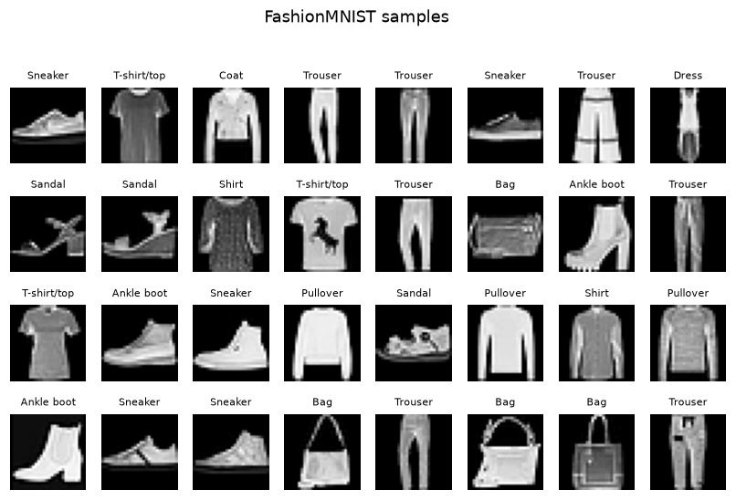
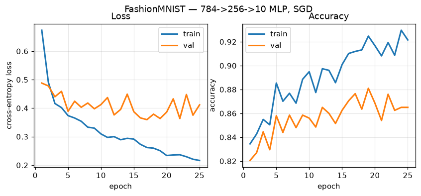
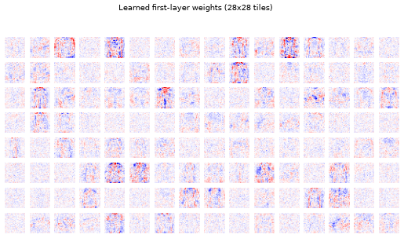
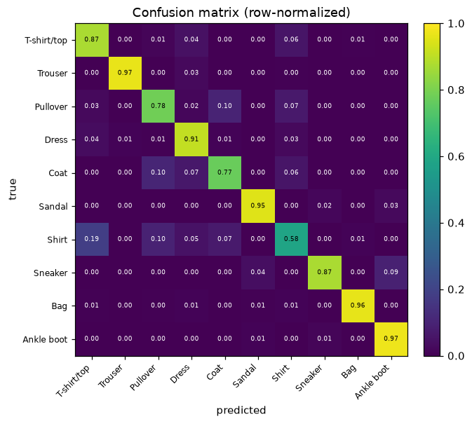
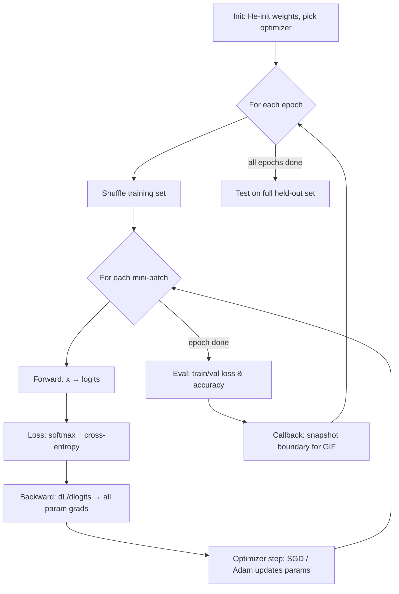

# Module 02 — Neural networks & the training loop

*From scalar autograd to real data.* In module 01 you built a scalar autograd
engine. Here we scale up: a small neural-network library in **pure NumPy** with
a **manual, hand-derived backward pass**, a real **mini-batch SGD training
loop**, and two things to train it on — 2D toy datasets you can *watch* learn,
and **FashionMNIST** loaded from the Hugging Face Hub. No PyTorch: the whole
point is to derive backprop yourself and see it work on real images.

**🕹 Interactive:** [Neural-net playground](../../explorables/02-nn-playground.html) —
this module's from-scratch net, ported to JavaScript and training live on two
moons while you watch the decision boundary bend.

**✅ Quiz:** [10 questions](../../quizzes/02.html) — check yourself once the training loop runs.

## Goals

By the end you will be able to:

- Implement `Linear`, `ReLU`, and a fused **softmax + cross-entropy** loss with
  forward *and* backward passes derived by hand — and verify them with a
  numerical gradient check.
- Write the training loop from scratch: train/val split, mini-batches, forward,
  backward, optimizer step, per-epoch metrics.
- Train an MLP to **≥85% test accuracy on FashionMNIST**, honestly measured on
  the full 10k test set.
- Produce the graphical intuition: a decision boundary **animating** as it
  trains, loss/accuracy curves, learned first-layer weights, and a confusion
  matrix.
- Understand why frameworks lean on optimized matmul kernels (the Zig sidebar).
- Meet the Hugging Face `datasets` ecosystem for the first time.

## What you'll see

The signature visual — an MLP bending its decision boundary around `make_moons`
as training proceeds (each frame is a training epoch):



The same architecture on concentric circles, final boundary:



FashionMNIST — a sample of the raw data with labels:



Training and validation curves for the `784 → 256 → 10` MLP:



What the first layer *learned* — each tile is one hidden unit's 784 incoming
weights reshaped to 28×28. Red/blue are positive/negative weights; you can see
edge- and stroke-detector templates emerge:



Where the model confuses classes (row-normalized). The bright off-diagonal
Shirt ↔ T-shirt/Coat/Pullover block is the classic FashionMNIST failure mode:



## Theory — forward and backward as a layered chain rule

A neural net is a **composition of functions**. Data flows *forward* through the
layers to a loss; gradients flow *backward* by the chain rule. That is the whole
idea — everything else is bookkeeping.

For our MLP the forward pass is:

```
x → [Linear W1,b1] → h1 → [ReLU] → a1 → [Linear W2,b2] → logits → [softmax+CE] → loss
```

Each layer caches what it needs, then backprop walks the same chain in reverse,
handing each layer `dL/d(its output)` and asking for `dL/d(its input)` plus its
parameter gradients:

- **Linear** `y = xW + b` → `dL/dW = xᵀg`, `dL/db = Σ g`, `dL/dx = g Wᵀ`
- **ReLU** `y = max(0,x)` → `dL/dx = g · [x > 0]`
- **Softmax + cross-entropy** (fused) → `dL/d(logits) = (softmax − onehot)/N`

That last gradient is famously clean *because* we fuse the softmax and the loss;
you derive it yourself in exercise (a). All three are checked against finite
differences in the library's gradient check (see below), so you never have to
wonder whether the math is right.

### The training loop



The code mirrors this diagram one-to-one — read `python/src/train.py` alongside
it.

## Hands-on

Everything runs with `uv`. Work from the `python/` directory:

```bash
cd modules/02-neural-networks/python
```

Sync the environment (numpy, matplotlib, datasets, pillow, scikit-learn):

```bash
uv sync
```

Sanity-check the manual backward pass with a numerical gradient check:

```bash
uv run python solutions/ex_a_softmax_backward.py
```

Train on the 2D toy data and render the decision-boundary GIF:

```bash
uv run python train_toy.py
```

Train the MLP on FashionMNIST to ≥85% test accuracy and emit all four figures:

```bash
uv run python train_fashion.py
```

The FashionMNIST run downloads ~30MB the first time (cached under
`~/.cache/huggingface`; nothing is committed to the repo). Representative
output — the full test accuracy is printed at the end:

```
epoch  25/25 | train loss 0.216 acc 0.921 | val loss 0.411 acc 0.865
FINAL TEST ACCURACY (full 10k set): 0.8646
```

## The library at a glance (`python/src/`)

| file        | contents                                                        |
| ----------- | --------------------------------------------------------------- |
| `nn.py`     | `Linear`, `ReLU`, `softmax`, fused `SoftmaxCrossEntropy`, `MLP` |
| `optim.py`  | `SGD` (with momentum) and `Adam`, both from scratch             |
| `train.py`  | train/val split, mini-batch iterator, the training loop         |
| `data.py`   | toy datasets + FashionMNIST via Hugging Face `datasets`         |
| `plots.py`  | every figure helper (curves, tiles, confusion, boundary)        |

## Hugging Face ecosystem — first contact

This is the course's first use of the Hugging Face Hub, and you'll see much more
of it later. There are two ways to get a dataset, and it's worth knowing both.

**In code**, `datasets` fetches, caches, and hands you ready-to-use splits:

```python
from datasets import load_dataset
ds = load_dataset("zalando-datasets/fashion_mnist")
ds["train"][0]  # {'image': <PIL 28x28>, 'label': 9}
```

(The canonical FashionMNIST now lives under the `zalando-datasets` namespace;
the bare `fashion_mnist` alias is legacy.)

**From the CLI**, `hf download` grabs a raw snapshot of the repo's files — handy
for inspecting exactly what's in a dataset, or pre-fetching in a Dockerfile:

```bash
hf download zalando-datasets/fashion_mnist --repo-type dataset
```

`load_dataset(...)` is what you want for training (it gives you typed,
memory-mapped Arrow tables); `hf download` is what you want for plumbing and
inspection. For the full story — streaming, `map`, filtering, splits — see the
Hugging Face LLM course, Datasets chapter:
<https://huggingface.co/learn/llm-course/chapter5>.

## Performance sidebar — why frameworks use optimized kernels (`zig/`)

The forward pass is dominated by one matmul, `X(256,784) @ W(784,256)`. The Zig
program implements it three ways — naive, cache-reordered, and blocked — and
times them, then we compare against numpy's BLAS.

```bash
cd ../zig && zig build run
```

Representative results on an Apple M5 (Zig 0.16, `ReleaseFast`, single thread):

| variant                        | time (ms) | GFLOP/s | speedup |
| ------------------------------ | --------: | ------: | ------: |
| naive (ijk)                    |    31.06  |    3.31 |  1.00x  |
| reordered (ikj)                |    13.79  |    7.45 |  2.25x  |
| blocked (tiled)                |    12.88  |    7.98 |  2.41x  |
| **numpy `@` (Accelerate BLAS)**|   **0.058** | **1773** | **~740x** |

Reordering the loops alone is a 2.25x win — same FLOPs, same result, just
cache-friendly access. And numpy is *another* two-plus orders of magnitude
beyond our best hand-written loop, because it dispatches to a hand-tuned BLAS
`sgemm`. That gap is the whole reason deep-learning frameworks are a thin layer
over compiled kernels. Full write-up and the numpy measurement:
[`zig/PERFORMANCE.md`](./zig/PERFORMANCE.md).

## Exercises

Skeletons in [`python/exercises/`](./python/exercises) with `# TODO(you):`
markers; verified answers in [`python/solutions/`](./python/solutions). Each
exercise runs standalone and tells you whether you got it right.

**(a) Derive & implement the softmax + cross-entropy backward.** The forward is
given; you write the two-line gradient and pass the numerical gradient check.

```bash
uv run python exercises/ex_a_softmax_backward.py   # GRADCHECK: FAIL until you fill it in
```

**(b) Add a second hidden layer and compare curves.** Build a `784→256→128→10`
net next to the `784→256→10` one and see whether depth helps here (spoiler:
capacity isn't the bottleneck on this small setup). Produces
`figures/ex_b_depth_comparison.png`.

```bash
uv run python exercises/ex_b_deeper_net.py
```

**(c) Implement Adam and compare against SGD.** Fill in the Adam update and race
it against SGD+momentum. Produces `figures/ex_c_adam_vs_sgd.png`.

```bash
uv run python exercises/ex_c_adam.py
```

Check your work against the solutions:

```bash
uv run python solutions/ex_c_adam.py
```

## Checkpoint — you should now be able to…

- [ ] Derive the backward pass of Linear, ReLU, and softmax+cross-entropy, and
      confirm each with a numerical gradient check.
- [ ] Explain backprop as a layered application of the chain rule, forward cache
      then reverse sweep.
- [ ] Write a mini-batch training loop with a train/val split and per-epoch
      metrics — no framework.
- [ ] Train an MLP to ≥85% test accuracy on FashionMNIST and read its curves,
      learned weights, and confusion matrix.
- [ ] Implement and contrast SGD(+momentum) and Adam.
- [ ] Load a dataset with `datasets.load_dataset` and fetch a snapshot with
      `hf download`.
- [ ] Explain why `x @ W` in numpy is ~100–700x faster than a tidy hand-written
      loop, and why frameworks depend on BLAS-class kernels.

## Links

- Hugging Face `datasets` documentation: <https://huggingface.co/docs/datasets>
- Hugging Face LLM course, Datasets chapter:
  <https://huggingface.co/learn/llm-course/chapter5>
- Zig performance sidebar: [`zig/PERFORMANCE.md`](./zig/PERFORMANCE.md)
