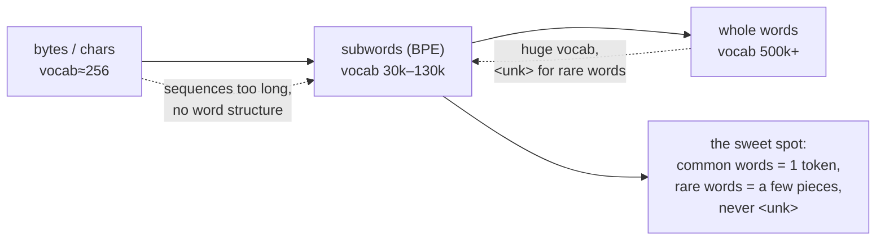
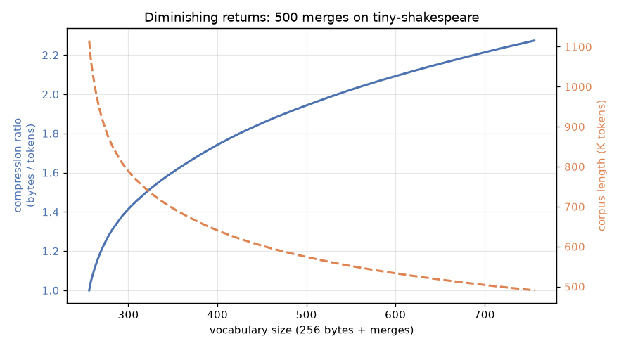
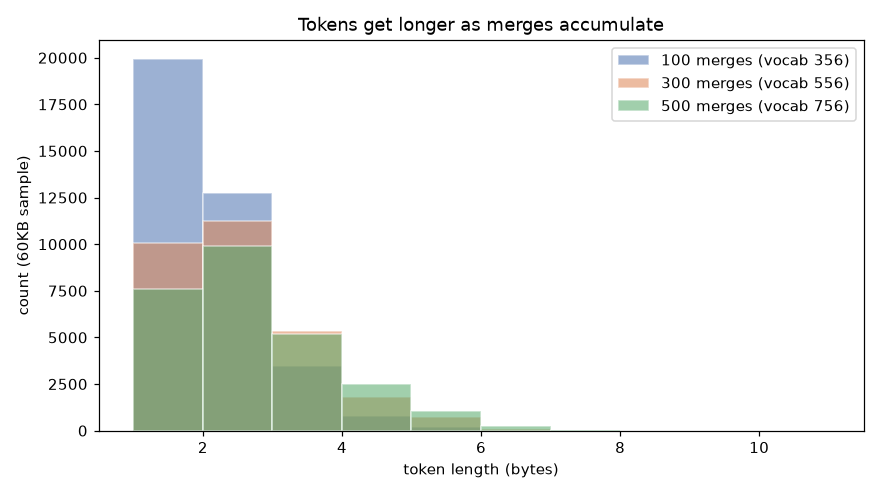
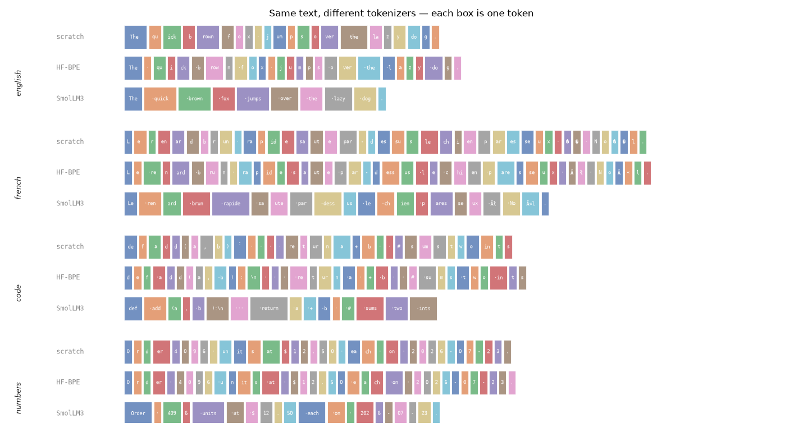
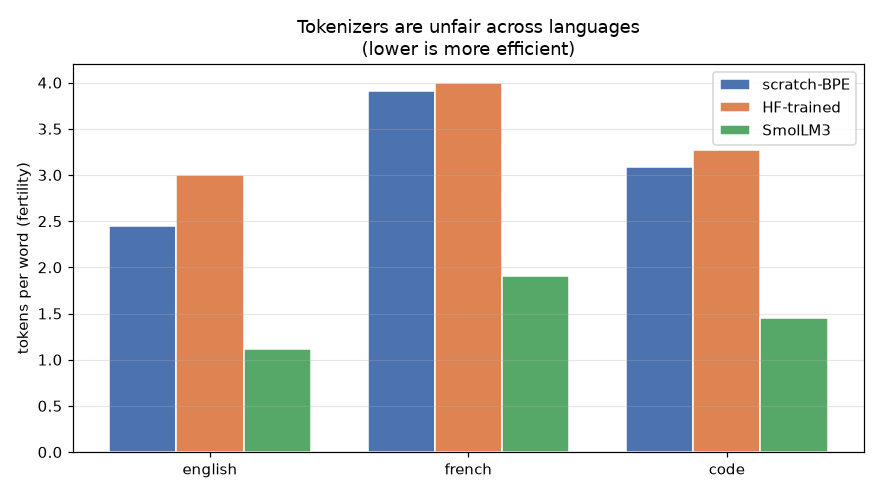

# Module 03 — Tokenization: from bytes to tokens

Before a language model sees a single number, something has to chop text into
pieces. That something is the **tokenizer**, and its choices ripple through
everything: context length, cost, which languages are cheap, even which
arithmetic a model can do. In this module you build a byte-level **BPE**
(Byte-Pair Encoding) tokenizer *from scratch* — twice, once in Python and once
in Zig — then graduate to the Hugging Face way and compare your toy against
SmolLM3's production 128k-token tokenizer.

**🕹 Interactive:** [BPE, one merge at a time](../../explorables/03-bpe-stepper.html) —
step through the real first 60 merges your trainer learns on tiny-shakespeare,
then apply them to text you type.

## Goals

By the end you will be able to:

- explain why modern LLMs tokenize at the **subword** level, between raw bytes
  and whole words;
- implement byte-level BPE end to end: `train` → `encode` → `decode`, with a
  guaranteed round-trip;
- read the *same* algorithm in Python and Zig and understand why the compiled
  version is ~20× faster while producing identical output;
- train a real BPE with the `tokenizers` library and load SmolLM3's tokenizer
  (files only, no model weights);
- **see** tokenization: compression curves, token-length distributions, colored
  token spans, and the cross-language "fertility" unfairness across languages.

## Why subwords? (the theory)

Tokenizers live on a spectrum. At one end, **bytes/characters**: a tiny
vocabulary (256 bytes) that can spell anything, but sequences are long and the
model must relearn spelling from scratch. At the other end, **whole words**: short
sequences, but a giant vocabulary that still can't cover every name, typo, or
language, so you drown in "unknown" tokens. **Subwords** are the sweet spot —
common words become single tokens, rare words fall back to a few pieces, and
because we work at the **byte** level there is *no* unknown token, ever.



BPE gets there with one absurdly simple idea: **repeatedly merge the most
frequent adjacent pair** of tokens. Start from bytes; the pair `('t','h')` is
everywhere in English, so merge it into a new token `th`; now `('th','e')` is
common, merge into `the`; and so on. The ordered list of merges *is* the model.

## What you'll see

**Diminishing returns.** Each merge shrinks the corpus, but the payoff tapers —
the first 100 merges buy far more compression than the next 400.



**Tokens get longer as you merge.** At 100 merges most tokens are still 1–2
bytes; by 500 merges a fat tail of 4–7 byte tokens appears (whole words like
`the`, `and`, `ing`).



**Same text, three tokenizers.** Each colored box is one token. Watch SmolLM3's
128k vocab swallow whole words while our 500-merge toy nibbles byte by byte —
and watch every tokenizer struggle more with French accents and code.



**Tokenizers are unfair across languages.** "Fertility" = tokens spent per word.
English is cheap; French and code cost more. SmolLM3 (trained on far more data)
is uniformly more efficient than our toy, but the *cross-language gap* persists.



## Hands-on walkthrough

Everything runs from the `python/` uv project. First, sync the environment:

```bash
cd modules/03-tokenization/python
```

```bash
uv sync
```

Train the from-scratch BPE and watch a round-trip succeed (~33 s for 500
merges on the ~1.1 MB corpus):

```bash
uv run python src/bpe.py ../corpus/input.txt 500
```

Run the Hugging Face comparison — trains a `tokenizers` BPE and loads SmolLM3,
then prints how all three split English, French, code, and numbers:

```bash
uv run python src/hf_way.py
```

Regenerate every figure in this README (trains 500 merges, ~40 s):

```bash
uv run python src/figures.py
```

## The Zig lane + cross-verification

The whole point of writing the trainer twice is to **prove** two independent
implementations agree. Both use the same deterministic tie-break (highest count;
ties broken by the lexicographically smallest pair), so their merge lists must
match byte for byte. Build the Zig trainer in release mode:

```bash
cd modules/03-tokenization/zig
```

```bash
zig build -Doptimize=ReleaseFast
```

Train 500 merges — this is the same algorithm as `bpe.py`, but compiled:

```bash
./zig-out/bin/bpe ../corpus/input.txt 500 /tmp/zig_merges.txt
```

The cross-language test builds the binary, trains both sides, and asserts the
merge lists are identical:

```bash
cd ../python && uv run pytest tests/test_cross_language.py -v
```

**The scoreboard** (same corpus, same 500 merges, Apple M-series):

| implementation | 500 merges | relative |
| --- | --- | --- |
| Python `bpe.py` | ~33 s | 1× |
| Zig `main.zig` (ReleaseFast) | ~1.5 s | **~21× faster** |

Identical output, ~20× the speed — the algorithm is the same, the constant
factor is the whole story. The section-by-section comparison, with commentary on
hash-map key choices and memory layout in each language, is in
[`ALGORITHM.md`](ALGORITHM.md).

## The Gradio playground

Type text, watch it shatter into colored token spans, and flip between your
from-scratch BPE, the HF-trained BPE, and SmolLM3 with a dropdown:

```bash
uv run python app.py
```

It loads the from-scratch tokenizer instantly from the committed merge list
(`artifacts/scratch_merges.txt`), trains the HF BPE in a second or two, and
loads SmolLM3's tokenizer from cache. A headless launch/close is exercised in
`tests/test_app.py`, so the server never lingers.

## Exercises

Skeletons with `# TODO(you):` markers live in [`exercises/`](exercises/);
verified reference solutions are in [`solutions/`](solutions/). Check your work
against the solution tests:

```bash
uv run pytest tests/test_solutions.py -v
```

- **(a) `exercise_a_merge.py`** — implement the merge-application function, the
  core primitive shared by training and encoding.
- **(b) `exercise_b_specials.py`** — add `<|endoftext|>` handling so a special
  token round-trips as one atomic id instead of its literal characters.
- **(c) `exercise_c_fertility.py`** — measure and plot SmolLM3's fertility on a
  language of your choice versus English (the reference solution uses Spanish
  and finds a ~1.7× tax).

## Run all the tests

```bash
uv run pytest
```

## Checkpoint — you should now be able to…

- describe the bytes ↔ subwords ↔ words tradeoff and why byte-level BPE avoids
  unknown tokens;
- train BPE by hand: count pairs, pick the best with a deterministic tie-break,
  apply merges, and round-trip `encode`/`decode`;
- explain why an identical algorithm runs ~20× faster in Zig, in terms of key
  representation, memory layout, and hidden copies;
- use the `tokenizers` library and load a production tokenizer (SmolLM3) without
  pulling in model weights or torch;
- read a fertility chart and articulate why tokenizers are "unfair" across
  languages — and what that costs users of under-represented languages.

## Links

- [Hugging Face LLM Course — Chapter 6: The Tokenizers library](https://huggingface.co/learn/llm-course/chapter6)
- [`tokenizers` documentation](https://huggingface.co/docs/tokenizers)
