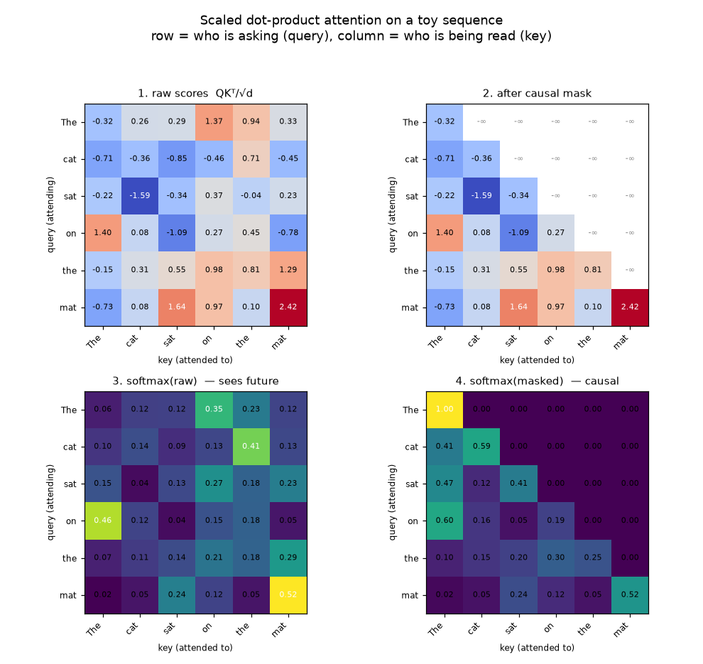
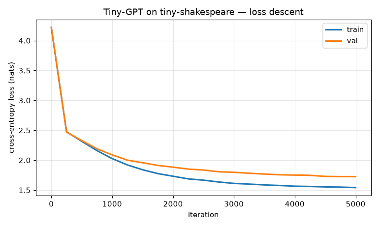
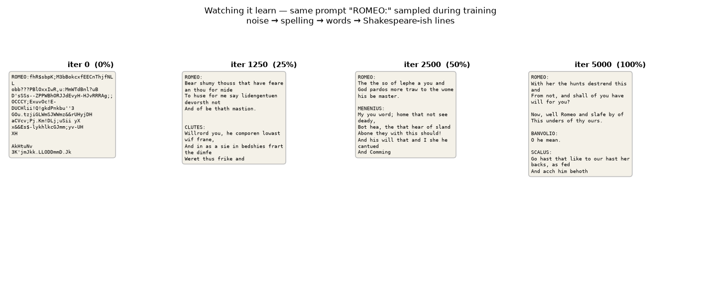
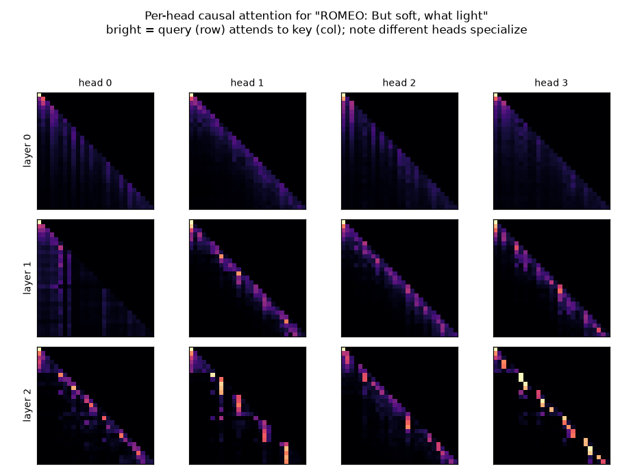
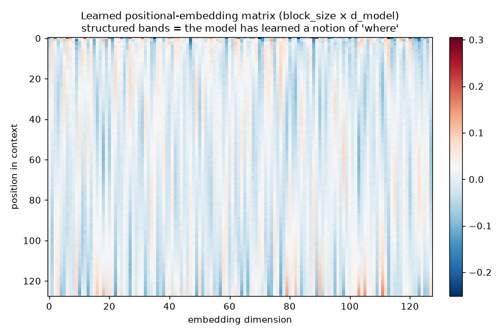
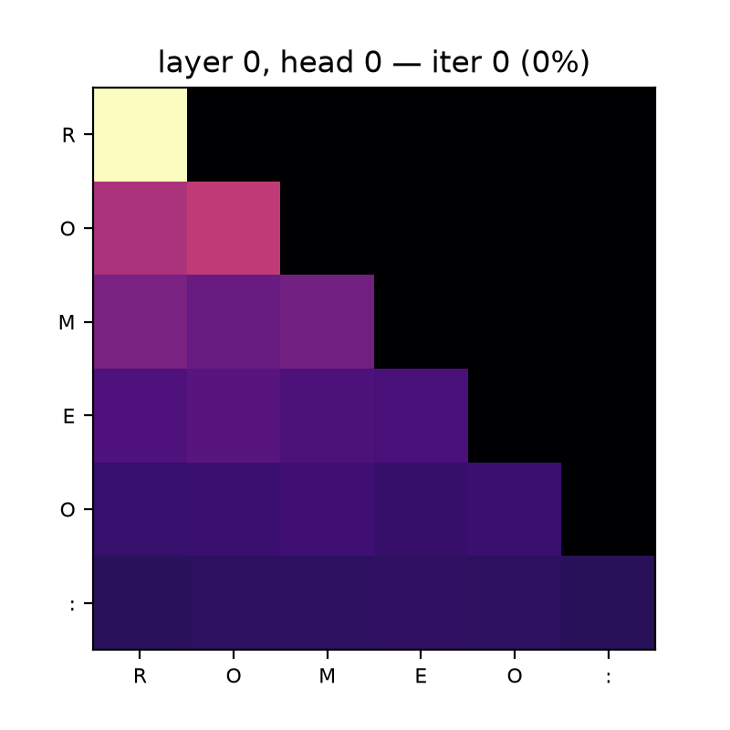
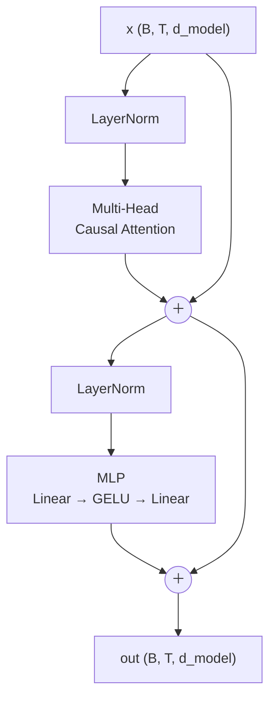

# Module 04 — Attention & the transformer: build a tiny GPT

> One operation — attention — replaced the recurrent net and unlocked the last
> decade of language models. It is nothing more than a **soft dictionary
> lookup**: every position asks a question, every position offers a key and a
> value, and the answer is the values weighted by how well the keys match the
> question. Stack that with an MLP, a residual stream and LayerNorm, mask out the
> future, and you have a GPT.

In this module you build a **decoder-only transformer** from `nn.Module`
primitives — you write `MultiHeadAttention`, the `MLP` block, and the
residual + LayerNorm wiring yourself, no `nn.Transformer` — and train it on
**tiny-shakespeare** at the character level on Apple-silicon GPU (MPS). You watch
it go from noise to spelling to Shakespeare-ish verse, look inside its attention
heads, and export its weights in a documented binary format that **module 07**
will load to reimplement this exact model's inference in Zig.

Before any of that, you implement scaled dot-product attention in **plain numpy**
so the core computation is legible before PyTorch hides it.

This is a from-scratch reconstruction in the spirit of Karpathy's
[nanoGPT](https://github.com/karpathy/nanoGPT), graphical-first.

**🕹 Interactive:** [Attention, one query at a time](../../explorables/04-attention.html) —
a Q·Kᵀ heatmap you can drive, with causal mask, temperature, and the real
attention heads of the tiny GPT you are about to train.

## Goals

By the end you can:

- derive and implement **scaled dot-product attention** and explain the `√d_head`;
- explain the **causal mask** and prove why removing it lets the model cheat;
- build **multi-head** attention, an MLP block, and the **pre-norm residual**
  transformer block, by hand;
- train a small GPT to a clear loss descent and legible samples on MPS;
- read **attention heatmaps** and see heads specialize across layers;
- control generation with **temperature** and **top-k** sampling;
- export the trained weights to a byte-exact format another language can load.

## What you'll see

Every concept here produces a figure.

**Scaled dot-product attention, and what the causal mask does**, on a 6-token toy
sequence — raw `QKᵀ/√d` scores, the same after masking the future, and the
softmax of each. Bottom-right is the only causally-valid one: every row is
lower-triangular and sums to 1.



**The training loss** falling on tiny-shakespeare (train and val cross-entropy):



**Watching it learn.** The same prompt `"ROMEO:"` sampled at 0 / 25 / 50 / 100 %
of training — random bytes, then plausible spelling, then words, then
speaker-tagged Shakespeare-ish lines:



**Per-head attention from the trained model** — a layer × head grid for one
prompt. Different heads learn different jobs: some attend to the previous token,
some to the line start, some spread over recent context:



**The learned positional-embedding matrix** (context position × embedding dim).
The structured vertical bands mean the model has learned a usable notion of
*where* a token sits:



**One head's attention evolving during training** (layer 0, head 0), as a short
loop — the diffuse early pattern sharpens into structure:



## Theory in one minute — attention as a soft dictionary lookup

A Python `dict` lookup is *hard*: a query key matches exactly one stored key and
you get its value. Attention is the *soft, differentiable* version. Each position
`t` emits a **query** `qₜ`; every position `j` emits a **key** `kⱼ` and a
**value** `vⱼ`. The match score is a dot product, scaled and softmaxed into
weights, and the output is the weighted average of the values:

```
scores = Q Kᵀ / √d_head           # how well each query matches each key
scores[t, j] = −∞  for j > t        # causal mask: can't read the future
A = softmax(scores)                 # weights, each row sums to 1
out = A V                           # values, averaged by match strength
```

The `√d_head` keeps the dot products from growing with dimension and saturating
the softmax. **Multi-head** attention just runs `h` of these in parallel on
`d_head`-sized slices, so different heads can attend to different things, then
concatenates and projects the results.

The transformer **block** wraps attention and a position-wise MLP in *pre-norm
residual* connections — normalize, transform, add back — so gradients flow
cleanly through the residual stream and depth is cheap:



The full model is: token embedding + positional embedding → `n_layer` of these
blocks → final LayerNorm → project to vocabulary logits (the output projection is
*tied* to the token embedding). Train it to predict the next character; sample it
autoregressively to generate.

## Hands-on

Everything runs from the `python/` uv project. First-time setup pulls the Torch
MPS wheels:

```bash
cd python && uv sync
```

**Step 1 — attention in numpy.** No neural net yet; just the core computation and
the mask, as a figure:

```bash
uv run python scripts/step1_numpy_attention.py
```

**Step 2 — train the tiny GPT on tiny-shakespeare (MPS).** ~620k parameters,
3 layers, 4 heads, `d_model=128`, context 128. Checkpoints and a training log
land in `../models/` (git-ignored):

```bash
uv run python scripts/train.py
```

Expected on an **Apple M5**: about **4–8 minutes** for 5000 iterations. You
should see train loss fall from ~4.2 to ~1.55 and val to ~1.73, with the sample
at the end looking like:

```
ROMEO:
With her the hunts destrend this and
From not, and shall of you have will for you?

BANVOLIO:
O he mean.
```

Not English — but character names, punctuation, line breaks and Shakespearean
cadence, all learned from raw characters.

**Step 3 — the figures** (loss curve, attention grid, generation-over-training,
positional embeddings, and the attention gif), from the trained checkpoint:

```bash
uv run python scripts/figures.py
```

**Step 4 — export the weights** for the module-07 Zig capstone. Writes
`artifacts/tiny_gpt_weights.bin` (raw little-endian f32, fixed tensor order),
`tiny_gpt_config.json` (dims + per-tensor manifest), and `tokenizer_chars.json`,
all documented in [`artifacts/EXPORT_FORMAT.md`](artifacts/EXPORT_FORMAT.md):

```bash
uv run python scripts/export_weights.py
```

## Exercises

Skeletons in [`exercises/`](exercises/) with `# TODO(you):` markers; verified
answers in [`solutions/`](solutions/). Run from `python/`, e.g.
`uv run python ../exercises/ex_a_single_head_attention.py`.

- **(a) Single-head attention in numpy** — implement the forward pass of one
  causal head given `X` and the `W_q/W_k/W_v` projections. Self-checks against a
  reference; confirms rows sum to 1 and never attend to the future.
- **(b) Ablate the causal mask** — implement `make_noncausal`, then a
  deterministic *future-leak probe* proves the point: changing a token at `t+1`
  moves the causal model's prediction at `t` by exactly `0`, but moves the
  non-causal model's. That leak is the "cheating" — the label is visible through
  attention, and the model is useless for generation, where the future does not
  exist.
- **(c) Top-k sampling and temperature** — implement temperature + top-k logit
  filtering and produce a comparison figure sampling the trained model under four
  settings (see `figures/ex_c_sampling_comparison.png`). Watch low temperature go
  safe-and-repetitive and high temperature go wild.

## Checkpoint — you should now be able to…

- write scaled dot-product attention from scratch and say why it is scaled;
- explain the causal mask and *demonstrate* what breaks without it;
- assemble multi-head attention, an MLP, and a pre-norm residual block into a GPT
  using only `nn.Module` primitives;
- train that GPT on MPS and read its loss curve, samples, and attention heads;
- steer generation with temperature and top-k;
- serialize a trained transformer to a byte-exact, language-agnostic format.

## Further reading

- Hugging Face LLM Course, chapter 1 — [How do Transformers work?](https://huggingface.co/learn/llm-course/chapter1)
- Andrej Karpathy — [nanoGPT](https://github.com/karpathy/nanoGPT) (this module is a graphical-first, smaller cousin)

> **Next:** module 07 reimplements the *inference* of this exact model in **Zig**,
> reading the weights you exported here straight from `artifacts/` — no Python at
> run time. The byte layout it depends on is pinned in `artifacts/EXPORT_FORMAT.md`.
