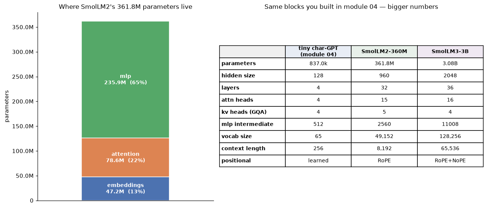
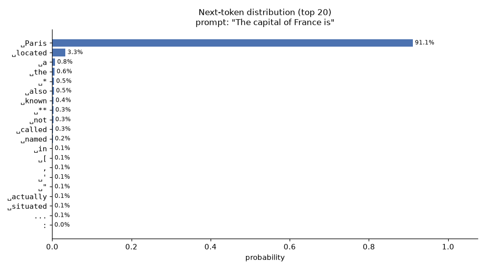
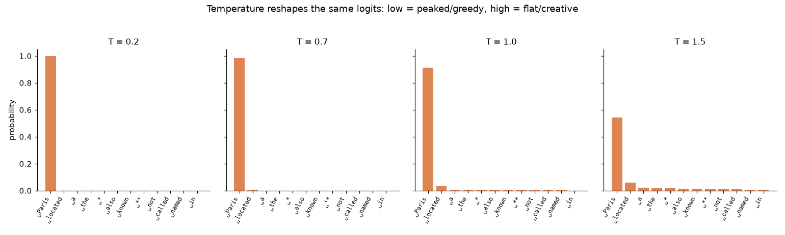
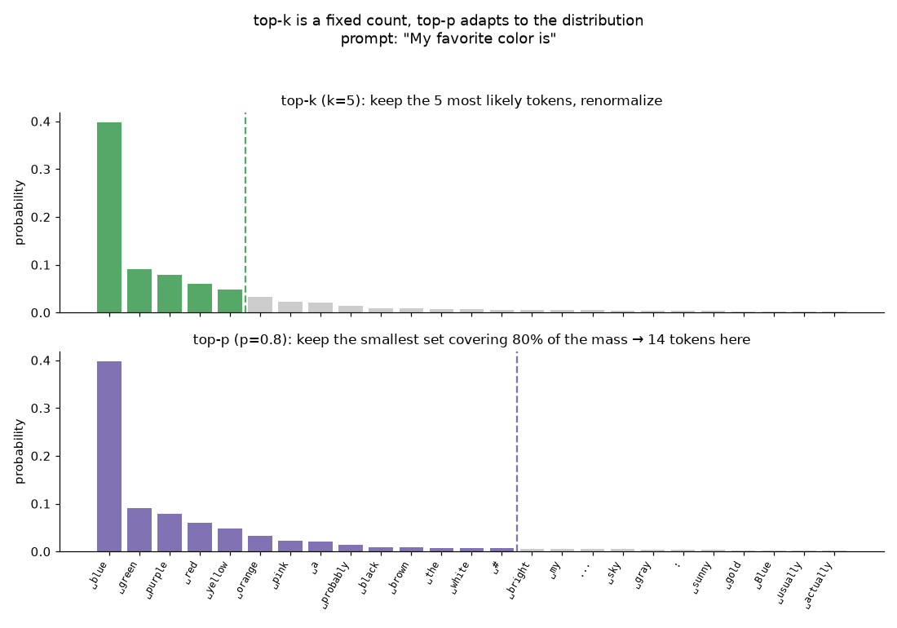
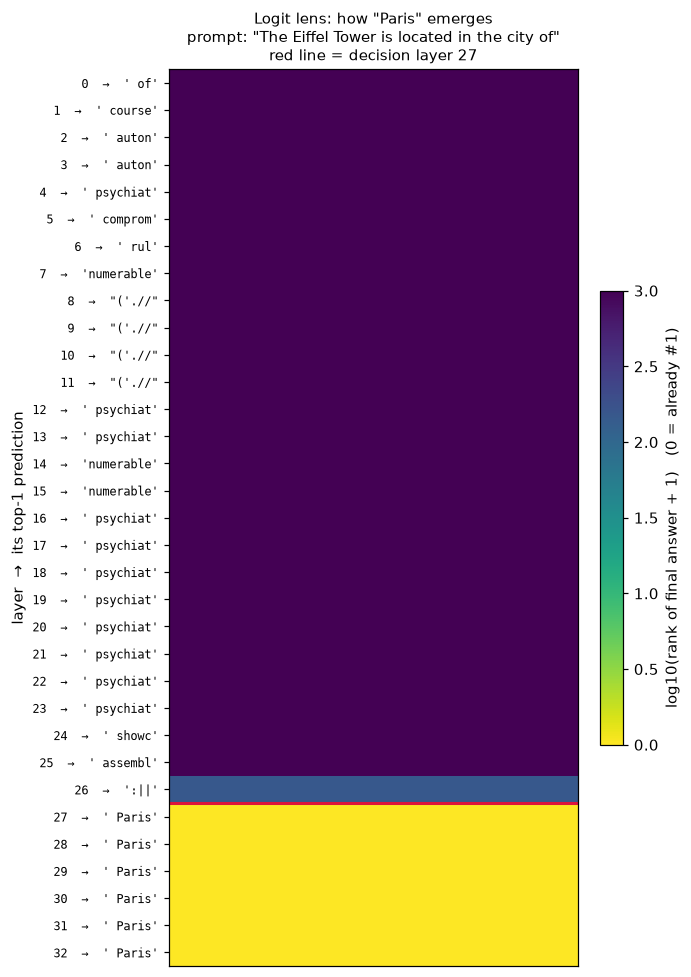
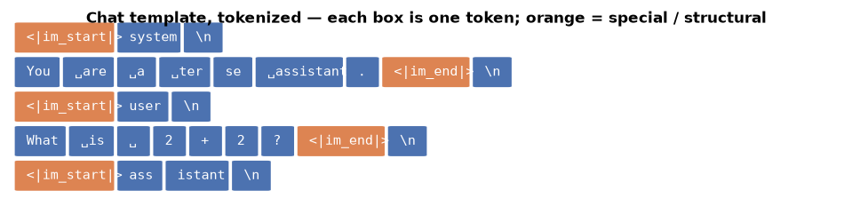
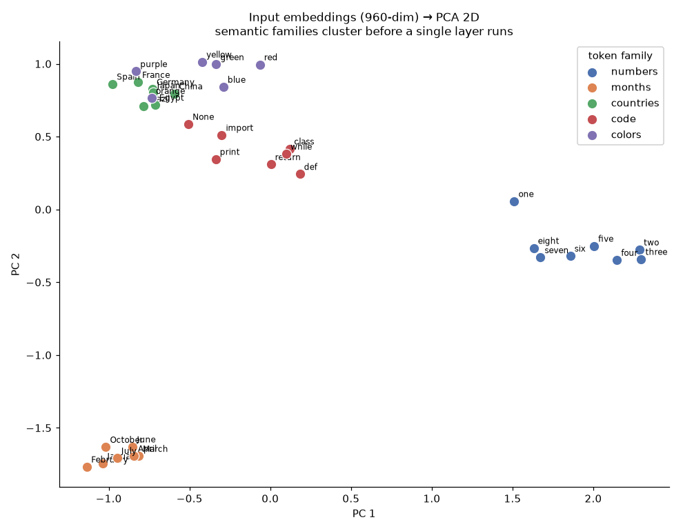
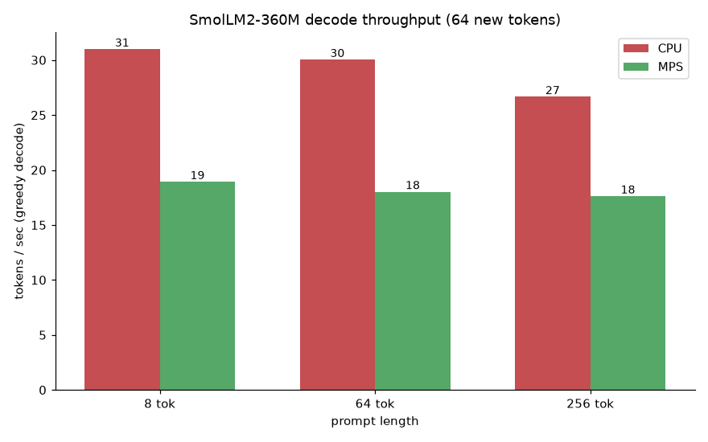

# Module 05 — The transformers library: anatomy of a real LLM

In module 04 you built a transformer **by hand**: attention, the residual
stream, a decoder block, a sampling loop — ~300 lines to make a tiny char-GPT
mumble Shakespeare. It worked, and now you know exactly what every line does.

This module is the **pivot**. Same architecture, but you stop writing it and
start *wielding* it. You load a real, pretrained, 360-million-parameter
instruction model — **SmolLM2-360M-Instruct** — with three lines of Hugging
Face code, then take it apart: where its parameters live, how it turns a
960-dimensional vector into a next-token choice, how temperature and top-p bend
that choice, at which layer it "decides" on an answer, and how its embedding
space already knows that July is a month and `def` is code. Everything is a
picture, and every picture comes from the real model running on your Mac.

**🕹 Interactive:** [Anatomy of a transformer](../../explorables/05-transformer-anatomy.html) —
watch a pulse carry one token up the decoder stack, hover any component for its
real tensor shapes, and read SmolLM2's logit lens layer by layer.

## Goals

By the end you will be able to:

- reach for `pipeline()` to do text-generation, sentiment, and zero-shot
  classification in three lines each — and explain what it hides;
- load any causal LM with `AutoTokenizer` / `AutoModelForCausalLM`, walk its
  module tree, and account for **where every parameter lives**;
- connect the giant to the toy: SmolLM2 is your module-04 block with bigger
  numbers — and SmolLM3-3B is the same recipe, bigger still;
- read a next-token distribution and predict how **temperature**, **top-k**, and
  **top-p** will reshape it;
- use the **logit lens** to watch an answer converge layer by layer, and find
  the "decision layer";
- dissect a **chat template** down to the special tokens, and see the embedding
  space cluster numbers, months, countries, and code;
- run all of this on **MPS**, and know when MPS is *not* the fast lane.

## The pivot: three lines vs three hundred

Here is the entire "generate text" experience now:

```python
from transformers import pipeline
gen = pipeline("text-generation", model="HuggingFaceTB/SmolLM2-360M-Instruct")
print(gen([{"role": "user", "content": "One surprising fact about octopuses?"}],
          max_new_tokens=64)[0]["generated_text"][-1]["content"])
```

That is the same computation you wrote in module 04 — tokenize, embed, run N
decoder blocks, project to logits, sample, repeat — with the tokenizer,
weights, KV cache, and sampling loop all folded behind one call. The rest of
this module pries that call back open, but with a *real* model inside.

## What you'll see

**Where 361.8M parameters live.** Load the model, walk its modules, and total
the tensors by role. Two-thirds of SmolLM2 is **MLP**; attention is only ~22%;
the embedding table (shared with the output head) is ~13%. And the shape is the
*same* as your module-04 block — just bigger. The tiny char-GPT, SmolLM2, and
SmolLM3-3B are three columns of the same design.



**A confident next token.** One forward pass gives logits over all 49,152
tokens. After `"The capital of France is"`, the model puts **91%** on `␣Paris`.



**Temperature reshapes the same logits.** Divide the logits by `T` before the
softmax: low `T` sharpens toward greedy, high `T` flattens toward chaos. Nothing
about the model changed — only how we read its scores.



**top-k is a count; top-p is a budget.** For an open-ended prompt
(`"My favorite color is"`) the distribution is *flat* — a dozen colors are all
plausible. `top-k=5` always keeps exactly 5; `top-p=0.8` keeps however many it
takes to cover 80% of the mass (here 14). top-p **adapts** to how confident the
model is; top-k does not.



**The logit lens: watch an answer appear.** Take each layer's hidden state,
push it through the *final* norm and output head, and see what token it would
predict. For `"The Eiffel Tower is located in the city of"`, the early and
middle layers predict junk; the correct answer `␣Paris` only snaps to rank #1
at **layer 27 of 32** — and then stays. The residual stream spends most of its
depth *retrieving*, and commits late.



**A chat template is exact.** An instruct model was trained on a specific
wrapper. `apply_chat_template` builds it; here every token is a box and the
structural special tokens (`<|im_start|>`, `<|im_end|>`) are orange. Note that
`system` / `user` / `assistant` are *ordinary* tokens — only the delimiters are
special.



**Meaning is geometry.** The input embedding matrix is a learned map. Project a
few hand-picked tokens to 2D with PCA and the families separate — numbers,
months, countries, code keywords, colors — *before a single layer runs*. A
nearest-neighbour lookup confirms it: `July`'s neighbours are `June`, `August`,
`September`.



## Get the model

SmolLM2-360M-Instruct is ~700 MB and lives in your **Hugging Face cache**
(`~/.cache/huggingface`), never in this repo. You can pull it eagerly with the
`hf` CLI:

```bash
hf download HuggingFaceTB/SmolLM2-360M-Instruct
```

…or just let the code fetch it lazily on first use — the `AutoModel` call below
downloads and caches it the first time, then loads instantly forever after:

```python
from transformers import AutoModelForCausalLM, AutoTokenizer
tok = AutoTokenizer.from_pretrained("HuggingFaceTB/SmolLM2-360M-Instruct")
model = AutoModelForCausalLM.from_pretrained("HuggingFaceTB/SmolLM2-360M-Instruct")
```

The **"same recipe, bigger"** upgrade path is
[SmolLM3-3B](https://huggingface.co/HuggingFaceTB/SmolLM3-3B): identical decoder
blocks, ~3.08B parameters, a 128k vocab, and a 64k context. Everything in this
module runs on it unchanged — swap the model id and wait a little longer. (We
read SmolLM3's `config.json` for the comparison table but do **not** download
its weights.)

## Hands-on walkthrough

Everything runs from the `python/` uv project. Sync once:

```bash
cd modules/05-transformers-library/python
```

```bash
uv sync
```

**First contact** — text-generation, sentiment, and zero-shot in three-line
calls (downloads two small task models the first time):

```bash
uv run python src/pipelines.py
```

**Anatomy** — walk the module tree, print the parameter budget, and (with
`--figure`) draw the treemap + tiny-GPT/SmolLM2/SmolLM3 comparison:

```bash
uv run python src/anatomy.py --figure
```

**Sampling lab** — next-token distribution, temperature sweep, top-k vs top-p:

```bash
uv run python src/sampling_lab.py --figures
```

**Logit lens** — the layer-by-layer convergence table and heatmap (try your own
`--prompt`):

```bash
uv run python src/logit_lens.py --figure
```

**Chat template + embeddings** — dissect the template, then project embeddings:

```bash
uv run python src/chat_template.py --figure
```

```bash
uv run python src/embeddings.py --figure
```

**Regenerate every figure in this README** in one shot (~1–2 min on MPS):

```bash
uv run python src/figures.py
```

## The Gradio playground

Chat with SmolLM2 while a live bar panel shows the **next-token distribution**
for your current conversation — move the temperature / top-k / top-p sliders and
watch it sharpen or flatten:

```bash
uv run python app.py
```

The build + a headless launch/close is exercised in `tests/test_app.py`, so the
test suite never leaves a server running.

## A note on devices: MPS is not always the fast lane

Every script picks **MPS** (the Apple GPU) automatically via `get_device()`.
But exercise (c) measures a surprise: for this 360M model doing **single-token
greedy decode**, plain **CPU is faster than MPS** on this machine (~30 vs ~18
tokens/sec). Autoregressive decoding runs one tiny matmul per step, and the
per-step kernel-launch overhead on MPS outweighs its throughput advantage at
batch size 1. MPS wins on big, *parallel* work (long prompts, large batches,
training) — not on skinny sequential loops. Measure, don't assume.



## Exercises

Skeletons with `# TODO(you):` live in [`exercises/`](exercises/); verified
reference solutions are in [`solutions/`](solutions/). Check your work:

```bash
uv run pytest tests/test_solutions.py -v
```

- **(a) `exercise_a_greedy.py`** — implement **greedy decoding by hand** from
  raw logits (argmax, append, repeat — no `.generate`), then the sampling
  variant, and confirm greedy is deterministic while sampling is seeded.
- **(b) `exercise_b_decision_layer.py`** — use the logit-lens tools to find the
  **decision layer** for three prompts. You'll find they differ: `"…city of"` →
  Paris decides at layer 27, `"…symbol for gold is"` → Au only at the very last
  layer, `"Two plus two equals"` → four at layer 26.
- **(c) `exercise_c_tokens_per_sec.py`** — implement the timing core and measure
  **tokens/sec on MPS vs CPU** for three prompt lengths, producing the figure
  above.

## Run all the tests

```bash
uv run pytest
```

This loads the real model and runs real generations, so it takes a couple of
minutes the first time.

## Checkpoint — you should now be able to…

- use `pipeline()` for several tasks and articulate exactly what it abstracts
  away relative to your module-04 code;
- load a model with `AutoModelForCausalLM`, walk `named_parameters()`, and say
  where the parameters live (MLP ≫ attention > embeddings ≫ norms);
- place the tiny char-GPT, SmolLM2-360M, and SmolLM3-3B on one continuum — same
  blocks, bigger numbers;
- take raw logits and reason about temperature, top-k, and top-p before running
  anything;
- run the logit lens and interpret a decision layer;
- read a chat template at the token level and explain why the wrapper matters;
- reason about MPS vs CPU for a given workload instead of assuming the GPU wins.

## Links

- Hugging Face **LLM Course**, Chapter 1 — [Transformer models](https://huggingface.co/learn/llm-course/chapter1)
- Hugging Face **LLM Course**, Chapter 2 — [Using Transformers](https://huggingface.co/learn/llm-course/chapter2)
- Hugging Face **LLM Course**, Chapter 3 — [Fine-tuning a model](https://huggingface.co/learn/llm-course/chapter3)
- Hugging Face **LLM Course**, Chapter 4 — [Sharing models and tokenizers](https://huggingface.co/learn/llm-course/chapter4)
- [`transformers` documentation](https://huggingface.co/docs/transformers)
- [SmolLM2-360M-Instruct model card](https://huggingface.co/HuggingFaceTB/SmolLM2-360M-Instruct)
- [SmolLM3-3B model card](https://huggingface.co/HuggingFaceTB/SmolLM3-3B) — the "same recipe, bigger" upgrade
