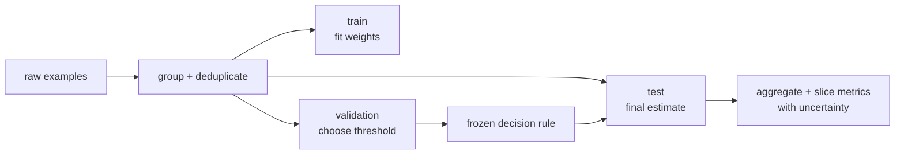

# Lab 05½ — Data & evaluation: know whether the model improved

> Training gives you a number. Evaluation tells you whether that number means
> anything.

This bridge lab sits between **module 05** (using a real model) and **module 06**
(fine-tuning one). You build a small evaluation harness from scratch before a
trainer or benchmark library hides the important decisions: the split, the
metric, the threshold, the slices, and the possibility that the answer leaked
into the test set.

**🕹 Interactive:** [The honest scorecard](../../explorables/05a-evaluation-lab.html)
— move a decision threshold, inspect the confusion matrix, and introduce data
leakage to see a suspiciously good score.

---

## Goals

By the end of this lab, you will:

- distinguish a training objective from an evaluation metric;
- create deterministic, disjoint train/validation/test splits;
- compute a confusion matrix, accuracy, precision, recall, specificity, and F1
  without a metrics library;
- explain why a decision threshold is a product decision, not a universal
  constant;
- measure calibration instead of treating a probability as a promise;
- evaluate slices rather than trusting one aggregate number;
- detect exact duplicate leakage before reporting a result; and
- write a compact evaluation card that makes a result reproducible.

## Why this comes before fine-tuning

A fine-tuning run can lower loss while making the behavior you care about worse.
Before changing weights, decide:

1. **What population is the model for?**
2. **What errors have different costs?**
3. **What data is allowed to influence training decisions?**
4. **What result would convince you to ship—or to stop?**

The test set answers the last question only once. Use the training split to fit
parameters, the validation split to make choices, and the test split for the
final estimate.



## The confusion matrix is the primitive

For a binary classifier, threshold probability `p` into a prediction:

```text
predict positive if p >= threshold
```

Every example then lands in one of four cells:

| | Actually positive | Actually negative |
|---|---:|---:|
| Predicted positive | true positive (TP) | false positive (FP) |
| Predicted negative | false negative (FN) | true negative (TN) |

All familiar metrics are summaries of these four counts:

```text
accuracy  = (TP + TN) / N
precision = TP / (TP + FP)
recall    = TP / (TP + FN)
F1        = 2 × precision × recall / (precision + recall)
```

Accuracy is useful when classes and error costs are reasonably balanced. It can
be actively misleading when positives are rare: a classifier that always says
"negative" is 99% accurate on a dataset with 1% positives.

## Thresholds encode costs

`0.5` is a convention, not a law. Lowering the threshold generally catches more
positives (higher recall) and raises more false alarms (lower precision).

- A screening system may prefer recall: missing a positive is costly.
- An interruptive alert may prefer precision: false alarms cause harm.
- A ranking system may not need one global threshold at all.

Choose the threshold on the **validation** set, record the rule, then evaluate
that frozen rule on the **test** set.

## Calibration: does 0.8 mean eight out of ten?

A model can rank examples correctly while being overconfident. Calibration asks:
among predictions near confidence `p`, is the observed frequency also near `p`?

The lab implements expected calibration error (ECE):

1. bucket probabilities into equal-width bins;
2. compute mean confidence and empirical positive rate per non-empty bin;
3. take the example-weighted mean absolute gap.

ECE is a diagnostic, not a complete verdict. Its value changes with binning and
sample size, so report those choices.

## Aggregate metrics hide slices

Always inspect slices that could fail differently: device, language, class,
source, time period, or data-collection process. A model can improve overall
while regressing badly on a small but important group.

Do not use slice analysis to hunt for a flattering subgroup. Define important
slices before looking at the final test results.

## Leakage: the fastest route to a fake breakthrough

Exact duplicates are the easy case. Near-duplicates, multiple samples from the
same person, and temporal leakage are harder. Split by the unit that could leak:
patient, customer, document, conversation, or time window—not blindly by row.

The included helper checks exact ID overlap. In a real project, also hash
normalized content and investigate semantic near-duplicates.

## Hands-on

Work from the lab's Python project:

```bash
cd modules/05a-data-evaluation/python
uv sync --locked
```

Run the deterministic experiment:

```bash
uv run python evaluation_lab.py
```

It writes `../figures/evaluation_scorecard.png` and prints aggregate and slice
metrics at three thresholds.

Run the tests:

```bash
uv run pytest -q
```

## Exercises

Skeletons live in [`python/exercises/`](python/exercises); verified answers live
in [`python/solutions/`](python/solutions).

1. **Threshold selection** — choose the validation threshold that maximizes F1,
   then report its untouched test performance.
2. **Leakage detector** — find overlapping example IDs and explain why removing
   them can make a good-looking score fall.
3. **Calibration** — implement ECE and compare a calibrated model with an
   overconfident one that has identical class predictions.

## The evaluation card

Every result in later modules should be accompanied by these seven lines:

```text
Task:
Data and split unit:
Model/artifact revision:
Decision rule:
Primary metric and important slices:
Leakage checks:
Random seed and command:
```

This is intentionally smaller than a model card. It is the minimum receipt for
one experiment.

## Checkpoint — you should now be able to…

- [ ] reconstruct every binary metric from TP, FP, FN, and TN;
- [ ] choose a threshold using validation data without touching the test set;
- [ ] explain discrimination versus calibration;
- [ ] identify the real unit that must remain on one side of a split;
- [ ] report both aggregate and important slice metrics; and
- [ ] produce an evaluation card another learner can reproduce.

## Sources

- Stanford CS336 — data, evaluation, and language modelling from scratch:
  <https://cs336.stanford.edu/>
- Stanford CRFM HELM — reproducible, multi-metric foundation-model evaluation:
  <https://crfm.stanford.edu/helm/>
- *Hidden Technical Debt in Machine Learning Systems*:
  <https://papers.nips.cc/paper/5656-hidden-technical-debt-in-machine-learning-systems>
- NIST AI Risk Management Framework and Generative AI Profile:
  <https://www.nist.gov/itl/ai-risk-management-framework>
