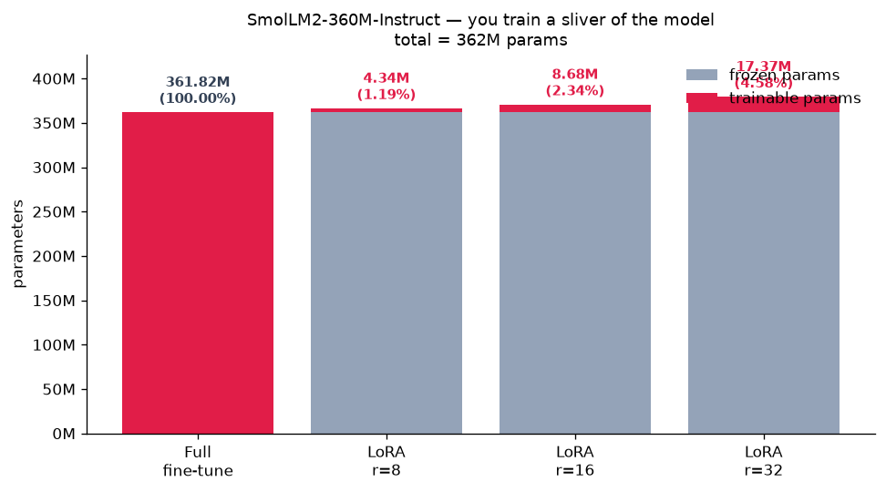
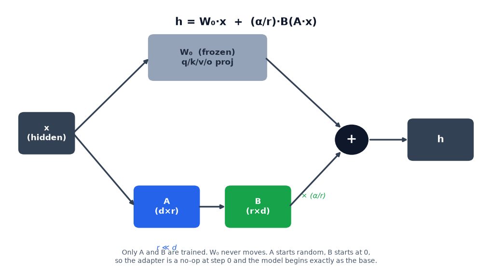
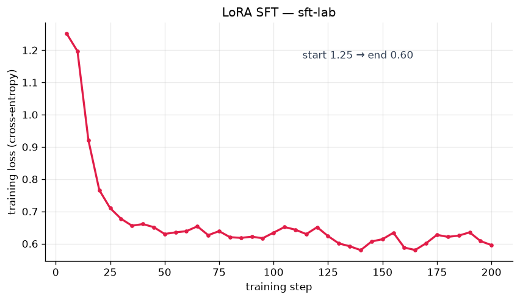
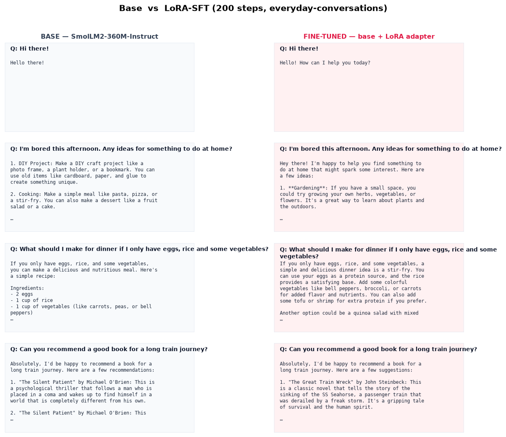
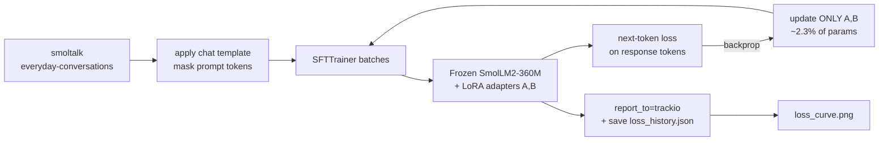

# Module 06 — Fine-tuning: make the model yours

*In module 05 you took a pretrained transformer apart and watched it generate.
Here you change its behaviour.* You'll **supervised-fine-tune (SFT)** a small
instruct model with a **LoRA** adapter — training under **3% of the weights** —
watch a real loss curve fall on your Mac's GPU, and produce **before/after**
evidence that the model's voice actually shifted. Then two more lanes: **MLX**,
Apple's native stack that trains the same model ~7× faster, and a **cloud** lane
you can rent a GPU for when your Mac isn't enough.

This module adapts the Hugging Face [smol-course](https://huggingface.co/learn/smol-course)
and [LLM Course chapter 11](https://huggingface.co/learn/llm-course/chapter11).

**🕹 Interactive:** [Low rank: what LoRA actually trains](../../explorables/06-lora-rank.html) —
drag the rank slider and watch this module's real trained ΔW rebuild itself from
7 singular directions while a frozen weight needs 28.

## Goals

By the end you will be able to:

- Explain the **SFT objective** (next-token cross-entropy on curated
  instruction/response pairs) and how it differs from pretraining.
- Explain **why LoRA works** — the *low intrinsic rank* of the update — and read
  the "you train 0.x%" parameter budget off a chart.
- Run a **real LoRA SFT** of SmolLM2-360M-Instruct with TRL's `SFTTrainer` +
  `peft` on your Mac, track it with **trackio** in local mode, and plot the loss.
- Produce **before/after** generations and judge honestly *what changed and what
  didn't* — the limits of small-scale SFT.
- Fine-tune the same model **Mac-native with MLX** and reason about the speed gap.
- Write (not run) a **cloud Job** that scales the recipe up, and avoid the
  30-minute timeout trap.
- Point yourself at what's next: **DPO** (preference alignment) and **GRPO**
  (reasoning / RL).

## What you'll see

**You train a sliver of the model.** Full fine-tuning updates every one of the
362M parameters; LoRA at rank 16 trains **8.7M — 2.3%**. The adapter counts here
are real (we wrap the actual model and count):



**Where the adapter sits.** LoRA freezes each attention/MLP projection `W₀` and
learns a tiny low-rank detour `B(A·x)` beside it. `A` starts random, `B` starts
at **zero**, so at step 0 the adapter is a no-op and the model *is* the base:



**The loss actually falls.** 200 LoRA-SFT steps on ~512 everyday-conversation
examples, on the M5's MPS backend — start **1.25 → end 0.60**:



**The signature deliverable — before vs after.** Same greedy decoding, same
prompts, base model vs base+adapter. The fine-tuned model adopts the warmer,
more conversational register of the training data (full text in
[`sample_generations.md`](./sample_generations.md)):



## Theory — SFT and why LoRA works

### The SFT objective

Pretraining teaches a model to continue *arbitrary* text. **Supervised
fine-tuning** narrows that to a *behaviour*: given curated
`(instruction, response)` pairs, minimise the next-token cross-entropy **on the
response tokens**. That's it — same loss as pretraining, but on hand-picked
conversations, and typically masking the loss on the prompt so the model learns
to *produce* answers, not to predict the questions.

```
   dataset:  [user turn]  →  [assistant turn]
   loss:      (masked)         cross-entropy on these tokens
```

Because the base model is *already* instruction-tuned, a few hundred examples
mostly move **register, length and format** — not raw knowledge. Keep that in
mind when you read the before/after.

### Why LoRA works — low intrinsic rank

Fine-tuning changes a weight matrix `W₀` into `W₀ + ΔW`. The key empirical fact:
**`ΔW` has very low intrinsic rank** — the useful update lives in a tiny subspace.
So instead of storing a full `d×d` update, LoRA factors it as two skinny matrices
`ΔW = (α/r)·B·A` with `A ∈ ℝ^{r×d}`, `B ∈ ℝ^{d×r}` and `r ≪ d` (here r=8/16/32,
d=960). You train only `A` and `B`; `W₀` stays frozen. Fewer parameters, less
memory, and the adapter is a few MB you can swap in and out.

### The training data flow



The code in [`python/sft_train.py`](./python/sft_train.py) mirrors this diagram
one-to-one.

## Hands-on (PyTorch + MPS, the primary lane)

One-time setup:

```bash
cd python
uv sync                       # ~2 min: transformers, trl, peft, torch, trackio
```

**Concept figures** (no training — wraps the model and counts params, ~30 s):

```bash
uv run python figures_concept.py
```

**Run the SFT lab** — LoRA-SFT SmolLM2-360M on ~512 examples, 200 steps.
*Honest M5 runtime: ~12 minutes.* Trains the adapter, saves loss history, and
writes `figures/loss_curve.png`:

```bash
uv run python sft_train.py --steps 200
```

> Too slow? `export MLCOURSE_MODEL=HuggingFaceTB/SmolLM2-135M-Instruct` before
> running to drop to the 135M model, or pass `--steps 100`.

**Watch it in trackio.** Training logged to a **local** trackio db (no Space, no
upload). Open the dashboard in your browser:

```bash
uv run trackio show           # then visit the printed http://localhost:7860 URL
```

The run lives under the default project **`huggingface`**. We *also* save the raw
loss history to `outputs/sft-lab/loss_history.json` and plot our own PNG — never
rely on screenshotting a dashboard for a deliverable.

**Before/after evidence** — generate the fixed prompt set with base vs adapter,
write `sample_generations.md` and the panel figure. *~2 min:*

```bash
uv run python generate_compare.py
```

Adapters and logs land in `python/outputs/` (git-ignored — only figures and
`sample_generations.md` are committed).

## The MLX lane — Mac-native, ~7× faster

Apple's own array framework beats PyTorch-on-MPS on this hardware. Same model,
same data, measured here: **~479 tok/s (PyTorch/MPS) vs ~3,500 tok/s (MLX)**.
Full walkthrough and honest caveats in [`mlx/README.md`](./mlx/README.md):

```bash
cd mlx
uv sync
uv run python convert_dataset.py --n 512
uv run python -m mlx_lm lora \
    --model mlx-community/SmolLM2-360M-Instruct \
    --train --data data --iters 100 --batch-size 4 \
    --num-layers 16 --learning-rate 2e-4 --adapter-path adapters
```

## The cloud lane — rent a GPU (optional, costs money)

When you want to fine-tune something bigger (SmolLM3-3B) on more data than MPS
can chew through, run the **same recipe** on a rented GPU with Hugging Face Jobs.
[`cloud/sft_job.py`](./cloud/sft_job.py) is a self-contained PEP 723 uv script;
[`cloud/README.md`](./cloud/README.md) has the full guide. The one command:

```bash
hf jobs uv run --name sft-smollm --flavor t4-small --timeout 2h \
    --secrets HF_TOKEN cloud/sft_job.py
```

- **~$0.40/h** on `t4-small` ⇒ a full run ≈ **$0.50–1.00**; `a10g-small` (~$1/h)
  is faster.
- Manage with `hf jobs ls` / `wait` / `logs` / `cancel`.
- ⚠️ **The 30-minute trap:** omit `--timeout` and Jobs kills your run at 30 min.
- Live loss curves via **trackio on a free Space** (`trackio_space_id`).
- Requires **prepaid credits** and is entirely **optional** — this course never
  launches it. Docs: <https://huggingface.co/docs/trl/main/en/jobs_training>.

## Exercises

In [`exercises/`](./python/exercises) with `# TODO(you):` markers; verified
answers in [`solutions/`](./python/solutions).

- **(a) Does rank matter?** Fine-tune r=4 vs r=32, overlay the loss curves,
  compare trainable-param counts. *Verified end-to-end (~8 min); produces
  `figures/ex_a_rank_comparison.png`.* Spoiler: 8× the params, marginal gain —
  everyday-conversations has low intrinsic rank.
- **(b) Where does the adapter go?** `q_proj`+`v_proj` only vs all-linear.
  Compare loss and param counts. *Runs ~8 min.*
- **(c) Teach the model your voice.** Write 20 of your own instruction pairs,
  fine-tune, and watch the model adopt your style on held-out prompts. *Runs
  ~4 min.* The solution uses a pirate persona so the transfer is unmistakable.

```bash
cd python
uv run python solutions/ex_a_rank.py      # ~8 min
uv run python solutions/ex_c_your_style.py # ~4 min, prints held-out generations
```

## What's next — beyond SFT

SFT teaches the model to *imitate* good answers. Two families go further:

- **DPO / preference alignment** ([smol-course module 3](https://huggingface.co/learn/smol-course)).
  Instead of one target response, you show the model *pairs* — a preferred and a
  rejected answer — and **Direct Preference Optimization** shifts probability mass
  toward the preferred one *without* a separate reward model. It's how you move
  from "answers in the right format" to "answers people actually prefer".
- **GRPO / reasoning with RL** ([LLM Course chapter 12 — Open R1](https://huggingface.co/learn/llm-course/chapter12)).
  **Group Relative Policy Optimization** is the reinforcement-learning recipe
  behind reasoning models like DeepSeek-R1: sample several answers per prompt,
  score them with a verifiable reward (did the math check out?), and push the
  policy toward the higher-scoring samples. This is how models learn to *reason*,
  not just imitate. No implementation here — a pointer for module 12+.

## Checkpoint — you should now be able to…

- [ ] State the SFT objective and why it moves behaviour, not knowledge.
- [ ] Explain LoRA's low-rank factorization and why `B` starts at zero.
- [ ] Read a "you train X%" budget off the parameter chart.
- [ ] Run a LoRA SFT with `SFTTrainer` + `peft`, track it in local trackio, and
      plot the loss from saved history.
- [ ] Produce and *honestly interpret* before/after generations.
- [ ] Fine-tune Mac-native with MLX and explain the speed gap vs PyTorch/MPS.
- [ ] Write a cloud Job, size the cost, and avoid the timeout trap.
- [ ] Name what DPO and GRPO add on top of SFT.

## Links

- Hugging Face **smol-course** — <https://huggingface.co/learn/smol-course>
- **LLM Course ch11** (fine-tuning) — <https://huggingface.co/learn/llm-course/chapter11>
- **LLM Course ch12** (Open R1 / GRPO) — <https://huggingface.co/learn/llm-course/chapter12>
- **TRL** docs — <https://huggingface.co/docs/trl>
- **PEFT** docs — <https://huggingface.co/docs/peft>
- **trackio** docs — <https://huggingface.co/docs/trackio>
- TRL on Jobs — <https://huggingface.co/docs/trl/main/en/jobs_training>
