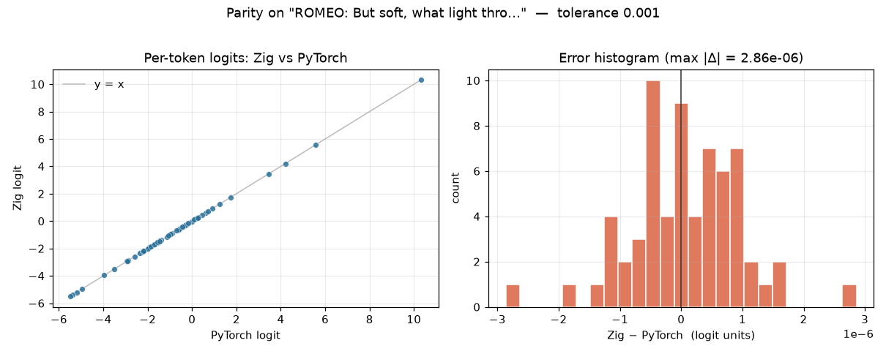
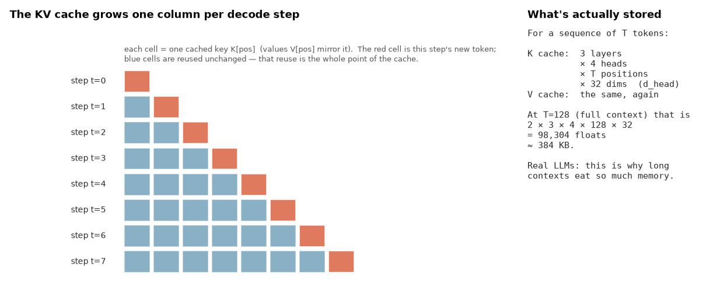
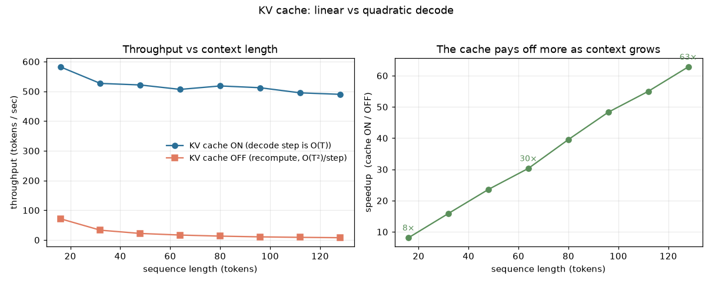
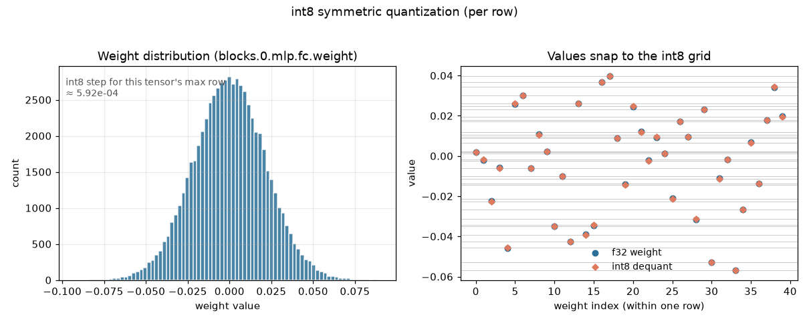
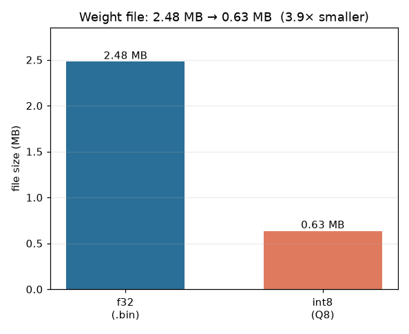
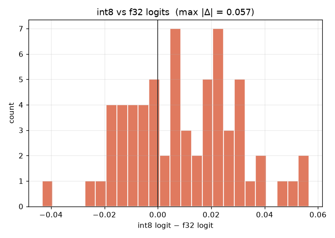
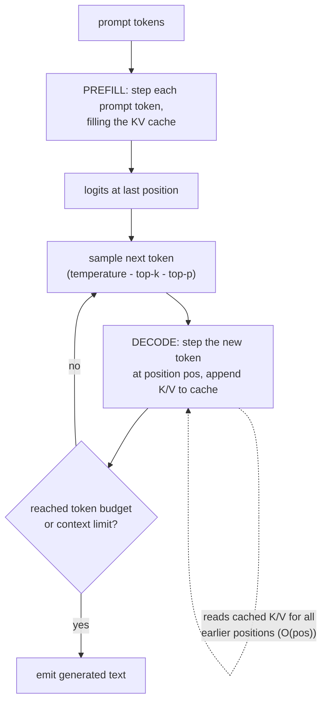

# Module 07 — Inference internals: your GPT, no framework

> Module 04 *trained* a tiny GPT with a framework doing the heavy lifting —
> autograd, `nn.Linear`, `F.softmax`, `model.generate`. Here you *run* that exact
> model with **nothing**: a few hundred lines of Zig that read the raw weight
> bytes and account for every float. No PyTorch, no autograd, no hidden decode
> loop. Just embeddings, LayerNorm, attention with a KV cache, a GELU MLP, and
> sampling — the machinery `llama.cpp` is made of, at a size you can hold in your
> head.

The model is the 619,776-parameter char-level GPT from module 04, exported to a
documented binary blob (`../04-attention-transformer/artifacts/`). This module's
Zig engine loads that blob and reproduces PyTorch's logits to a **max absolute
difference of ~3e-6** — then we use that trustworthy engine to *see* the two
things frameworks hide most completely: the **KV cache** and **quantization**.

## Goals

By the end you can:

- **load a transformer from raw bytes** — parse a tensor manifest, slice a flat
  f32 blob, and wire up embeddings, LayerNorm, QKV, attention, MLP, and a tied
  LM head by hand;
- explain and implement the **KV cache**, and measure the linear-vs-quadratic
  decode curve it produces;
- tell **prefill from decode** and see why the causal mask vanishes in the
  decode loop;
- implement **temperature, top-k, and top-p** sampling from scratch;
- quantize weights to **int8** and reason about the size/quality trade — and map
  it to GGUF's `Q8_0` / `Q4_K`;
- prove your engine matches PyTorch with a **parity test**, the credibility core
  of everything above.

## What you'll see

Every idea here produces a figure.

**Parity — the whole module rests on this.** Same prompt, same weights, two
independent forward passes (PyTorch and Zig). The logits land on the `y = x`
line; the error histogram is a spike at zero (max |Δ| ≈ 3e-6, tolerance 1e-3).
If this passes, the engine *is* the model.



**The KV cache, drawn.** Each decode step appends one key (and one value) column
per head, per layer; attention reads every column so far. The red cell is the
new token; the blue cells are reused untouched — that reuse is the entire point.



**Linear vs quadratic decode.** With the cache ON, throughput is flat in context
length (~500 tok/s); with it OFF, every step recomputes the whole sequence and
throughput collapses. The speedup grows with context — 8× at 16 tokens, **63× at
128**.



**int8 quantization.** Weights are near-Gaussian; per-row int8 snaps each value
onto a 255-level grid with a per-row scale.



**The payoff, and the price.** The weight file drops from 2.48 MB to 0.63 MB
(3.9× smaller), while the logits barely move (max |Δ| ≈ 0.06) and perplexity on
held-out text changes in the *third decimal place*. Decode speed is essentially
unchanged here — the honest reason is explained in the [quantization lab](#the-quantization-lab).




## The story

You already built this model — you just let a framework run it. The gap between
"I trained a GPT" and "I understand how a GPT runs" is exactly the code in this
module. Loading the weights forces you to know the byte layout. Writing attention
forces you to know the QKV split and the causal mask. Writing the *decode loop*
forces you to discover the KV cache — because without it, generating token 100
pointlessly recomputes the keys and values of tokens 0–99, and you can watch the
tokens/sec fall off a cliff. Quantizing forces you to confront that most of a
model's bytes are low-precision-tolerant. None of this is visible from
`model.generate(...)`; all of it is visible here.

## The decode loop, at a glance



Prefill warms the cache with the prompt; decode emits one token per forward pass,
each pass touching only the new token and reading the cache for the rest. The
[algorithm card](ALGORITHM.md) walks the Python and Zig sides line by line.

## Hands-on

Everything is one command. From `modules/07-inference-internals/`:

**Build the engine** (Zig 0.16, ReleaseFast by default):

```bash
cd zig
zig build            # -> zig-out/bin/tiny-gpt
zig build test       # kernel unit tests: LayerNorm, softmax, GELU, erf
```

**Generate text** — the headline command:

```bash
zig-out/bin/tiny-gpt generate --prompt "ROMEO:" --tokens 200 --temperature 0.8
```

```
ROMEO:
For his a did a day.

LUCENTIO:
Why now, I come the projest their do to put the ...
```

(Char-level and tiny, so it spells and tags speakers but doesn't stay coherent —
the same quality you saw at the end of module 04. Try `--top-k 20` or
`--top-p 0.9` or `--seed N`.) Note: this checkpoint's context is **128 tokens**;
generation caps there.

**Prove it matches PyTorch** (the parity check + figure):

```bash
cd ../python
uv run python scripts/parity.py     # asserts max|Δ logit| < 1e-3, draws the scatter
uv run pytest -q                    # the same check, as a test, + cache self-consistency
```

**Regenerate every figure:**

```bash
uv run python scripts/figures.py    # KV-cache + quantization figures (runs the bench)
```

**Measure the KV cache yourself:**

```bash
cd ../zig
zig-out/bin/tiny-gpt bench                       # tokens/sec, cache on vs off
zig-out/bin/tiny-gpt generate --prompt "ROMEO:" --tokens 120 --no-cache   # the slow path
zig-out/bin/tiny-gpt selfcheck                   # cache on == cache off (max|Δ| ~ 0)
```

### The KV cache lab

The engine implements **both** decode strategies from one primitive, `step`
(see [`zig/src/gpt.zig`](zig/src/gpt.zig)). With the cache on, each step is
O(context); with `--no-cache` it replays the whole sequence, O(context²) per
step. Same math, so `selfcheck` confirms identical logits — only the speed
differs:

| context | cache ON (tok/s) | cache OFF (tok/s) | speedup |
|--------:|-----------------:|------------------:|--------:|
| 16      | 582              | 72                | 8×      |
| 64      | 507              | 17                | 30×     |
| 128     | 490              | 8                 | **63×** |

(Apple M5, single thread, ReleaseFast, scalar Zig — absolute numbers are modest
because there's no SIMD/BLAS; the *shape* of the curves is the lesson.) At full
context the cache stores `2 × 3 layers × 4 heads × 128 × 32 = 98,304` floats
(~384 KB) — the [schematic](figures/kv_cache_schematic.png) draws exactly this.
In a real LLM that same tensor is what makes long contexts so memory-hungry.

### The quantization lab

`quantize` converts the f32 blob to an int8 **Q8** file using per-row symmetric
quantization (one f32 scale per output row, values in `[-127, 127]`):

```bash
cd zig
zig-out/bin/tiny-gpt quantize --out tiny_gpt_weights.q8.bin   # 2.48 MB -> 0.63 MB
zig-out/bin/tiny-gpt generate --prompt "ROMEO:" --tokens 120 --q8 tiny_gpt_weights.q8.bin
zig-out/bin/tiny-gpt perplexity --text ../corpus/heldout.txt                       # f32
zig-out/bin/tiny-gpt perplexity --text ../corpus/heldout.txt --q8 tiny_gpt_weights.q8.bin  # int8
```

Results on the held-out Shakespeare slice:

| weights | file size | perplexity | logit max \|Δ\| vs f32 | decode |
|---------|----------:|-----------:|-----------------------:|-------:|
| f32     | 2.48 MB   | 4.657      | —                      | ~480 tok/s |
| int8 Q8 | 0.63 MB   | 4.657      | 0.06                   | ~490 tok/s |

**An honest note on speed.** Our engine *dequantizes* the int8 weights back to
f32 at load and runs the identical compute path — so decode speed is unchanged;
the win you can see here is **4× on disk/RAM**, and the point is that it costs
essentially nothing in quality. Real engines get a *speed* win too, but only on
large, memory-bandwidth-bound models where reading fewer weight bytes per token
directly speeds up the matmuls (and with true int8 kernels). At 620K parameters
we're compute-bound on tiny matmuls, so there's no bandwidth to save — the lab
teaches the trade-off honestly rather than faking a speedup.

**How this maps to the real world.** This is a stripped-down `Q8_0`: GGUF's
`Q8_0` is also 8-bit symmetric, but in **blocks of 32** weights (a scale per
block, not per row). The `Q4_K` you see on Hugging Face model cards pushes to
**4 bits** with a two-level (super-block) scale scheme — same idea, more
aggressive, more bookkeeping. See the [GGUF spec](https://github.com/ggml-org/ggml/blob/master/docs/gguf.md),
[llama.cpp](https://github.com/ggerganov/llama.cpp), and the
[Hugging Face quantization docs](https://huggingface.co/docs/transformers/quantization).

## Exercises

Skeletons with a failing test in [`exercises/`](exercises); verified answers in
[`solutions/`](solutions). Each reimplements a kernel that also lives in the
engine — run with `zig test exercises/<file>.zig`.

- **A — LayerNorm** ([`ex_a_layernorm.zig`](exercises/ex_a_layernorm.zig)):
  implement the LayerNorm kernel; the test checks it against reference values
  dumped from `torch.nn.LayerNorm`. Watch the biased variance and `eps`.
- **B — top-p (nucleus) sampling** ([`ex_b_topp.zig`](exercises/ex_b_topp.zig)):
  implement the adaptive cutoff that keeps the smallest set of tokens reaching
  probability mass `p`, then renormalizes. Same routine the engine runs behind
  `--top-p`.
- **C — perplexity, f32 vs int8** ([`ex_c_perplexity.zig`](exercises/ex_c_perplexity.zig)
  + provided harness [`ex_c_perplexity.py`](exercises/ex_c_perplexity.py)):
  fill in the log-softmax/NLL "logit-dump plumbing", then run the harness to
  measure how little int8 costs on held-out text.

## Checkpoint — you should now be able to…

- load a transformer's weights from a documented binary format and run a correct
  forward pass with no framework;
- draw the KV cache's exact shape and explain why decode is O(n) with it and
  O(n²) without;
- distinguish prefill from decode and say where each token's compute goes;
- implement temperature, top-k, and top-p sampling;
- quantize a model to int8, quantify the size/quality trade, and place it against
  GGUF `Q8_0`/`Q4_K`;
- defend your engine's correctness with a sub-1e-3 parity test against PyTorch.

## Further reading

- **[llama2.c](https://github.com/karpathy/llama2.c)** — Karpathy's single-file
  C inference engine; this module is its spiritual cousin in Zig.
- **[llama.cpp](https://github.com/ggerganov/llama.cpp)** and the
  **[GGUF spec](https://github.com/ggml-org/ggml/blob/master/docs/gguf.md)** — the
  production version of everything here: many quant formats, SIMD/Metal kernels,
  the same KV cache.
- **[Hugging Face quantization docs](https://huggingface.co/docs/transformers/quantization)**
  — `Q8_0`, `Q4_K`, GPTQ, AWQ, bitsandbytes in practice.
- **Real-world next step:** grab a **SmolLM3 GGUF** and run it under **llama.cpp**.
  It is *literally* what you just built — the same load-weights → prefill →
  decode-with-KV-cache → sample loop — only bigger, quantized harder, and with
  hand-tuned kernels. Nothing in it will be a mystery anymore.
