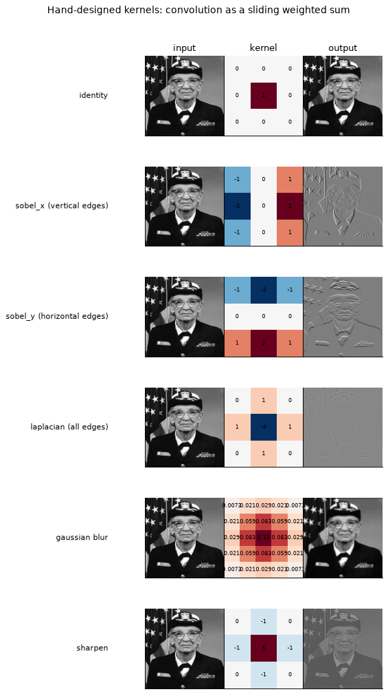
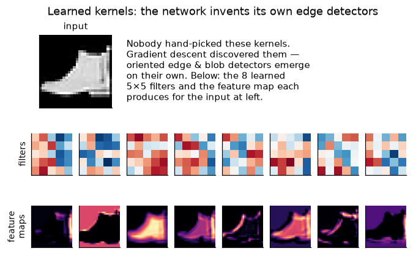
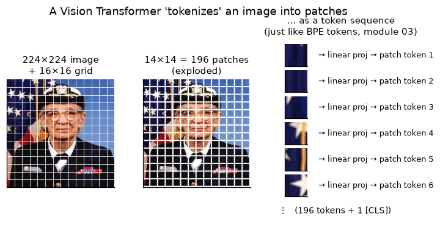
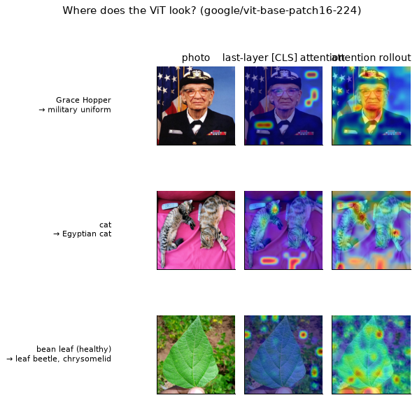
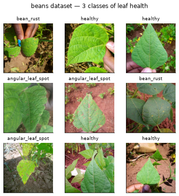
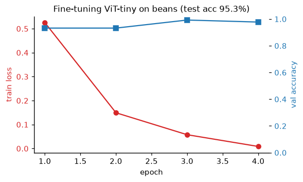
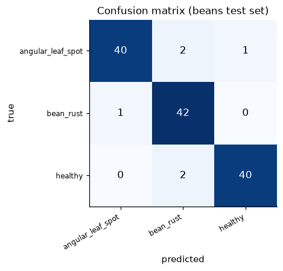
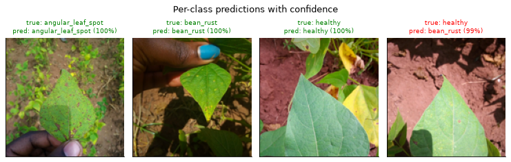
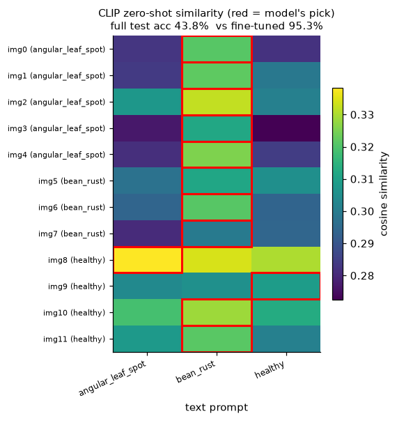

# Module 08 — Vision: from convolutions to Vision Transformers

You have spent five modules teaching a transformer to read. Now we point the
same machinery at pixels. The surprise of the last few years is that vision did
*not* need a fundamentally new architecture — the **Vision Transformer (ViT)**
chops an image into patches, calls each patch a "token", and runs the exact
encoder you built in modules 04/05. This module walks the whole arc: start with
the humble **convolution** (the inductive bias that ruled vision for a decade),
watch a tiny CNN *invent its own edge detectors*, then graduate to ViTs, look at
where they attend, fine-tune one on a real dataset, and finish with **CLIP**
classifying images it was never trained to classify.

We follow the [Hugging Face Community Computer Vision Course](https://huggingface.co/learn/computer-vision-course)
(units 1–3) and keep everything hands-on and graphical.

## Goals

By the end you will be able to:

- implement **2D convolution from scratch** and explain classic kernels
  (edge / blur / sharpen) as sliding weighted sums;
- articulate the **convolutional inductive bias** (locality + weight sharing)
  and *see* a CNN learn edge/blob detectors with no supervision of the filters;
- explain how a ViT **tokenizes an image into patches** and map every ViT
  component back to the text transformer you already know;
- read **attention maps** on images ("where does the model look") via last-layer
  [CLS] attention and attention rollout;
- **fine-tune a pretrained ViT** on a real dataset with the Hugging Face
  `Trainer` and read training curves, a confusion matrix, and per-class
  predictions;
- run **CLIP zero-shot** classification from text prompts and reason about the
  trade-off between *pretraining scale* and *task-specific fine-tuning*.

## Theory bridge — two inductive biases

A **convolution** bakes in strong assumptions: features are *local* (a pixel is
explained by its neighbours) and *translation-equivariant* (the same kernel
slides everywhere, so an edge is an edge wherever it appears). That bias is why
CNNs learn from modest data — but it also *limits* what they can express.

A **Vision Transformer** throws almost all of that away. It cuts the image into
patches, linearly embeds each into a vector, adds a position embedding, and lets
**self-attention** decide which patches talk to which — globally, from layer
one. Weaker prior, more flexibility; it needs more data (or a big pretrain) to
pay off. Same encoder block as text, a different way of turning the input into
tokens:


The whole module is about feeling both sides of that trade-off in your hands.

## What you'll see

**1a — Convolution as a sliding weighted sum.** A hand-designed kernel is just a
small grid of weights. Slide it over the image, and different weights pick out
different structure: vertical edges, horizontal edges, all edges, blur, sharpen.



**1b — The network invents its own edge detectors.** Nobody hand-picks kernels
in practice. Train a two-layer CNN on FashionMNIST and its first-layer 5×5
filters arrange themselves into oriented edge and blob detectors — the feature
maps below light up on exactly those structures. This is *learned* feature
extraction, and it is the reason deep learning displaced hand-engineered vision.



**2 — A ViT tokenizes an image into patches.** The bridge to modules 03–05 made
literal: a 224×224 image becomes a 14×14 grid of 16×16 patches, each flattened
and linearly projected into a token. 196 patch tokens + 1 `[CLS]`, then the same
transformer encoder as text.



| aspect | text transformer (module 05) | Vision Transformer |
| --- | --- | --- |
| input unit | BPE subword token | 16×16 pixel patch |
| sequence length | up to context window | 196 patches + 1 `[CLS]` |
| embedding | learned token lookup table | linear projection of flattened patch |
| position info | positional encoding | learned position embedding |
| encoder block | MHSA + MLP + LayerNorm | **identical** |
| layers / hidden / heads | ~30 / 512–4096 / 8–32 | 12 / 768 / 12 (ViT-base) |
| readout | next-token head | `[CLS]` → class head |

**3 — Where does the ViT look?** Attention weights, overlaid on the photo. The
last-layer `[CLS]` attention is spiky; **attention rollout** (multiplying the
residual-augmented attention across all 12 layers) gives a cleaner map. Note the
honest failure on the bean leaf: ViT-base only knows ImageNet classes, so it
guesses "leaf beetle" — but it still *attends to the leaf*.



**4 — Fine-tuning a ViT on `beans`.** We take ImageNet-pretrained **ViT-tiny**
(5.7M params), replace its 1000-class head with a fresh 3-class head, and
fine-tune on the [`beans`](https://huggingface.co/datasets/AI-Lab-Makerere/beans)
leaf-disease dataset (1034 train images).



Four epochs, about a minute on an M5, and the loss collapses while validation
accuracy climbs to ~98%:



On the held-out test set it reaches **95.3%**. The confusion matrix shows the
few mistakes cluster where you'd expect — the two *diseases* occasionally get
confused with each other, rarely with "healthy":



Per-class predictions with confidence, including one honest, confident mistake
(a healthy leaf called `bean_rust`):



**5 — CLIP zero-shot: no training at all.** [CLIP](https://huggingface.co/openai/clip-vit-base-patch32)
was pretrained to match images with captions. We classify the *same* beans test
set with nothing but text prompts describing the visible symptoms — no fine-tune.
The similarity matrix shows CLIP's pick (red box) for each image; it collapses
toward one class and lands at **43.8%**, barely above the 33% chance baseline
and far below our fine-tuned **95.3%**.



The lesson is not "CLIP is bad" — CLIP is *astonishing* at open-vocabulary
recognition of things it saw during pretraining. It is that a huge generalist
prior does **not** replace a few minutes of task-specific fine-tuning on a
narrow, specialist distribution (fine-grained agricultural disease). Scale and
fine-tuning are complements, not substitutes.

## Hands-on walkthrough

Everything runs from the `python/` uv project. Sync the environment first
(pulls torch, transformers, datasets; models and datasets download to the
default Hugging Face cache, never into the repo):

```bash
cd modules/08-vision/python
```

```bash
uv sync
```

**Convolution from scratch** — apply the classic kernels and print a self-check
(instant):

```bash
uv run python src/conv.py
```

**Train the tiny CNN** and watch it learn (~15 s on M5, downloads FashionMNIST
once):

```bash
uv run python src/cnn.py
```

**ViT anatomy** — patchify a blank image and confirm the (196, 768) sequence
shape (instant):

```bash
uv run python src/vit_anatomy.py
```

**Attention rollout** on the bundled Grace Hopper photo (~5 s after the ViT-base
download):

```bash
uv run python src/attention.py
```

**Fine-tune ViT-tiny on beans** — the real training run (~1 min on M5, reports
honest validation/test accuracy):

```bash
uv run python src/finetune.py
```

**CLIP zero-shot** on the beans test set (~15 s, prints the zero-shot accuracy):

```bash
uv run python src/clip_zeroshot.py
```

**Regenerate every figure** in this README (retrains the CNN *and* the beans
ViT, so budget ~3 min on M5):

```bash
uv run python src/figures.py
```

You can also generate figures selectively, e.g. just the vision-transformer
ones:

```bash
uv run python src/figures.py patches attention
```

### Honest M5 runtimes

| step | what it does | time (M5, MPS) | result |
| --- | --- | --- | --- |
| `src/conv.py` | numpy conv self-check | < 1 s | — |
| `src/cnn.py` | train TinyCNN, 6 epochs | ~15 s | ~82% test |
| `src/attention.py` | ViT-base rollout, 1 image | ~5 s | "military uniform" |
| `src/finetune.py` | fine-tune ViT-tiny, 4 epochs | ~55 s | **95.3%** test |
| `src/clip_zeroshot.py` | CLIP zero-shot, 128 images | ~15 s | **43.8%** |
| `src/figures.py` (all) | retrain + all 10 figures | ~3 min | 10 PNGs |

(First runs are slower — they download the datasets and the three checkpoints:
ViT-tiny 23 MB, ViT-base 346 MB, CLIP 605 MB.)

## Exercises

Skeletons with `# TODO(you):` markers live in [`exercises/`](exercises/);
verified reference solutions are in [`solutions/`](solutions/). Check your work:

```bash
uv run pytest tests/test_solutions.py -m "not slow" -v
```

- **(a) `exercise_a_patchify.py`** — implement the `patchify` function from
  scratch with numpy (reshape → transpose → reshape). This is a ViT's very first
  operation; the test checks both the output shape and the patch ordering.
- **(b) `exercise_b_your_photo.py`** — wire up the attention-rollout script and
  run it on **your own photo**, then interpret the heatmap. Try a clean studio
  shot vs a cluttered scene:

  ```bash
  uv run python ../exercises/exercise_b_your_photo.py /path/to/your_photo.jpg
  ```

- **(c) `exercise_c_swap_dataset.py`** — swap `beans` for another small HF image
  dataset ([`Bingsu/Cat_and_Dog`](https://huggingface.co/datasets/Bingsu/Cat_and_Dog),
  2 classes) and rerun the fine-tune. Because cats and dogs are heavily
  represented in ImageNet, ViT-tiny transfers almost instantly — the reference
  solution reaches **96%** test accuracy on an 800-image subset in **~28 s** (2
  epochs). Report what transfers: fine-grained bean-disease features had to be
  learned from scratch; cat-vs-dog is nearly solved by the pretrained backbone.

  ```bash
  uv run python ../solutions/solution_c_swap_dataset.py
  ```

## Run all the tests

```bash
uv run pytest
```

The fast tests (numpy conv, patchify, solution equivalence) run in ~2 s; the one
`slow`-marked test downloads Cat_and_Dog and trains a few steps to prove the
dataset-swap solution actually runs (~12 s). Deselect it with `-m "not slow"`.

## Checkpoint — you should now be able to…

- implement 2D convolution and explain edge/blur/sharpen kernels as local
  weighted sums, and why `same` vs `valid` padding change the output shape;
- describe the **convolutional inductive bias** and why a trained CNN's
  first-layer filters look like oriented edge and blob detectors;
- explain, end to end, how a ViT turns an image into a sequence of patch tokens,
  and match every ViT block to its module-05 text-transformer counterpart;
- compute and read **attention rollout** heatmaps, and reason about a model
  attending to the right region while predicting the wrong (out-of-distribution)
  label;
- fine-tune a pretrained ViT with the `Trainer`, and interpret training curves,
  a confusion matrix, and confidence-scored predictions;
- run **CLIP zero-shot** classification and articulate when a generalist
  pretrain beats fine-tuning and when it does not.

## Links

- [Hugging Face Community Computer Vision Course](https://huggingface.co/learn/computer-vision-course)
  — units 1–3 (fundamentals, CNNs, Vision Transformers)
- [transformers — image classification task guide](https://huggingface.co/docs/transformers/tasks/image_classification)
- [`timm` (PyTorch Image Models) documentation](https://huggingface.co/docs/timm)
- [ViT paper — *An Image is Worth 16×16 Words*](https://arxiv.org/abs/2010.11929)
- [Attention rollout — Abnar & Zuidema, 2020](https://arxiv.org/abs/2005.00928)
- [CLIP model card — `openai/clip-vit-base-patch32`](https://huggingface.co/openai/clip-vit-base-patch32)
- [`beans` dataset](https://huggingface.co/datasets/AI-Lab-Makerere/beans)
