# Module 09 — Diffusion: learning to denoise

*Destruction is easy; learning to reverse it is generative modelling.* You have
built transformers and fine-tuned LLMs — models that predict the next token.
Diffusion models generate a different way: they start from **pure noise** and
**iteratively remove it** until structure appears. This module builds that idea
three times — first on a 2D point cloud you can watch dissolve and reassemble,
then a from-scratch DDPM on FashionMNIST images, then the same thing the
industrial way with Hugging Face `diffusers` — and closes with the road to
Stable Diffusion. It adapts units 1–2 of the
[HF Diffusion Models Course](https://huggingface.co/learn/diffusion-course).

**🕹 Interactive:** [Diffusion on a spiral](../../explorables/09-diffusion.html) —
scrub a 2D spiral into pure noise, then run this module's trained denoiser live
in your browser to pull the spiral back out.

**✅ Quiz:** [10 questions](../../quizzes/09.html) — check yourself once the denoiser samples.

## Goals

By the end you will be able to:

- Explain the **forward process** (add Gaussian noise on a schedule) and why it
  has a closed form that lets you jump to any timestep in one shot.
- Explain the **reverse process** and the **noise-prediction objective**: train
  a network to predict the noise added, then subtract it step by step.
- Implement diffusion end-to-end on 2D data — schedule, sinusoidal time
  embedding, MLP, sampling loop — and *see* the learned denoising vector field.
- Write a small **UNet** and train a **mini-DDPM** on FashionMNIST to
  recognizable (if blurry) samples in minutes on an M-series Mac.
- Use `diffusers` to load a pretrained DDPM, then **swap the scheduler**
  (DDPM→DDIM) and read the quality-vs-steps trade-off — mapping every piece
  back to what you built by hand.
- Describe **latent diffusion**, **text conditioning**, and **classifier-free
  guidance** — the three ideas that turn a denoiser into Stable Diffusion.

## What you'll see

The **forward process** on a 2D spiral: structure dissolving into isotropic
Gaussian noise as the timestep `t` climbs. This is *given*, not learned — pure
algebra.

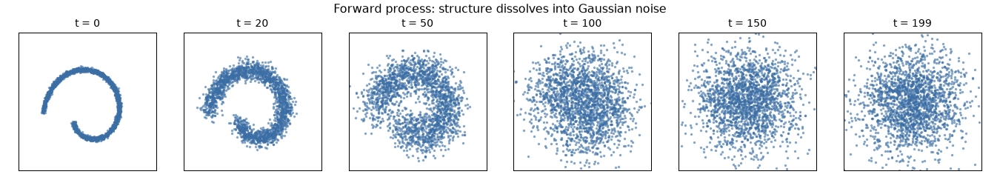

The **reverse process** — the part we learn. Pure noise, organised back into the
spiral by a small MLP applied ~200 times:

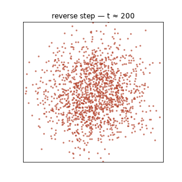

What the network actually learned: the **denoising vector field** (`−ε`, which
is proportional to the score of the noised data). At high `t` it points broadly
toward the data's centre of mass; at low `t` it sharpens toward the spiral
manifold:

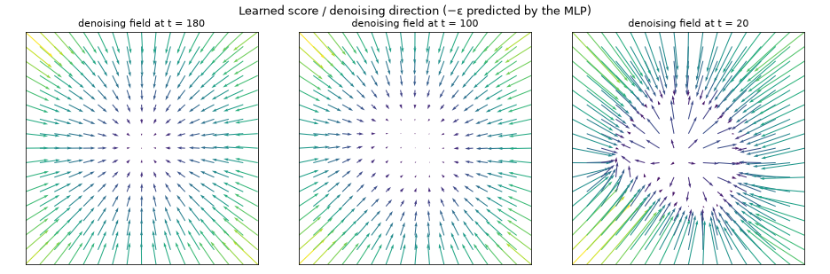

Same idea, on **images**. A from-scratch UNet trained on FashionMNIST — the same
16 seeds sampled at successive training checkpoints, learning to *dream better*:

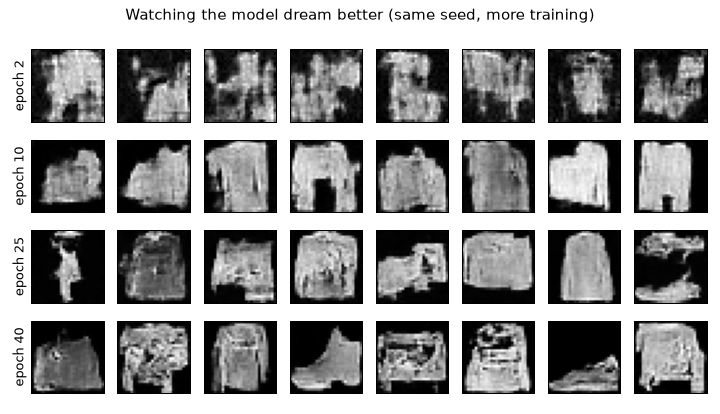

One sample's **denoising trajectory**, `t = T → 0` (pure noise to garment):

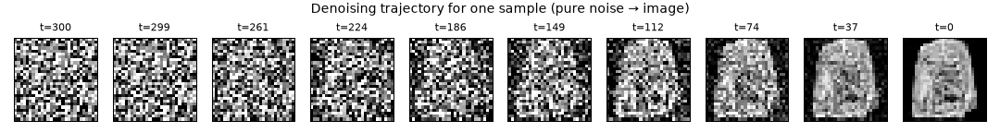

Final samples from the from-scratch mini-DDPM — recognizable shirts, trousers,
bags, and boots:

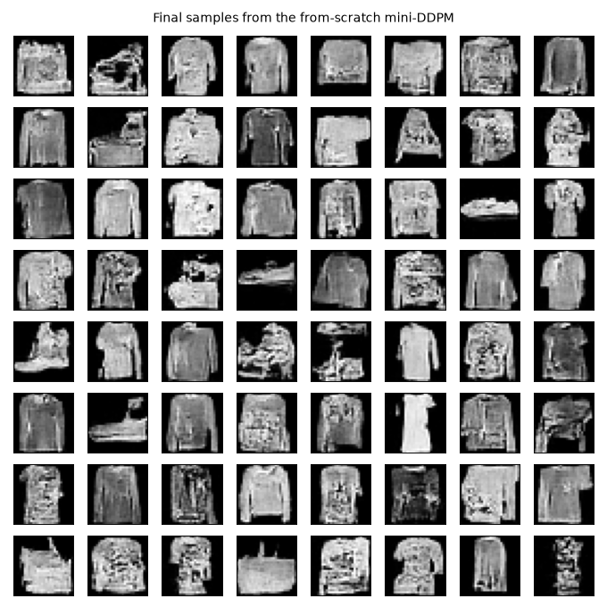

The **Hugging Face way** — a pretrained DDPM, sampled with **DDIM** at
10 / 50 / 200 steps (same UNet, same seed). Watch quality climb with step count,
and note the wall-clock cost:

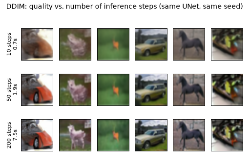

## Theory — destruction is easy, reversing it is generative modelling

### The forward process (fixed)

Take a data point `x0`. Add a little Gaussian noise, repeatedly, for `T` steps.
Each step is `x_t = sqrt(1-β_t)·x_{t-1} + sqrt(β_t)·ε`. The `β_t` values are the
**noise schedule**. After enough steps the data is indistinguishable from
`N(0, I)` — all structure gone.

The magic is that you never simulate those steps. Because a sum of Gaussians is
Gaussian, there is a **closed form** to jump straight to any `t`:

```
x_t = sqrt(ᾱ_t)·x0 + sqrt(1 − ᾱ_t)·ε,     ε ~ N(0, I)
```

where `ᾱ_t = Π_{s≤t}(1 − β_s)` is the fraction of the original signal that
survives. You implement this one line in exercise (a) — it is the entire forward
process.

### The reverse process (learned)

We want to undo noising: given `x_t`, produce a slightly cleaner `x_{t-1}`. DDPM
trains a network `ε_θ(x_t, t)` to **predict the noise** `ε` that was added, using
the world's simplest loss:

```
L = ‖ ε − ε_θ(x_t, t) ‖²          (mean-squared error on the noise)
```

That's it — sample a random data point, a random timestep, a random noise;
noise the point with the closed form; ask the network for the noise back; MSE.
The 2D lab and the image DDPM use the *identical* objective — only the network
differs (MLP vs UNet). To **sample**, start from `x_T ~ N(0, I)` and walk the
chain down, at each step subtracting the predicted noise and adding a little
back (the stochastic term):

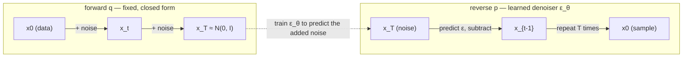

The network needs to know *which* noise level it is looking at, so the timestep
`t` is fed in through a **sinusoidal embedding** — the same positional-encoding
trick from the transformer module, reused for time.

## Hands-on

Everything runs with `uv` from the `python/` directory. Runtimes are honest
measurements on an **Apple M5 (MPS)**.

```bash
cd modules/09-diffusion/python
uv sync
```

**1 — Diffusion in 2D (the whole idea, in ~1 minute).** Trains the spiral model
and renders the forward panel, the reverse GIF, the vector field, and the loss.

```bash
uv run python run_toy2d.py     # ~15s train + figures on M5
```

```
device: mps
epoch  2499/2500 | loss 0.3422
trained in 5.2s | final loss 0.3422
```

**2 — Mini-DDPM on FashionMNIST (from scratch).** A ~377K-param UNet, 10k
images, 40 epochs. Downloads ~30MB of FashionMNIST the first time (cached under
`~/.cache/huggingface`; nothing committed).

```bash
uv run python run_ddpm.py      # ~4.2 min on M5
```

```
params: 376,833
epoch   0/40 | loss 0.3217
epoch  39/40 | loss 0.0817
trained in 4.2 min | final loss 0.0817
```

**3 — The Hugging Face way (`diffusers`).** Loads pretrained
`google/ddpm-cifar10-32`, generates, then swaps DDPM→DDIM and times 10/50/200
steps. Downloads ~100MB of weights the first time.

```bash
uv run python run_diffusers.py
```

```
model: google/ddpm-cifar10-32 | UNet params: 35,746,307
DDIM  10 steps | 6 imgs | 0.65s (65 ms/step)
DDIM  50 steps | 6 imgs | 1.91s (38 ms/step)
DDIM 200 steps | 6 imgs | 7.53s (38 ms/step)
```

Same UNet weights throughout — only the **scheduler** changed. That is the whole
point of the abstraction (next section). Ten DDIM steps already give a plausible
image; the extra 190 steps buy sharpness at ~10× the cost.

**4 — Road-to-SD schematics** (no model downloads, instant):

```bash
uv run python run_roadmap.py
```

### The `diffusers` abstraction — mapped to what you built

`diffusers` factors a diffusion model into three objects. You wrote all three by
hand; the library just makes them swappable:

| `diffusers` object | what it is | your from-scratch version |
| --- | --- | --- |
| **model** (`UNet2DModel`) | predicts the noise `ε_θ(x_t, t)` | `TinyUNet` in `src/ddpm_mnist.py` |
| **scheduler** (`DDPMScheduler`, `DDIMScheduler`, …) | the noise schedule **and** the sampling-step math | `Diffusion` in `src/schedules.py` (`betas`, `q_sample`, `p_sample_step`) |
| **pipeline** (`DDPMPipeline`) | glue: draw noise, loop the scheduler over the model, return images | the `p_sample_loop` you call in the run scripts |

Because the scheduler is a separate object, you can train with DDPM and *sample*
with DDIM — a deterministic solver that reaches similar quality in far fewer
steps — without retraining anything. That swap is the `run_diffusers.py` figure.

## The road to Stable Diffusion

The from-scratch DDPM denoises **pixels** and is **unconditional**. Three ideas
bridge from here to a text-to-image model like Stable Diffusion. This section is
conceptual — no SD weights are downloaded — and the full treatment is in
[diffusion-course units 3–4](https://huggingface.co/learn/diffusion-course).

**Latent diffusion.** Denoising megapixels is wasteful. Stable Diffusion first
compresses the image ~48× with a VAE encoder and runs the *entire* diffusion
process in that small latent space, decoding to pixels only at the very end. The
UNet you built is unchanged in spirit — it just denoises a `64×64×4` latent
instead of a `512×512×3` image.

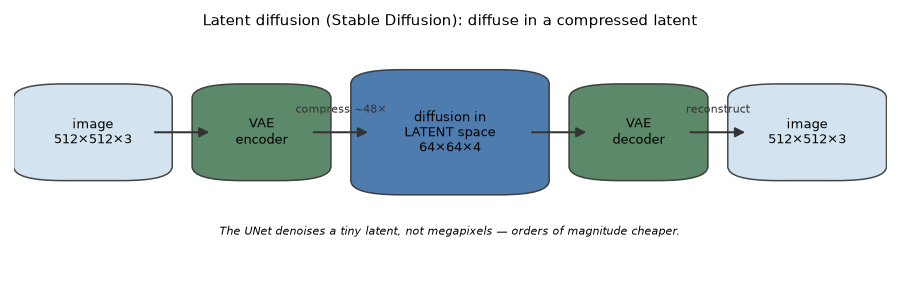

**Text conditioning.** A prompt is encoded by a **CLIP** text encoder into a
sequence of embeddings, and the UNet's **cross-attention** layers let each image
patch attend to those word embeddings at every block. The denoiser becomes
`ε_θ(x_t, t, text)` — same objective, one extra input.

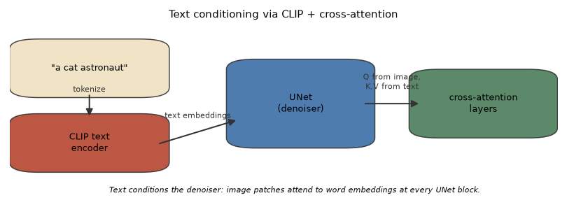

**Classifier-free guidance (CFG).** To make samples follow the prompt more
strongly, run the denoiser twice — once with the prompt, once with a null prompt
— and extrapolate: `ε = ε_uncond + w·(ε_cond − ε_uncond)`. Larger `w` means
sharper, more on-prompt, less diverse. You implement exactly this, in 2D, in
exercise (c).

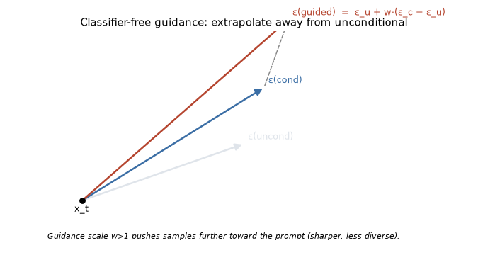

## Exercises

Skeletons in [`python/exercises/`](./python/exercises) with `# TODO(you):`
markers; verified answers in [`python/solutions/`](./python/solutions). Each runs
standalone and self-checks. Run from `python/`.

**(a) Implement the forward process `q_sample`.** Fill in the closed-form
`x_t = sqrt(ᾱ_t)·x0 + sqrt(1−ᾱ_t)·ε`. Two checks: exact match against the
reference, and unit variance at `t=T`.

```bash
uv run python exercises/ex_a_q_sample.py   # raises until you fill it in
uv run python solutions/ex_a_q_sample.py   # ALL PASS
```

**(b) Swap the noise schedule (linear vs cosine).** Implement the cosine
schedule, then compare the two reverse-process GIFs and the `ᾱ_t` decay curves.
Produces `figures/ex_b_linear.gif`, `ex_b_cosine.gif`, `ex_b_schedules.png`.

```bash
uv run python solutions/ex_b_schedule.py   # ~20s
```

**(c) Conditional generation with classifier-free guidance (2D).** Train one
model on two-moons that can be told *which* moon to draw, then sweep the
guidance scale `w ∈ {0, 1, 3}`. `w=0` ignores the label (both moons), `w=1`
selects the moon, `w=3` tightens onto it. Produces `figures/ex_c_conditional.png`.

```bash
uv run python solutions/ex_c_conditional.py   # ~15s
```

## Checkpoint — you should now be able to…

- [ ] State the forward-process closed form and explain why noising has no
      learnable parameters.
- [ ] Explain the noise-prediction objective and write its two-line training
      step from memory.
- [ ] Implement a full 2D diffusion model — schedule, time embedding, MLP,
      sampling loop — and interpret its learned denoising vector field.
- [ ] Write a small UNet and train a DDPM on FashionMNIST to recognizable
      samples on a laptop GPU.
- [ ] Explain the `diffusers` model / scheduler / pipeline split and map each to
      code you wrote by hand.
- [ ] Explain the quality-vs-steps trade-off and why swapping DDPM→DDIM needs no
      retraining.
- [ ] Explain latent diffusion, CLIP text conditioning, and classifier-free
      guidance — and how CFG steers generation.

## Links

- Hugging Face Diffusion Models Course: <https://huggingface.co/learn/diffusion-course>
- `diffusers` documentation: <https://huggingface.co/docs/diffusers>
- DDPM paper — Ho, Jain, Abbeel 2020, *Denoising Diffusion Probabilistic
  Models*: <https://arxiv.org/abs/2006.11239>
- DDIM paper — Song, Meng, Ermon 2021, *Denoising Diffusion Implicit Models*:
  <https://arxiv.org/abs/2010.02502>
- Improved DDPM (cosine schedule) — Nichol & Dhariwal 2021:
  <https://arxiv.org/abs/2102.09672>
