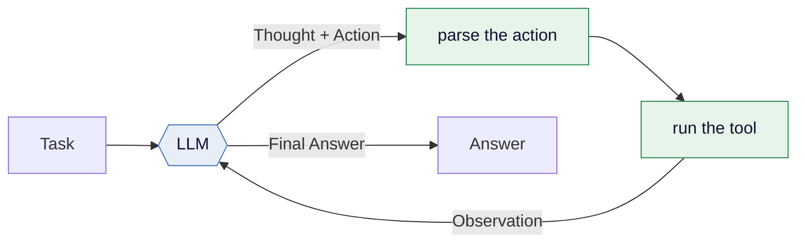
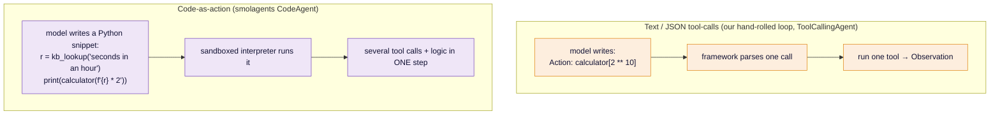
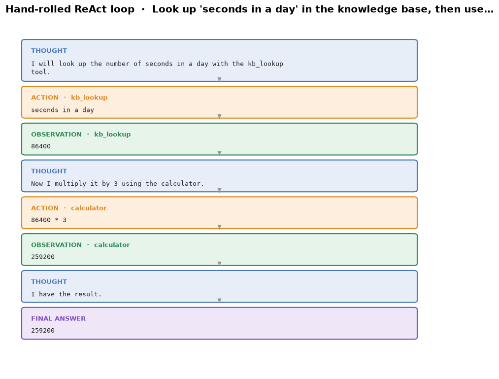
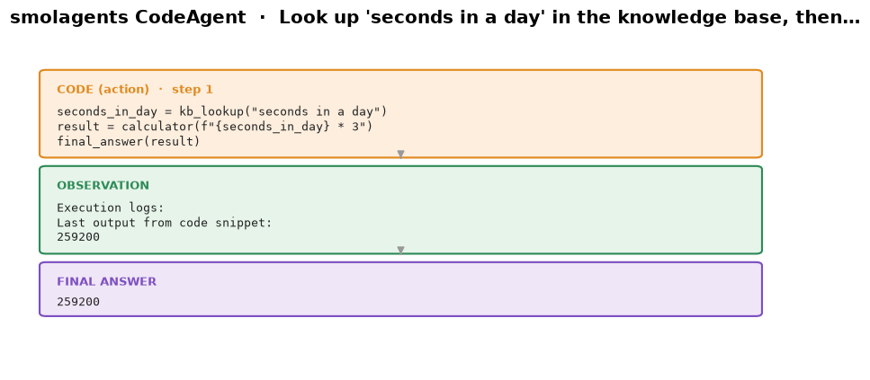
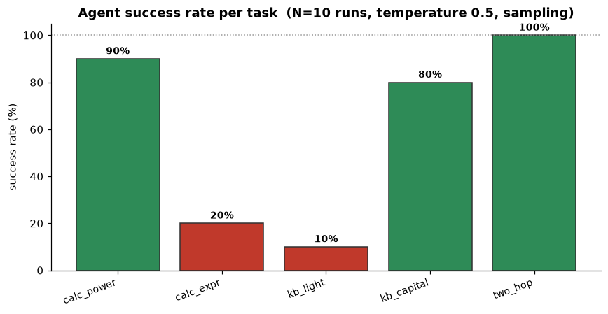
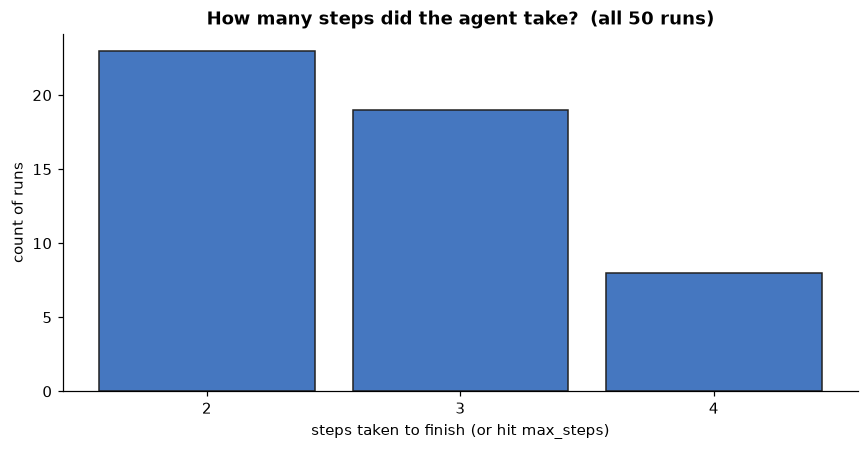

# Module 10 — Agents: models that act

You have built a language model, fine-tuned it, and watched it generate text.
But a model that only *emits tokens* is a brain in a jar. An **agent** gives it
hands: a loop that lets the model *decide to use a tool*, *see the result*, and
*decide again* — until the task is done. That loop is the whole idea, and in this
final module you build it twice: once **by hand in ~100 lines**, then the
**smolagents** way. Everything runs **locally** on a small SmolLM2 — no API keys,
no credits, no cloud. Then we do the thing most tutorials skip: we **measure**
the agent, because an agent is a stochastic system and "it worked once" is not a
result.

This module adapts the [Hugging Face Agents Course](https://huggingface.co/learn/agents-course)
and points onward to the [MCP Course](https://huggingface.co/learn/mcp-course).

## Goals

By the end you will be able to:

- explain an agent as **LLM + tools + a loop**, and write the **ReAct** loop from
  scratch — prompt, tool-call parsing, observation injection, termination;
- run the same tasks with **smolagents' `CodeAgent`** and a **local**
  `TransformersModel`, and explain **code-as-action** vs JSON/text tool calls;
- be honest about **small-model failure modes** — looping, format drift, skipped
  tools — and steer around them with the **system prompt**;
- treat agents as **stochastic systems**: run an eval suite N times and read a
  **success-rate bar chart** and a **steps histogram** instead of a single demo;
- drive the agent from a **Gradio playground** that shows the step trace live;
- know exactly **where to go next** — bigger local models, the MLX lane,
  Inference Providers, and the Agents/MCP course certifications.

## What is an agent? (the theory)

A plain LLM call is a function: `text -> text`. An **agent** wraps that call in a
loop and gives the model **tools** it can invoke. The canonical recipe is
**ReAct** ([Yao et al., 2022](https://arxiv.org/abs/2210.03629)) — *Reason +
Act* — where the model alternates between **Thought** (reasoning in words) and
**Action** (calling a tool), reading each tool's **Observation** before the next
Thought:



That is the entire mechanism. Everything fancier — planning, memory, multi-agent
systems, frontier "agentic" products — is a hardened version of this loop. So we
build the loop itself first, with nothing hidden.

### Two ways to "act": text tool-calls vs code-as-action

There are two dominant styles for the **Action** step:



**Text tool-calls** are simple to parse and easy to reason about — one action per
step. **Code-as-action** (smolagents' signature idea) lets the model write a
*program*: it can call several tools, do arithmetic, loop, and branch in a single
step, which often collapses a multi-step ReAct dance into one. The trade-off is
that you must run model-written code in a **sandbox**. You will see both.

## What you'll see

**The hand-rolled loop, laid bare.** One demo task, rendered as the exact
Thought → Action → Observation → … → Final Answer blocks our 100-line loop
produced with a local SmolLM2-1.7B:



**The smolagents way — code as action.** The same tools, but now the model
writes Python that calls them; watch a multi-hop task resolve in far fewer steps:



**Agents are stochastic — so measure them.** Run the agent 10× per task at a
non-zero temperature and the truth comes out: some tasks are rock-solid, others
are coin-flips for a 1.7B model.



**Cost is variable too.** The same task can finish in 2 steps or thrash until it
hits the step limit. The distribution, not the best case, is what you ship
against:



## Hands-on walkthrough

Everything runs from the `python/` uv project. Sync once:

```bash
cd modules/10-agents/python
uv sync
```

> **Local + honest.** The agent brain is `HuggingFaceTB/SmolLM2-1.7B-Instruct`
> running on **MPS in float32**. There are **no API calls** anywhere in this
> module. The first run downloads ~3.4 GB of weights and every model call takes a
> few seconds on a Mac; a full multi-step task is tens of seconds. This is a
> teaching setup — a 1.7B model is *small*, and part of the lesson is watching
> where it stumbles.

### 1. The loop, from scratch

Read [`src/handrolled.py`](python/src/handrolled.py) — it is deliberately ~100
lines with nothing hidden: the ReAct system prompt, the `Action: tool[arg]`
parser, the tool dispatch, the observation injection, the termination check. Run
it on three demo tasks plus one instructive failure:

```bash
uv run python src/handrolled.py     # ~4–6 min on an M-series Mac (incl. the looping failure demo)
```

It writes a full transcript to [`transcripts/handrolled_trace.txt`](transcripts/handrolled_trace.txt)
and a JSON trace the figure script renders. Here is a real condensed trace (the
two-hop task, temperature 0):

```
TASK: Look up 'seconds in a day' in the knowledge base, then use the calculator to multiply that number by 3.
Thought: I will look up seconds in a day.
Action: kb_lookup[seconds in a day]
Observation: 86400
Thought: Now I multiply by 3 with the calculator.
Action: calculator[86400 * 3]
Observation: 259200
Final Answer: 259200
```

**The three tools** ([`src/tools.py`](python/src/tools.py)) are all local and
offline: a **safe calculator** (it walks the Python AST and refuses anything but
arithmetic — no `eval`, so a hallucinated `__import__('os')...` just errors), a
**knowledge-base lookup** over a shipped [`knowledge_base.json`](knowledge_base.json),
and a **file lister** over this module's own directory.

#### Be honest: how a small model fails here

A 1.7B model is not a frontier agent, and this module shows the seams rather than
hiding them. The failure modes you will actually hit:

- **Format drift.** The model writes the tool call *inside* a Thought
  (`Thought: kb_lookup("speed of light")`) instead of on an `Action:` line, so the
  parser finds nothing. The fix that works: a **one-shot example** of the exact
  format in the system prompt. (This module ships that example — remove it and
  watch tasks 2–3 collapse into `no parseable Action` errors.)
- **Looping.** When a tool says *"Did you mean: earth radius km?"*, the small model
  often re-issues an almost-identical bad key forever. You will reproduce and
  **fix this in Exercise B**, from the system prompt alone. The shipped
  `FAILURE_TASK` in `handrolled.py` is exactly this loop, left in on purpose.
- **Over-acting.** Hand it a looked-up *number* and it compulsively does
  arithmetic even when you only asked it to *report* the value — e.g. it looks up
  the speed of light and then squares it. That is exactly why the system prompt
  ships a **report-only** worked example; delete Example 1 and watch a "report the
  value" task turn into a runaway multiply.

The three demo tasks are phrased explicitly *because* coaxing a small model onto
rails is a real part of building with one. At temperature 0 they succeed
reproducibly (`1036`, `Tokyo`, `259200`); the fourth
(Earth-radii-into-Moon-distance) is the shipped failure, and its transcript shows
the loop in full — the model keeps re-issuing a key the KB already rejected.

### 2. The smolagents way

Same three tools, same local model — but now a
[`CodeAgent`](https://huggingface.co/docs/smolagents) writes **Python** as its
action. Read [`src/smol_way.py`](python/src/smol_way.py) and run:

```bash
uv run python src/smol_way.py       # ~3–5 min; writes transcripts/smol_trace.txt
```

The tools are the *same functions* from `tools.py`, re-exposed with smolagents'
`@tool` decorator — one source of truth, two frameworks. Because the model writes
code, a two-hop task collapses into a **single** step — here is the actual
snippet the local model produced for "look up seconds-in-a-day, then multiply by
3":

```python
seconds_in_day = kb_lookup("seconds in a day")   # -> "86400"
result = calculator(f"{seconds_in_day} * 3")     # -> "259200"
final_answer(result)
```

smolagents runs that in a restricted Python interpreter and feeds the output back
as the observation. Two teaching points fall out of the run: (1) the same
lookup+calc that took the hand-rolled loop *two* ReAct turns is *one* CodeAgent
step; and (2) on the nested-parentheses task `(2 ** 10 + sqrt(144)) * 3 - 100`,
the CodeAgent returns the correct **3008** because it builds the expression in
code — whereas the naive hand-rolled model is prone to dropping the outer
parentheses. Structure helps. Per-step logs are captured to
[`transcripts/smol_trace.txt`](transcripts/smol_trace.txt) and rendered above.

### 3. Observability & eval mini-lab

One successful demo proves almost nothing. An agent is a **stochastic system**:
change the seed (or the temperature) and the outcome changes. So we run a small
fixed suite — **5 tasks × N runs** — and look at the *distribution*.
[`src/eval_lab.py`](python/src/eval_lab.py) runs the hand-rolled agent at
**temperature 0.5** (sampling, on purpose) and records, per task, the **success
rate** and the **steps taken**:

```bash
uv run python src/eval_lab.py --n 10      # ~15–25 min for 5×10 episodes
# faster smoke test:
uv run python src/eval_lab.py --n 3
```

It writes [`transcripts/eval_results.json`](transcripts/eval_results.json); the
figures come from `src/figures.py`. Our actual run (N=10, temperature 0.5) is a
perfect cautionary tale:

| task | what it asks | success |
|------|--------------|--------:|
| `two_hop` | look up seconds-in-an-hour, ×2 | **100%** |
| `calc_power` | `2 ** 10` | 90% |
| `kb_capital` | capital of Japan | 80% |
| `calc_expr` | `(5 + 7) * 3` | **20%** |
| `kb_light` | report the speed of light | **10%** |

Two tasks that look trivial — a parenthesised product and "just report this
number" — are near coin-flips or worse, because at temperature the small model
rewrites the expression or compulsively does arithmetic on the looked-up value.
The teaching point is blunt: **report the bar, not the anecdote.** You only learn
`kb_light` is a 10%-task by running it ten times.

Regenerate every figure any time:

```bash
uv run python src/figures.py
```

### 4. Gradio agent playground

Chat with the local agent and watch it think. [`app.py`](python/app.py) puts the
chat on the left and the **live step trace** (the code it wrote, each tool
observation) on the right:

```bash
uv run python app.py                 # http://127.0.0.1:7860  (first message is slow: weights load)
```

The agent is built lazily on the first message, so the UI opens instantly. It is
a teaching toy: a 1.7B model will sometimes flail, and that is honest.

## Scaling up — beyond a 1.7B local model

Everything above is deliberately small so it runs on a laptop with no keys. Here
is how you make it *better*, in rough order of effort — **README only, nothing to
run here**:

- **A bigger local model.** Swap the `model_id` for
  `HuggingFaceTB/SmolLM3-3B` in `build_model()` (`src/smol_way.py`) or
  `model_local.DEFAULT_MODEL`. `TransformersModel` handles it; you trade speed for
  much better format-following and multi-hop reliability. This is the single
  highest-leverage change.
- **The MLX lane (Apple silicon).** smolagents ships an
  [`MLXModel`](https://huggingface.co/docs/smolagents) that runs `mlx-community`
  models through Apple's MLX for a real speed-up on M-series chips:
  ```python
  from smolagents import MLXModel, CodeAgent
  model = MLXModel(model_id="mlx-community/SmolLM3-3B-4bit")
  agent = CodeAgent(tools=[...], model=model)
  ```
  Same agent, faster brain, still fully local.
- **Inference Providers (opt-in, tiny free tier).** Hugging Face's serverless
  [Inference Providers](https://huggingface.co/docs/inference-providers) give
  ~**$0.10/month** of free credits on a signed-in account. smolagents'
  `InferenceClientModel` targets them. **This module never uses it** — it spends
  credits — but for real work a hosted 8B–70B model is a different league. Opt in
  yourself; do not wire keys into course code.
- **Your own fine-tuned model.** In **module 06** you fine-tuned SmolLM3. That
  checkpoint can be the agent's brain — point `TransformersModel` at your local
  adapter/merged model. The Agents Course **bonus unit 1** is exactly this:
  *fine-tuning an LLM for function-calling*, which is how you make a small model a
  *reliable* tool-caller instead of a flaky one.

### Where to go next in the Agents & MCP courses

- **[Agents Course](https://huggingface.co/learn/agents-course), units 2–4.**
  Unit 2 goes deep on frameworks — **smolagents**, **LlamaIndex**, and
  **LangGraph** — and its *bonus unit 2* is agent **observability & evaluation**,
  the grown-up version of our mini-lab. Units 3–4 cover real **use cases** and a
  **final assignment with certification** (build an agent, submit it to a
  leaderboard).
- **[MCP Course](https://huggingface.co/learn/mcp-course).** Our tools are Python
  functions wired in by hand. The **Model Context Protocol** is the emerging
  standard for connecting agents to tools and data *as a service* — the same
  calculator or knowledge base exposed over MCP, discoverable and reusable across
  agents and apps. If module 10 is "an agent uses tools", MCP is "tools become
  infrastructure."

## Exercises

Skeletons in [`exercises/`](exercises), verified solutions in
[`solutions/`](solutions) (temperature 0 for reproducibility). Run each from the
`python/` dir so imports resolve.

- **A — [add a `@tool`](exercises/exercise_a_unit_tool.py).** Implement a
  `unit_converter` (km↔mi, kg↔lb, °C↔°F), wrap it with `@tool`, and hand it to a
  `CodeAgent`. Solution: [`solution_a_unit_tool.py`](solutions/solution_a_unit_tool.py).
- **B — [break it, then fix it from the prompt](exercises/exercise_b_break_fix.py).**
  Reproduce the KB **retry loop**, then add one recovery rule to the system prompt
  so the agent copies the suggested key and escapes. Compare the **before/after
  traces**. Solution: [`solution_b_break_fix.py`](solutions/solution_b_break_fix.py).
- **C — [give the loop a memory](exercises/exercise_c_memory.py).** Add a
  conversation-summary memory to the hand-rolled loop so a second task can say
  "multiply *that* by 10" and resolve it against the first answer. Solution:
  [`solution_c_memory.py`](solutions/solution_c_memory.py).

Run the offline test suite (no model needed — it mocks the LLM, so it is fast):

```bash
uv run pytest -q
```

## Checkpoint — you should now be able to…

- [ ] explain an agent as **LLM + tools + loop**, and name the parts of **ReAct**;
- [ ] write a tool-calling loop **from scratch**: prompt → parse → run tool →
      inject observation → repeat → answer;
- [ ] build the same agent with **smolagents** and explain **code-as-action** vs
      text/JSON tool-calls;
- [ ] recognise small-model failure modes (**format drift, looping,
      shortcutting**) and fix them from the **system prompt**;
- [ ] **evaluate** an agent as a stochastic system — success rate and step cost
      over N runs — instead of trusting one demo;
- [ ] point a bigger/MLX/hosted model at the same agent, and know which HF course
      unit takes each idea further.

---

## Course complete — where to go next

This is the last module. You started with a scalar autograd engine and ended with
a model that *acts*. To keep going:

- **[Agents Course](https://huggingface.co/learn/agents-course)** and
  **[MCP Course](https://huggingface.co/learn/mcp-course)** — finish the units,
  do the final assignments, earn the **certifications**.
- **[smol-course](https://huggingface.co/learn/smol-course)** — go deeper on
  making *small* models genuinely good (alignment, evaluation, function-calling),
  which is the key to reliable local agents.
- **[Open R1](https://github.com/huggingface/open-r1)** — the open reproduction of
  reasoning models; the frontier of "models that think before they act."
- **Your own project.** You have every piece now: build a model, fine-tune it for
  tool-calling (bonus unit 1), wrap it in this loop, expose its tools over MCP,
  and *measure* it. That is a real agent, built end to end, by you.

Thanks for building all ten modules. Now go make something that acts.
